# You Don’t Know JS Yet: Get Started By Kyle Simpson. Summary

### Index

- [Chapter 1: What is JavaScript?](#chapter1)
  - [Many Faces](#ManyFaces)
  - [Backwards & Forwards](#BackwardsAndForwards)
  - [Jumping the Gaps](#JumpingTheGaps)
  - [Filling the Gaps](#FillingTheGaps)
  - [What’s in an Interpretation?](#WhatsInAnInterpretation)
  - [Web Assembly (WASM)](#WASM)
  - [Strictly Speaking](#StrictlySpeaking)
  - [Defined](#Defined)
- [Chapter 2: Surveying JS](#Chapter2)
  - [Each File is a Program](#EachFileIsAProgram)
  - [Values](#Values)
  - [Arrays And Objects](#ArraysAndObjects)
  - [Value Type Determination](#ValueTypeDetermination)
  - [Declaring and Using Variables](#DeclaringAndUsingVariables)
  - [Functions](#Functions)
  - [Comparisons](#Comparisons)
  - [Equal...ish](#Equalish)
  - [Coercive Comparisons](#CoerciveComparisons)
  - [How We Organize in JS](#HowWeOrganizeInJs)
  - [Classes](#Classes)
  - [Class Inheritance](#ClassInheritance)
  - [Modules](#Modules)
  - [Classic Modules](#ClassicModules)
  - [ES Modules](#ESModules)
- [Chapter 3: Digging to the Roots of JS](#Chapter3)
  - [Iteration](#Iteration)
  - [Consuming Iterators](#ConsumingIterators)
  - [Iterables](#Iterables)
  - [Closure](#Closure)
  - [this Keyword](#thisKeyword)
  - [Prototypes](#Prototypes)
  - [Object Linkage](#ObjectLinkage)
  - [this Revisited](#ThisRevisited)
- [Chapter 4: The Bigger Picture](#Chapter4)
  - [Pillar 1: Scope and Closure](#Pillar1)
  - [Pillar 2: Prototypes](#Pillar2)
  - [Pillar 3: Types and Coercion](#Pilar3)
- [Appendix A: Exploring Further](#AppendixA)
  - [Values vs. References](#ValuesVsReferences)
  - [So Many Function Forms](#SoManyFunctionForms)
  - [Coercive Conditional Comparison](#CoerciveConditionalComparison)
  - [Prototypal “Classes”](#PrototypalClasses)
- [Appendix B: Practice, Practice, Practice!](#AppendixB)
  - [Practicing Comparisons](#PracticingComparisons)
  - [Practicing Closure](#PracticingClosure)
  - [Practicing Prototypes](#PracticingPrototypes)

## <div id="chapter1" />Chapter 1: What is JavaScript?

Using the console/REPL (Read-Evaluate-Print-Loop) in your browser’s Developer Tools (or Node) feels like a pretty straight forward JS environment at first glance. But it’s not, really.

Developer Tools are... tools for developers. They prioritize DX (Developer Experience).
But I’ll just hint at some examples of quirks that have been true at various points in different JS console environments, to reinforce my point about not assuming native JS behavior while using them:

- Whether a var or function declaration in the top- level “global scope” of the console actually creates a real global variable (and mirrored window property, and vice versa!).
- Whether "use strict"; on one line-entry (pressing <enter> after) enables strict mode for the rest of that console session.

Don’t trust what behavior you see in a developer console as representing exact to-the- letter JS semantics; for that, read the specification. Instead, think of the console as a “JS-friendly” environment. That’s useful in its own right.

### <div id="ManyFaces" /> Many Faces

The term “paradigm” in programming language context refers to a broad (almost universal) mindset and approach to structuring code.

But no matter what a program’s individual style may be, the big picture divisions around paradigms are almost always evident at first glance of any program.

Typical paradigm-level code categories include procedural, object-oriented (OO/classes), and functional (FP):

- Procedural style organizes code in a top-down, linear progression through a predetermined set of operations, usually collected together in related units called procedures.
- OO style organizes code by collecting logic and data together into units called classes.
- FP style organizes code into functions (pure computations as opposed to procedures), and the adaptations of those functions as values.

But many languages also support code patterns that can come from, and even mix and match from, different paradigms. So called “multi-paradigm languages” offer ultimate flexibility.
JavaScript is most definitely a multi-paradigm language. You can write procedural, class-oriented, or FP-style code.

### <div id="BackwardsAndForwards" /> Backwards & Forwards

Backwards compatibility means that once something is accepted as valid JS, there will not be a future change to the language that causes that code to become invalid JS.

The idea is that JS developers can write code with confidence that their code won’t stop working unpredictably because a browser update is released. This makes the decision to choose JS for a program a more wise and safe investment, for years into the future.

That “guarantee” is no small thing. Maintaining backwards compatibility, stretched out across almost 25 years of the language’s history, creates an enormous burden and a whole slew of unique challenges.
Compare backwards compatibility to its counterpart, for- wards compatibility. Being forwards-compatible means that including a new addition to the language in a program would not cause that program to break if it were run in an older JS engine. JS is not forwards-compatible.

HTML and CSS, by contrast, are forwards-compatible but not backwards-compatible. If you dug up some HTML or CSS written back in 1995, it’s entirely possible it would not work (or work the same) today. But, if you use a new feature from 2019 in a browser from 2010, the page isn’t “broken” – the unrecognized CSS/HTML is skipped over, while the rest of the CSS/HTML would be processed accordingly.

It may seem desirable for forwards-compatibility to be included in programming language design, but it’s generally impractical to do so. Markup (HTML) or styling (CSS) are declarative in nature, so it’s much easier to “skip over” un- recognized declarations with minimal impact to other recognized declarations.

### <div id="JumpingTheGaps" />Jumping the Gaps

If the feature is a new syntax, the program will in general completely fail to compile and run, usually throwing a syntax error.

For new and incompatible syntax, the solution is transpiling.

Transpiling is a contrived and community-invented term to describe using a tool to convert the source code of a program from one form to another (but still as textual source code). Typically, forwards-compatibility problems related to syntax are solved by using a transpiler (the most common one being Babel (https://babeljs.io)) to convert from that newer JS syntax version to an equivalent older syntax.

For example, a developer may write a snippet of code like:

```
if (something) {
	let x = 3;
	console.log(x);
}
else {
	let x = 4;
	console.log(x);
}
```

This is how the code would look in the source code tree for that application. But when producing the file(s) to deploy to the public website, the Babel transpiler might convert that code to look like this:

```
var x$0, x$1;
if(something) {
	x$0 = 3;
	console.log(x$0);
}
else {
	x$1 = 4;
	console.log(x$1);
}
```

The original snippet relied on _let_ to create block-scoped _x_ variables in both the _if_ and _else_ clauses which did not interfere with each other. An equivalent program (with minimal re-working) that Babel can produce just chooses to name two different variables with unique names, producing the same non-interference outcome.

You may wonder: why go to the trouble of using a tool to convert from a newer syntax version to an older one? Couldn’t we just write the two variables and skip using the let keyword? The reason is, it’s strongly recommended that developers use the latest version of JS so that their code is clean and communicates its ideas most effectively.

Developers should focus on writing the clean, new syntax forms, and let the tools take care of producing a forwards-compatible version of that code that is suitable to deploy and run on the oldest-supported JS engine environments.

### <div id="FillingTheGaps" />Filling the Gaps

If the forwards-compatibility issue is not related to new syntax, but rather to a missing API method that was only recently added, the most common solution is to provide a definition for that missing API method that stands in and acts as if the older environment had already had it natively defined. This pattern is called a polyfill (aka “shim”).

Consider this code:

```
// getSomeRecords() returns us a promise for some
// data it will fetch
var pr = getSomeRecords();

// show the UI spinner while we get the data

startSpinner();

pr
.then(renderRecords) // render if successful
.catch(showError) // show an error if not
.finally(hideSpinner) // always hide the spinner
```

This code uses an ES2019 feature, the _finally(..)_ method on the promise prototype. If this code were used in a pre- ES2019 environment, the _finally(..)_ method would not exist, and an error would occur.

A polyfill for _finally(..)_ in pre-ES2019 environments could look like this:

```
if (!Promise.prototype.finally) {
	Promise.prototype.finally = function f(fn){
		return this.then(
			function t(v){
				return Promise.resolve( fn() )
					.then(function t(){
						return v;
					});
			},
			function c(e){
				return Promise.resolve( fn() )
					.then(function t(){
						throw e;
					});
			}
		);
	};
}
```

Transpilers like Babel typically detect which polyfills your code needs and provide them automatically for you.

Transpilation and polyfilling are two highly effective techniques for addressing that gap between code that uses the latest stable features in the language and the old environments a site or application needs to still support.

### <div id="WhatsInAnInterpretation" />What’s in an Interpretation?

A long-debated question for code written in JS: is it an interpreted script or a compiled program? The majority opinion seems to be that JS is an interpreted (scripting) language. But the truth is more complicated than that.

For much of the history of programming languages, “interpreted” languages and “scripting” languages have been looked down on as inferior compared to their compiled counterparts. The reasons for this acrimony are numerous, including the perception that there is a lack of performance optimization, as well as dislike of certain language characteristics, such as scripting languages generally using dynamic typing instead of the “more mature” statically typed languages.

The real reason it matters to have a clear picture on whether JS is interpreted or compiled relates to the nature of how errors are handled.

Historically, scripted or interpreted languages were executed in generally a top-down and line-by-line fashion; there’s typically not an initial pass through the program to process it before execution begins.

In scripted or interpreted languages, an error on line 5 of a program won’t be discovered until lines 1 through 4 have already executed.

Depending on context, deferring error handling to the line the error occurs on may be a desirable or undesirable effect.

Compare that to languages which do go through a processing step (typically, called parsing) before any execution occurs.

In this processing model, an invalid command (such as broken syntax) on line 5 would be caught during the parsing phase, before any execution has begun, and none of the program would run.

So what do “parsed” languages have in common with “compiled” languages? First, all compiled languages are parsed. So a parsed language is quite a ways down the road toward being compiled already. In classic compilation theory, the last remaining step after parsing is code generation: producing an executable form.

In other words, parsed languages usually also perform code generation before execution.

JS source code is parsed before it is executed. So JS is a parsed language, but is it compiled?

The parsed JS is converted to an optimized (binary) form, and that “code” is subsequently executed the engine does not commonly switch back into line-by-line execution.

To be specific, this “compilation” produces a binary byte code (of sorts), which is then handed to the “JS virtual machine” to execute. Some like to say this VM is “interpreting” the byte code. But then that means Java, and a dozen other JVM- driven languages, for that matter, are interpreted rather than compiled. Of course, that contradicts the typical assertion that Java/etc are compiled languages.

Another wrinkle is that JS engines can employ multiple passes of JIT (Just-In-Time) processing/optimization on the generated code (post parsing), which again could reasonably be labeled either “compilation” or “interpretation” depending on perspective. It’s actually a fantastically complex situation under the hood of a JS engine.

Consider the entire flow of a JS source program:

1. After a program leaves a developer’s editor, it gets transpiled by Babel, then packed by Webpack (and perhaps half a dozen other build processes), then it gets delivered in that very different form to a JS engine.
2. The JS engine parses the code to an AST (Abstract Syntax Tree).
3. Then the engine converts that AST to a kind of byte code, a binary intermediate representation (IR), which is then refined/converted even further by the optimizing JIT compiler.
4. Finally, the JS VM executes the program.

> "It’s clear that in spirit, if not in practice, **JS is a compiled language**."
> \- Kyle Simpson

### <div id="WASM" />Web Assembly (WASM)

In 2013, engineers from Mozilla Firefox demonstrated a port of the Unreal 3 game engine from C to JS. The ability for this code to run in a browser JS engine at full 60fps performance was predicated on a set of optimizations that the JS engine could perform specifically because the JS version of the Unreal engine’s code used a style of code that favored a subset of the JS language, named “ASM.js”.

This subset is valid JS written in ways that are somewhat uncommon in normal coding, but which signal certain important typing information to the engine that allow it to make key optimizations. ASM.js was introduced as one way of addressing the pressures on the runtime performance of JS.

Several years after ASM.js demonstrated the validity of tooling-created versions of programs that can be processed more efficiently by the JS engine, another group of engineers (also, initially, from Mozilla) released Web Assembly (WASM).

WASM is similar to ASM.js in that its original intent was to provide a path for non-JS programs (C, etc.) to be converted to a form that could run in the JS engine. Unlike ASM.js, WASM chose to additionally get around some of the inherent delays in JS parsing/compilation before a program can execute, by representing the program in a form that is entirely unlike JS.

WASM is a representation format more akin to Assembly (hence, its name) that can be processed by a JS engine by skipping the parsing/compilation that the JS engine normally does.

For example, if a language like Go supports threaded programming, but JS (the language) does not, WASM offers the potential for such a Go program to be converted to a form the JS engine can understand, without needing a threads feature in the JS language itself.

WASM is evolving to become a cross-platform virtual machine (VM) of sorts, where programs can be compiled once and run in a variety of different system environments.

So, WASM isn’t only for the web, and WASM also isn’t JS. WASM will not replace JS.

### <div id="StrictlySpeaking" />Strictly Speaking

Back in 2009 with the release of ES5, JS added strict mode as an opt-in mechanism for encouraging better JS programs.

More than 10 years later, strict mode’s optionality means that it’s still not necessarily the default for JS programmers.

Why strict mode? Strict mode shouldn’t be thought of as a restriction on what you can’t do, but rather as a guide to the best way to do things so that the JS engine has the best chance of optimizing and efficiently running the code.

Most strict mode controls are in the form of early errors, meaning errors that aren’t strictly syntax errors but are still thrown at compile time (before the code is run).

The best mindset is that strict mode is like a linter reminding you how JS should be written to have the highest quality and best chance at performance.

Strict mode is switched on per file with a special pragma (nothing allowed before it except comments/whitespace):

```
// only whitespace and comments are allowed
// before the use-strict pragma
"use strict";
// the rest of the file runs in strict mode
```

Strict mode can alternatively be turned on per-function scope, with exactly the same rules about its surroundings:

```
function someOperations() {
	// whitespace and comments are fine here
	"use strict";
	// all this code will run in strict mode
}
```

Interestingly, if a file has strict mode turned on, the function level strict mode pragmas are disallowed. So you have to pick one or the other.

The **only** valid reason to use a per-function approach to strict mode is when you are converting an existing non-strict mode program file and need to make the changes little by little over time. Otherwise, it’s vastly better to simply turn strict mode on for the entire file/program.

Virtually all transpiled code ends up in strict mode even if the original source code isn’t written as such. Most JS code in production has been transpiled, so that means most JS is already adhering to strict mode.

ES6 modules assume strict mode, so all code in such files is automatically defaulted to strict mode.

### <div id="Defined" />Defined

JS is an implementation of the ECMAScript standard (version ES2019 as of this writing), which is guided by the TC39 committee and hosted by ECMA. It runs in browsers and other JS environments such as Node.js.

JS is a multi-paradigm language, meaning the syntax and capabilities allow a developer to mix and match (and bend and reshape!) concepts from various major paradigms, such as procedural, object-oriented (OO/classes), and functional (FP).

JS is a compiled language, meaning the tools (including the JS engine) process and verify a program (reporting any errors!) before it executes.

## <div id="Chapter2" />Chapter 2: Surveying JS

### <div id="EachFileIsAProgram" />Each File is a Program

Since JS treats files as programs, one file may fail (during parse/compile or execution) and that will not necessarily prevent the next file from being processed. Obviously, if your application depends on five .js files, and one of them fails, the overall application will probably only partially operate, at best.

The only way multiple standalone .js files act as a single program is by sharing their state (and access to their public functionality) via the “global scope.”

Since ES6, JS has also supported a module format in addition to the typical standalone JS program format. Modules are also file-based. If a file is loaded via module-loading mechanism such as an _import_ statement or a _\<script type=module\>_ tag, all its code is treated as a single module.

JS does in fact still treat each module separately. Similar to how “global scope” allows standalone files to mix together at runtime, importing a module into another allows runtime interoperation between them.

Regardless of which code organization pattern (and loading mechanism) is used for a file (standalone or module), you should still think of each file as its own (mini) program, which may then cooperate with other (mini) programs to perform the functions of your overall application.

## <div id="Values" />Values

The most fundamental unit of information in a program is a value. Values are data. They’re how the program maintains state. Values come in two forms in JS: **primitive** and **object**.

Values are embedded in programs using literals:

```
greeting("My name is Kyle.");
```

In this program, the value _"My name is Kyle."_ is a primitive string literal; strings are ordered collections of characters, usually used to represent words and sentences.

The choice of which quote character is entirely stylistic. The important thing, for code readability and maintainability sake, is to pick one and to use it consistently throughout the program.

Another option to delimit a string literal is to use the back-tick ` character. However, this choice is not merely stylistic; there’s a behavioral difference as well. Consider:

```
console.log("My name is ${ firstName }.");
// My name is ${ firstName }.

console.log('My name is ${ firstName }.');
// My name is ${ firstName }.

console.log(`My name is ${ firstName }.`);
// My name is Kyle.
```

Assuming this program has already defined a variable _firstName_ with the string value _"Kyle"_, the ` -delimited string then resolves the variable expression (indicated with _${ .. }_) to its current value. This is called **interpolation**.

The better approach is to use " or ' (again, pick one and stick to it!) for strings unless you need interpolation; reserve ` only for strings that will include interpolated expressions.

Other than strings, JS programs often contain other primitive literal values such as booleans and numbers:

```
while (false) {
	console.log(3.141592);
}
```

_while_ represents a loop type, a way to repeat operations while its condition is true.

In this case, the loop will never run (and nothing will be printed), because we used the _false_ boolean value as the loop conditional. _true_ would have resulted in a loop that keeps going forever, so be careful!

Another variation on numbers is the _bigint_ (big-integer) primitive type, which is used for storing arbitrarily large numbers.

Numbers are most often used in programs for counting steps, such as loop iterations, and accessing information in numeric positions.

```
console.log(`My name is ${ names[1] }.`); // My name is Kyle.
```

We used _1_ for the element in the second position, instead of _2_, because like in most programming languages, JS array indices are 0-based (_0_ is the first position).

In addition to strings, numbers, and booleans, two other _primitive_ values in JS programs are _null_ and _undefined_. While there are differences between them (some historic and some contemporary), for the most part both values serve the purpose of indicating _emptiness_ (or absence) of a value.

It’s safest and best to use only _undefined_ as the single empty value, even though _null_ seems attractive in that it’s shorter to type!

```
while (value != undefined) {
	console.log("Still got something!");
}
```

The final primitive value to be aware of is a symbol, which is a special-purpose value that behaves as a hidden unguessable value. Symbols are almost exclusively used as special keys on objects:

```
hitchhikersGuide[ Symbol("meaning of life") ];
// 42
```

You won’t encounter direct usage of symbols very often in typical JS programs. They’re mostly used in low-level code such as in libraries and frameworks.

### <div id="ArraysAndObjects" />Arrays And Objects

Besides primitives, the other value type in JS is an object value.

As mentioned earlier, arrays are a special type of object that’s comprised of an ordered and numerically indexed list of data:

```
names = [ "Frank", "Kyle", "Peter", "Susan" ];

names.length;
// 4

names[0];
// Frank

names[1];
// Kyle
```

JS arrays can hold any value type, either primitive or object (including other arrays). Even functions are values that can be held in arrays or objects. Functions, like arrays, are a special kind (aka, sub-type) of object.

Objects are more general: an unordered, keyed collection of any various values. In other words, you access the element by a string location name (aka “key” or “property”) rather than by its numeric position (as with arrays).

```
name = {
    first: "Kyle",
    last: "Simpson",
    age: 39,
    specialties: [ "JS", "Table Tennis" ]
};

console.log(`My name is ${ name.first }.`);
```

Here, _name_ represents an object, and _first_ represents the name of a location of information in that object (value collection). Another syntax option that accesses information in an object by its property/key uses the square-brackets [ ], such as _name["first"]_.

### <div id="ValueTypeDetermination" />Value Type Determination

For distinguishing values, the _typeof_ operator tells you its built-in type, if primitive, or "object" otherwise:

```
typeof 42;					// "number"
typeof "abc";  				// "string"
typeof true;  				// "boolean"
typeof undefined;  			// "undefined"
typeof null;  				// "object" -- oops, bug!
typeof { "a": 1 };  		// "object"
typeof [1,2,3];  			// "object"
typeof function hello(){}; 	// "function"
```

_typeof null_ unfortunately returns _"object"_ instead of the expected _"null"_. Also, _typeof_ returns the specific _"function"_ for functions, but not the expected _"array"_ for arrays.

Converting from one value type to another, such as from string to number, is referred to in JS as “coercion.”

Primitive values and object values behave differently when they’re assigned or passed around.

### <div id="DeclaringAndUsingVariables" />Declaring and Using Variables

To be explicit about something that may not have been obvious in the previous section: in JS programs, values can either appear as literal values, or they can be held in variables; think of variables as just containers for values.

Variables have to be declared (created) to be used. There are various syntax forms that declare variables (aka, “identifiers”), and each form has different implied behaviors.

The _var_ keyword declares a variable to be used in that part of the program, and optionally allows initial value assignment.

The _let_ keyword has some differences to _var_, with the most obvious being that _let_ allows a more limited access to the variable than _var_. This is called “block scoping” as opposed to regular or function scoping. Consider:

```
var adult = true;

if (adult) {
	var name = "Kyle";
	let age = 39;
	console.log("Shhh, this is a secret!");
}
console.log(name);
// Kyle

console.log(age);
// Error!
```

The attempt to access _age_ outside of the _if_ statement results in an error, because _age_ was block-scoped to the _if_, whereas _name_ was not.

Block-scoping is very useful for limiting how widespread variable declarations are in our programs, which helps prevent accidental overlap of their names.

But _var_ is still useful in that it communicates “this variable will be seen by a wider scope”.

A third declaration form is _const_. It’s like _let_ but has an additional limitation that it must be given a value at the moment it’s declared, and cannot be re-assigned a different value later.

```
const myBirthday = true;
let age = 39;

if (myBirthday) {
	age=age+1; //OK!
	myBirthday = false; // Error!
}
```

The _myBirthday_ constant is not allowed to be re-assigned. _const_ declared variables are not “unchangeable”, they just cannot be re-assigned.

```
const actors = [
	"Morgan Freeman", "Jennifer Aniston"
];

actors[2] = "Tom Cruise"; // OK :(
actors = []; // Error!
```

The best semantic use of a _const_ is when you have a simple primitive value that you want to give a useful name to, such as using _myBirthday_ instead of _true_. This makes programs easier to read.

If you stick to using _const_ only with primitive values, you avoid any confusion of re-assignment (not allowed) vs. mutation (allowed)! That’s the safest and best way to use _const_.

Besides _var / let / const_, there are other syntactic forms that declare identifiers (variables) in various scopes.

```
function hello(name) {
	console.log(`Hello, ${ name }.`);
}

hello("Kyle");
// Hello, Kyle.
```

The identifier _hello_ is created in the outer scope, and it’s also automatically associated so that it references the function. But the named parameter _name_ is created only inside the function, and thus is only accessible inside that function’s scope. _hello_ and _name_ generally behave as _var_-declared.

Another syntax that declares a variable is a _catch_ clause:

```
try {
	someError();
}
catch (err) {
	console.log(err);
}
```

The _err_ is a block-scoped variable that exists only inside the _catch_ clause, as if it had been declared with _let_.

### <div id="Functions" />Functions

The word “function” has a variety of meanings in programming. For example, in the world of Functional Programming, “function” has a precise mathematical definition and implies a strict set of rules to abide by.

In JS, we should consider “function” to take the broader meaning of another related term: “procedure.” A procedure is a collection of statements that can be invoked one or more times, may be provided some inputs, and may give back one or more outputs.

From the early days of JS, function definition looked like:

```
function awesomeFunction(coolThings) {
	// ..
	return amazingStuff;
}
```

This is called a function declaration because it appears as a statement by itself, not as an expression in another statement.

In contrast to a function declaration statement, a function expression can be defined and assigned like this:

```
// let awesomeFunction = ..
// const awesomeFunction = ..
var awesomeFunction = function(coolThings) {
	// ..
	return amazingStuff;
};
```

This function is an expression that is assigned to the variable _awesomeFunction_. Different from the function declaration form, a function expression is not associated with its identifier until that statement during runtime.

It’s extremely important to note that in JS, functions are values that can be assigned (as shown in this snippet) and passed around.

Not all languages treat functions as values, but it’s essential for a language to support the functional programming pattern, as JS does.

JS functions can receive parameter input:

```
function greeting(myName) {
	console.log(`Hello, ${ myName }!`);
}
greeting("Kyle"); // Hello, Kyle!
```

In this snippet, _myName_ is called a parameter, which acts as a local variable inside the function.
Functions also can return values using the _return_ keyword:

```
function greeting(myName) {
	return `Hello, ${ myName }!`;
}

var msg = greeting("Kyle");

console.log(msg); // Hello, Kyle!
```

You can only _return_ a single value, but if you have more values to return, you can wrap them up into a single object/array.

Since functions are values, they can be assigned as properties on objects:

```
var whatToSay = {
	greeting() {
		console.log("Hello!");
    },
    question() {
        console.log("What's your name?");
    },
    answer() {
	    console.log("My name is Kyle.");
    }
};

whatToSay.greeting();
// Hello!
```

In this snippet, references to three functions (_greeting()_, _question()_, and _answer()_) are included in the object held by _whatToSay_.

### <div id="Comparisons" />Comparisons

Making decisions in programs requires comparing values to determine their identity and relationship to each other.

### <div id="Equalish" />Equal...ish

We must be aware of the nuanced differences between an **equality** comparison and an **equivalence** comparison.

If you’ve spent any time working with and reading about JS, you’ve certainly seen the so-called “triple-equals” === operator, also described as the “strict equality” operator.

```
3 === 3.0;					// true
"yes" === "yes"; 			// true
null === null; 				// true
false === false;			// true

42 === "42"; 				// false
"hello" === "Hello"; 		// false
true === 1;  				// false
0 === null;  				// false
"" === null;  				// false
null === undefined;			// false
```

The \=\=\= operator is designed to _lie_ in two cases of special values: _NaN_ and _-0_. Consider:

```
NaN === NaN; 				// false
0 === -0; 					// true
```

In the case of _NaN_, the \=\=\= operator lies and says that an occurrence of _NaN_ is not equal to another _NaN_. In the case of _-0_ (yes, this is a real, distinct value you can use intentionally in your programs!), the \=\=\= operator lies and says it’s equal to the regular _0_ value.

For _NaN_ comparisons, use the _Number\.isNaN\(\.\.\)_ utility.

For _-0_ comparison, use the _Object\.is\(\.\.\)_ utility, _Object.is\(\.\.\)_ can also be used for non-lying _NaN_ checks, if you prefer.

There are deeper historical and technical reasons for these lies, but that doesn’t change the fact that \=\=\= is not actually strictly exactly equal comparison, in the strictest sense.

The story gets even more complicated when we consider comparisons of object values (non-primitives). Consider:

```
[1,2,3] === [1,2,3]; 		// false
{ a: 42 } === { a: 42 } 	// false
(x=>x*2) === (x=>x*2) 		// false
```

When it comes to objects, a content-aware comparison is generally referred to as “structural equality.”

In JS, all object values are held by reference, are assigned and passed by reference-copy, and to our current discussion, are compared by reference (identity) equality.

```
var x = [ 1, 2, 3 ];

// assignment is by reference-copy, so
// y references the *same* array as x,
// not another copy of it.
var y = x;

y === x; 		// true
y===[1,2,3]; 	//false
x===[1,2,3]; 	//false
```

In this snippet, y \=\=\= x is true because both variables hold a reference to the same initial array. The array structure and contents don’t matter in this comparison, only the reference identity. To do structural equality comparison, you’ll need to implement the checks yourself.

### <div id="CoerciveComparisons" />Coercive Comparisons

Coercion means a value of one type being converted to its respective representation in another type. In fact, both operators consider the type of the values being compared.
And if the comparison is between the same value type, both \=\= and \=\=\= do exactly the same thing, no difference whatsoever.

If the value types being compared are different, the \=\= differs from \=\=\= in that it allows coercion before the comparison. In other words, they both want to compare values of like types, but \=\= allows type conversions first, and once the types have been converted to be the same on both sides, then \=\= does the same thing as \=\=\=. Instead of “loose equality,” the \=\= operator should be described as “coercive equality.”

Just being aware of this nature of \=\= —that it prefers primitive and numeric comparisons— helps you avoid most of the troublesome corner cases.

There’s a pretty good chance that you’ll use relational comparison operators like \<, >\ (and even \<\= and \>\=).

Just like \=\=, these operators will perform as if they’re “strict” if the types being relationally compared already match.

they’ll allow coercion first (generally, to numbers) if the types differ.

These relational operators typically use numeric comparisons, except in the case where both values being compared are already strings; in this case, they use alphabetical (dictionary- like) comparison of the strings:

```
var x = "10";
var y = "9";

x < y; // true, watch out!
```

There’s no way to get these relational operators to avoid coercion, other than to just never use mismatched types in the comparisons.

Coercive comparisons crop up in other places in JS, such as conditionals (_if_, etc.).

### <div id="HowWeOrganizeInJs" />How We Organize in JS

Two major patterns for organizing code (data and behavior) are used broadly across the JS ecosystem: classes and modules. These patterns are not mutually exclusive; many programs can and do use both.

In some respects, these patterns are very different. But interestingly, in other ways, they’re just different sides of the same coin. Being proficient in JS requires understanding both patterns and where they are appropriate (and not!).

### <div id="Classes" />Classes

The terms “object-oriented”, “class-oriented”, and “classes” are all very loaded full of detail and nuance; they’re not universal in definition.
A class in a program is a definition of a “type” of custom data structure that includes both data and behaviors that operate on that data. Classes define how such a data structure works, but classes are not themselves concrete values. To get a concrete value that you can use in the program, a class must be instantiated (with the _new_ keyword) one or more times.

```
class Page {
	constructor(text) {
		this.text = text;
	}
	print() {
		console.log(this.text);
	}
}

class Notebook {
	constructor() {
		this.pages = [];
	}

	addPage(text) {
		var page = new Page(text);
		this.pages.push(page);
	}

	print() {
		for (let page of this.pages) {
			page.print();
        }
	}
}

var mathNotes = new Notebook();
mathNotes.addPage("Arithmetic: + - * / ...");
mathNotes.addPage("Trigonometry: sin cos tan ...");

mathNotes.print();

// ..
```

The behavior is _print()_, a method that dumps the text to the console. Behavior (methods) can only be called on instances (not the classes themselves).

The _class_ mechanism allows packaging data (_text_ and _pages_) to be organized together with their behaviors.

### <div id="ClassInheritance" />Class Inheritance

Another aspect inherent to traditional “class-oriented” design, though a bit less commonly used in JS, is “inheritance” (and “polymorphism”). Consider:

```
class Publication {
	constructor(title,author,pubDate) {
		this.title = title;
		this.author = author;
		this.pubDate = pubDate;
	}
	print() {
        console.log(`
	        Title: ${ this.title }
	        By: ${ this.author }
	        ${ this.pubDate }
		`);
	}
}
```

This _Publication_ class defines a set of common behavior that any publication might need.
Now let’s consider more specific types of publication, like _Book_ and _BlogPost_:

```
class Book extends Publication {
	constructor(bookDetails) {
		super(
			bookDetails.title,
			bookDetails.author,
			bookDetails.publishedOn
		);
		this.publisher = bookDetails.publisher;
		this.ISBN = bookDetails.ISBN;
	}
	print() {
		super.print();
		console.log(`
			Publisher: ${ this.publisher }
			ISBN: ${ this.ISBN }
		`);
	}
}

Class BlogPost extends Publication {
	constructor(title,author,pubDate,URL) {
		super(title,author,pubDate);
		this.URL = URL;
	}

	print() {
		super.print();
		console.log(this.URL);
	}
}
```

Both _Book_ and _BlogPost_ use the _extends_ clause to extend the general definition of _Publication_ to include additional behavior. _The super(..)_ call in each constructor delegates to the parent Publication class’s constructor for its initialization work, and then they do more specific things according to their respective publication type (aka, “sub-class” or “child class”).

The fact that both the inherited and overridden methods can have the same name and co-exist is called _polymorphism_.

Inheritance is a powerful tool for organizing data/behavior in separate logical units (classes), but allowing the child class to cooperate with the parent by accessing/using its behavior and data.

### <div id="Modules" />Modules

The module pattern has essentially the same goal as the class pattern, which is to group data and behavior together into logical units. Also like classes, modules can “include” or “access” the data and behaviors of other modules, for cooperation sake.

### <div id="ClassicModules" />Classic Modules

ES6 added a module syntax form to native JS syntax. But from the early days of JS, modules was an important and common pattern that was leveraged in countless JS programs, even without a dedicated syntax.

The key hallmarks of a classic _module_ are an outer function (that runs at least once), which returns an “instance” of the module with one or more functions exposed that can operate on the module instance’s internal (hidden) data.

Because a module of this form is just a _function_, and calling it produces an “instance” of the module, another description for these functions is “module factories”.

The _class_ form stores methods and data on an object instance, which must be accessed with the _this._ prefix. With modules, the methods and data are accessed as identifier variables in scope, without any _this._ Prefix.

With _class_, the “API” of an instance is implicit in the class definition—also, all data and methods are public. With the _module_ factory function, you explicitly create and return an object with any publicly exposed methods, and any data or other unreferenced methods remain private inside the factory function.

You may run across these forms in different JS programs: AMD (Asynchronous Module Definition), UMD (Universal Module Definition), and CommonJS (classic Node.js-style modules). The variations, however, are minor (yet not quite compatible). Still, all of these forms rely on the same basic principles.
Consider also the usage (aka, “instantiation”) of these module factory functions:

```
var YDKJS = Book({
	title: "You Don't Know JS",
	author: "Kyle Simpson",
	publishedOn: "June 2014",
	publisher: "O'Reilly",
	ISBN: "123456-789"
});

YDKJS.print();
// Title: You Don't Know JS
// By: Kyle Simpson
// June 2014
// Publisher: O'Reilly
// ISBN: 123456-789

var forAgainstLet = BlogPost(
	"For and against let",
	"Kyle Simpson",
	"October 27, 2014", "https://davidwalsh.name/for-and-against-let"
);

forAgainstLet.print();
// Title: For and against let
// By: Kyle Simpson
// October 27, 2014
// https://davidwalsh.name/for-and-against-let
```

### <div id="ESModules" />ES Modules

The implementation approach does, however, differ significantly.

First, there’s no wrapping function to define a module. The wrapping context is a file. ESMs are always file-based; one file, one module.

Second, you don’t interact with a module’s “API” explicitly, but rather use the _export_ keyword to add a variable or method to its public API definition. If something is defined in a module but not exported, then it stays hidden (just as with _classic modules_).

Third, and maybe most noticeably different from previously discussed patterns, you don’t “instantiate” an ES module, you just import it to use its single instance. ESMs are, in effect, “singletons,” in that there’s only one instance ever created, at first import in your program, and all other imports just receive a reference to that same single instance. If your module needs to support multiple instantiations, you have to provide a _classic module-style_ factory function on your ESM definition for that purpose.

## <div id="Chapter3" />Chapter 3: Digging to the Roots of JS

### <div id="Iteration" />Iteration

The iterator pattern has been around for decades, and suggests a “standardized” approach to consuming data from a source one chunk at a time. The idea is that it’s more common and helpful to iterate the data source—to progressively handle the collection of data by processing the first part, then the next, and so on, rather than handling the entire set all at once.

The iterator pattern defines a data structure called an “iterator” that has a reference to an underlying data source (like the query result rows), which exposes a method like _next()_. Calling _next()_ returns the next piece of data.

You don’t always know how many pieces of data that you will need to iterate through, so the pattern typically indicates completion by some special value or exception once you iterate through the entire set and go past the end.

The importance of the iterator pattern is in adhering to a standard way of processing data iteratively, which creates cleaner and easier to understand code, as opposed to having every data structure/source define its own custom way of handling its data.

ES6 standardized a specific protocol for the iterator pattern directly in the lan- guage. The protocol defines a next() method whose return is an object called an iterator result ; the object has value and done properties, where done is a boolean that is false until the iteration over the underlying data source is complete.

### <div id="ConsumingIterators" />Consuming Iterators

With the ES6 iteration protocol in place, it’s workable to consume a data source one value at a time, checking after each _next()_ call for done to be true to stop the iteration. But this approach is rather manual, so ES6 also included several mechanisms (syntax and APIs) for standardized consumption of these iterators.

Another mechanism that’s often used for consuming iterators is the ... operator. This operator actually has two symmetrical forms: _spread_ and _rest_ (or gather, as I prefer). The _spread_ form is an iterator-consumer.

To spread an iterator, you have to have something to spread it into. There are two possibilities in JS: an array or an argument list for a function call.

An array spread:

```
// spread an iterator into an array,
// with each iterated value occupying
// an array element position.
var vals = [ ...it ];
```

A function call spread:

```
// spread an iterator into a function,
// call with each iterated value
// occupying an argument position.
doSomethingUseful( ...it );
```

In both cases, the iterator-spread form of ... follows the iterator-consumption protocol (the same as the for..of loop) to retrieve all available values from an iterator and place (aka, spread) them into the receiving context.

### <div id="Iterables" />Iterables

The iterator-consumption protocol is technically defined for consuming _iterables_; an iterable is a value that can be iterated over.

The protocol automatically creates an iterator instance from an iterable, and consumes just that iterator instance to its completion. This means a single iterable could be consumed more than once; each time, a new iterator instance would be created and used.

So where do we find iterables?

ES6 defined the basic data structure/collection types in JS as iterables. This includes strings, arrays, maps, sets, and others.

Consider:

```
// an array is an iterable

var arr = [ 10, 20, 30 ];

for (let val of arr) {
	console.log(`Array value: ${ val }`);
}

// Array value: 10
// Array value: 20
// Array value: 30
```

Since arrays are iterables, we can shallow-copy an array using iterator consumption via the ... spread operator:

```
ar arrCopy = [ ...arr ];
```

A Map data structure uses objects as keys, associating a value (of any type) with that object. Maps have a different default iteration than seen here, in that the iteration is not just over the map’s values but instead its entries. An entry is a tuple (2-element array) including both a key and a value.

Consider:

```
// given two DOM elements, `btn1` and `btn2`

var buttonNames = new Map(); buttonNames.set(btn1,"Button 1"); buttonNames.set(btn2,"Button 2");

for (let [btn,btnName] of buttonNames) {
	btn.addEventListener("click",function onClick(){
		console.log(`Clicked ${ btnName }`);
	});
}
```

In the _for..of_ loop over the default map iteration, we use the _[btn,btnName]_ syntax (called “array destructuring”) to break down each consumed tuple into the respective key/value pairs (_btn1_ / "Button 1" and _btn2_ / "Button 2").

If we want to consume only the values of the above _buttonNames_ map, we can call _values()_ to get a values-only iterator:

```
for (let btnName of buttonNames.values()) {
	console.log(btnName);
}

// Button 1
// Button 2
```

Or if we want the index and value in an array iteration, we can make an entries iterator with the entries() method:

```
var arr = [ 10, 20, 30 ];

for (let [idx,val] of arr.entries()) {
	console.log(`[${ idx }]: ${ val }`);
}

// [0]: 10
// [1]: 20
// [2]: 30
```

For the most part, all built-in iterables in JS have three iterator forms available: keys-only (_keys()_), values-only (_values()_), and entries (_entries()_).

Beyond just using built-in iterables, you can also ensure your own data structures adhere to the iteration protocol; doing so means you opt into the ability to consume your data with _for..of_ loops and the ... operator. “Standardizing” on this protocol means code that is overall more readily recognizable and readable.

The iteration-consumption protocol expects an _iterable_, but the reason we can provide a direct _iterator_ is that an iterator is just an iterable of itself! When creating an iterator instance from an existing iterator, the iterator itself is returned.

### <div id="Closure" />Closure

Let’s define closure in a pragmatic and concrete way:

Closure is when a function remembers and continues to access variables from outside its scope, even when the function is executed in a different scope.

We see two definitional characteristics here. First, closure is part of the nature of a function. Objects don’t get closures, functions do. Second, to observe a closure, you must execute a function in a different scope than where that function was originally defined.

Consider:

```
function greeting(msg) {
	return function who(name) {
		console.log(`${ msg }, ${ name }!`);
	};
}

var hello = greeting("Hello");
var howdy = greeting("Howdy");

hello("Kyle");
// Hello, Kyle!

hello("Sarah");
// Hello, Sarah!

howdy("Grant");
// Howdy, Grant!
```

First, the _greeting(..)_ outer function is executed, creating an instance of the inner function _who(..)_; that function closes over the variable _msg_, which is the parameter from the outer scope of _greeting(..)_. When that inner function is returned, its reference is assigned to the _hello_ variable in the outer scope. Then we call _greeting(..)_ a second time, creating a new inner function instance, with a new closure over a new _msg_, and return that reference to be assigned to _howdy_.

When the _greeting(..)_ function finishes running, normally we would expect all of its variables to be garbage collected (removed from memory). We’d expect each _msg_ to go away, but they don’t. The reason is closure. Since the inner function instances are still alive (assigned to _hello_ and _howdy_, respectively), their closures are still preserving the msg variables.

These closures are not a snapshot of the _msg_ variable’s value; they are a direct link and preservation of the variable itself.

That means closure can actually observe (or make!) updates to these variables over time.

```
function counter(step = 1) {
	var count = 0;
	return function increaseCount(){
		count = count + step;
		return count;
	};
}

var incBy1 = counter(1);
var incBy3 = counter(3);

incBy1(); 			//1
incBy1(); 			//2

incBy3(); 			//3
incBy3(); 			//6
incBy3(); 			//9
```

Each instance of the inner _increaseCount()_ function is closed over both the _count_ and _step_ variables from its outer _counter(..)_ function’s scope. _step_ remains the same over time, but _count_ is updated on each invocation of that inner function. Since closure is over the variables and not just snapshots of the values, these updates are preserved.

Closure is most common when working with asynchronous code, such as with callbacks.

```
function getSomeData(url) {
	ajax(url,function onResponse(resp){
		console.log(
			`Response (from ${ url }): ${ resp }`
		);
	});
}

getSomeData("https://some.url/wherever");
// Response (from https://some.url/wherever): ...
```

It’s not necessary that the outer scope be a function—it usually is, but not always—just that there be at least one variable in an outer scope accessed from an inner function:

```
for (let [idx,btn] of buttons.entries()) {
	btn.addEventListener("click",function onClick(){
		console.log(`Clicked on button (${ idx })!`);
	});
}
```

Because this loop is using _let_ declarations, each iteration gets new block-scoped (aka, local) _idx_ and _btn_ variables; the loop also creates a new inner _onClick(..)_ function each time.

Closure is one of the most prevalent and important programming patterns in any language. But that’s especially true of JS; it’s hard to imagine doing anything useful without leveraging closure in one way or another.

### <div id="thisKeyword" />this Keyword

One common misconception is that a function’s _this_ refers to the function itself. Because of how _this_ works in other languages, another misconception is that _this_ points the instance that a method belongs to. Both are incorrect.

When a function is defined, it is _attached_ to its enclosing scope via closure. Scope is the set of rules that controls how references to variables are resolved.

But functions also have another characteristic besides their scope that influences what they can access. This characteristic is best described as an _execution context_, and it’s exposed to the function via its _this_ keyword.

Scope is static and contains a fixed set of variables available at the moment and location you define a function, but a function’s execution context is dynamic, entirely dependent on how it is called (regardless of where it is defined or even called from).

One way to think about the execution context is that it’s a tangible object whose properties are made available to a function while it executes. Compare that to scope, which can also be thought of as an object; except, the scope object is hidden inside the JS engine, it’s always the same for that function, and its properties take the form of identifier variables available inside the function.

```
function classroom(teacher) {
	return function study() {
		console.log(
			`${ teacher } says to study ${ this.topic }`
		);
	};
}
var assignment = classroom("Kyle");
```

Other way to invoke a function is with the _call(..)_ method, which takes an object to use for setting the _this_ reference for the function call.

The same context-aware function invoked in different ways, gives different answers each time for what object this will reference.

The benefit of _this-aware_ functions—and their dynamic context—is the ability to more flexibly _re-use_ a single function with data from different objects. A function that closes over a scope can never reference a different scope or set of variables. But a function that has dynamic _this_ context awareness can be quite helpful for certain tasks.

### <div id="Prototypes" />Prototypes

Where _this_ is a characteristic of function execution, a prototype is a characteristic of an object, and specifically resolution of a property access.

A series of objects linked together via prototypes is called the “prototype chain.”

The purpose of this prototype linkage is so that accesses against B for properties/methods that B does not have, are _delegated_ to A to handle. Delegation of property/method access allows two (or more!) objects to cooperate with each other to perform a task.

Consider defining an object as a normal literal:

```
var homework = {
	topic: "JS"
};
```

However, its default prototype linkage connects to the _Object.prototype_ object, which has common built-in methods on it like _toString()_ and _valueOf()_, among others.

We can observe this prototype linkage _delegation_ from _homework_ to _Object.prototype_:

```
homework.toString(); // [object Object]
```

_homework.toString()_ works even though homework doesn’t have a _toString()_ method defined; the delegation invokes _Object.prototype.toString()_ instead.

### <div id="ObjectLinkage" />Object Linkage

To define an object prototype linkage, you can create the object using the _Object.create(..)_ utility:

```
var homework = {
	topic: "JS"
};

var otherHomework = Object.create(homework);

otherHomework.topic; // "JS"
```

The first argument to _Object.create(..)_ specifies an object to link the newly created object to, and then returns the newly created (and linked!) object.

The next figure shows how the three objects (_otherHomework_, _homework_, and _Object.prototype_) are linked in a prototype chain:


Delegation through the prototype chain only applies for accesses to lookup the value in a property. If you assign to a property of an object, that will apply directly to the object regardless of where that object is prototype linked to.

_Object.create(null)_ creates an object that is not prototype linked anywhere, so it’s purely just a standalone object; in some circumstances, that may be preferable.

### <div id="ThisRevisited" />this Revisited

_this_ supports dynamic context based on how the function is called is so that method calls on objects which delegate through the prototype chain still maintain the expected _this_.

Consider:

```
var homework = {
	study() {
		console.log(`Please study ${ this.topic }`);
	}
};

var jsHomework = Object.create(homework);
jsHomework.topic = "JS"; jsHomework.study();
// Please study JS

var mathHomework = Object.create(homework);
mathHomework.topic = "Math";
mathHomework.study();
// Please study Math
```

The two objects _jsHomework_ and _mathHomework_ each prototype link to the single homework object, which has the _study()_ function. _jsHomework_ and _mathHomework_ are each given their own topic property.



_jsHomework.study()_ delegates to _homework.study()_, but its _this_ (_this.topic_) for that execution resolves to _jsHomework_ because of how the function is called, so _this.topic_ is _"JS"_. Similarly for _mathHomework.study()_ delegating to _homework.study()_ but still resolving _this_ to _mathHomework_, and thus _this.topic_ as _"Math"_.

## <div id="Chapter4" />Chapter 4: The Bigger Picture

### <div id="Pillar1" />Pillar 1: Scope and Closure

Scopes nest inside each other, and for any given expression or statement, only variables at that level of scope nesting, or in higher/outer scopes, are accessible; variables from lower/inner scopes are hidden and inaccessible.

This is how scopes behave in most languages, which is called lexical scope. The scope unit boundaries, and how variables are organized in them, is determined at the time the program is parsed (compiled).

JS is lexically scoped, though many claim it isn’t, because of two particular characteristics of its model that are not present in other lexically scoped languages.

The first is commonly called hoisting: when all variables declared anywhere in a scope are treated as if they’re declared at the beginning of the scope. The other is that var-declared variables are function scoped, even if they appear inside a block.

Neither hoisting nor function-scoped var are sufficient to back the claim that JS is not lexically scoped. _let/const_ declarations have a peculiar error behavior called the “Temporal Dead Zone” (TDZ) which results in observable but unusable variables.

Closure is a natural result of lexical scope when the language has functions as first-class values, as JS does. When a function makes reference to variables from an outer scope, and that function is passed around as a value and executed in other scopes, it maintains access to its original scope variables; this is closure.

Across all of programming, but especially in JS, closure drives many of the most important programming patterns, including modules.

### <div id="Pillar2" />Pillar 2: Prototypes

The second pillar of the language is the prototypes system.

JS is one of very few languages where you have the option to create objects directly and explicitly, without first defining their structure in a class.

For many years, people implemented the class design pattern on top of prototypes—so- called “prototypal inheritance”, and then with the advent of ES6’s class keyword, the language doubled-down on its inclination toward OO/class-style programming.

The prototype system: the ability for two objects to simply connect with each other and cooperate dynamically (during function/method execution) through sharing a this context. Classes are just one pattern you can build on top of such power.

But another approach, in a very different direction, is to simply embrace objects as objects, forget classes altogether, and let objects cooperate through the prototype chain. This is called behavior delegation.

> "Behavior delegation is more powerful than class inheritance, as a means for organizing behavior and data in our programs."
> \- Kyle Simpson

But class inheritance gets almost all the attention. And the rest goes to functional programming (FP), as the sort of “anti-class” way of designing programs. “classes aren’t the only way to use objects”.

### <div id="Pilar3" />Pillar 3: Types and Coercion

Arguably, this pillar is more important than the other two, in the sense that no JS program will do anything useful if it doesn’t properly leverage JS’s value types, as well as the conversion (_coercion_) of values between types.

## <div id="AppendixA" />Appendix A: Exploring Further

### <div id="ValuesVsReferences" />Values vs. References

In many languages, the developer can choose between assigning/passing a value as the value itself, or as a reference to the value. In JS, however, this decision is entirely determined by the kind of value.

If you assign/pass a value itself, the value is copied. For example:

```
var myName = "Kyle"; var yourName = myName;
```

Here, the _yourName_ variable has a separate copy of the _"Kyle"_ string from the value that’s stored in _myName_. That’s because the value is a primitive, and primitive values are always assigned/passed as **value copies**.

Here’s how you can prove there’s two separate values involved:

```
var myName = "Kyle";

var yourName = myName;

myName = "Frank";

console.log(myName);
// Frank

console.log(yourName);
// Kyle
```

See how _yourName_ wasn’t affected by the re-assignment of _myName_ to _"Frank"_? That’s because each variable holds its own copy of the value.

By contrast, references are the idea that two or more variables are pointing at the same value, such that modifying this shared value would be reflected by an access via any of those references. In JS, only object values (arrays, objects, functions, etc.) are treated as references.

Consider:

```
var myAddress = {
	street: "123 JS Blvd", city: "Austin", state: "TX"
};

var yourAddress = myAddress;

// I've got to move to a new house!
myAddress.street = "456 TS Ave";

console.log(yourAddress.street);
// 456 TS Ave
```

_yourAddress.street.myAddress_ and _yourAddress_ have copies of the reference to the single shared object, so an update to one is an update to both.

JS chooses the value-copy vs. reference-copy behavior based on the value type. Primitives are held by value, objects are held by reference.

### <div id="SoManyFunctionForms" />So Many Function Forms

```
var awesomeFunction = function(coolThings) {
	// ..
	return amazingStuff;
};
```

The function expression here is referred to as an anonymous function expression, since it has no name identifier between the function keyword and the (..) parameter list.

JS performs a “name inference” on an anonymous function:

```
awesomeFunction.name;
// "awesomeFunction"
```

The _name_ property of a function will reveal either its directly given name (in the case of a declaration) or its inferred name in the case of an anonymous function expression.

Name inference only happens in limited cases such as when the function expression is assigned (with =). If you pass a function expression as an argument to a function call, for example, no name inference occurs; the name property will be an empty string, and the developer console will usually report “(anonymous function)”.

Even if a name is inferred, it’s still an anonymous function. Why? Because the inferred name is a metadata string value, not an available identifier to refer to the function. An anonymous function doesn’t have an identifier to use to refer to itself from inside itself for recursion, event unbinding, etc.

```
// let awesomeFunction = ..
// const awesomeFunction = ..
var awesomeFunction = function someName(coolThings) {
	// ..
	return amazingStuff;
};

awesomeFunction.name;
// "someName"
```

This function expression is a named function expression, since the identifier _someName_ is directly associated with the function expression at compile time; the association with the identifier _awesomeFunction_ still doesn’t happen until runtime at the time of that statement.

Notice also that the explicit function _name_, the identifier _someName_, takes precedence when assigning a _name_ for the _name_ property.

Should function expressions be named or anonymous?

If a function exists in your program, it has a purpose; and if it has a purpose, it has a natural name that describes that purpose. If a function has a name, you the code author should include that name in the code, so that the reader does not have to infer that name from reading and mentally executing that function’s source code. Even a trivial function body like x \*2 has to be read to infer a name like “double” or “multBy2”; that brief extra mental work is unnecessary when you could just take a second to name the function “double” or “multBy2” once, saving the reader that repeated mental work every time it’s read in the future.

Here are some more declaration forms:

```
// generator function declaration
function *two() { .. }

// async function declaration
async function three() { .. }

// async generator function declaration
async function *four() { .. }

// named function export declaration (ES6 modules)
export function five() { .. }
```

And here are some more of the (many!) function expression forms:

```
// IIFE
(function(){ .. })();
(function namedIIFE(){ .. })();

// asynchronous IIFE
(async function(){ .. })();
(async function namedAIIFE(){ .. })();

// arrow function expressions
var f;
f = () => 42;
f = x => x * 2;
f = (x) => x * 2;
f = (x,y) => x * y;
f = x => ({ x: x * 2 });
f = x => { return x * 2; };
f = async x => {
	var y = await doSomethingAsync(x);
	return y * 2;
};
someOperation( x => x * 2 );
// ..
```

Keep in mind that arrow function expressions are **syntactically anonymous**, meaning the syntax doesn’t provide a way to provide a direct name identifier for the function. The function expression may get an inferred name, but only if it’s one of the assignment forms, not in the (more common!) form of being passed as a function call argument (as in the last line of the snippet).

Since I don’t think anonymous functions are a good idea to use frequently in your programs, I’m not a fan of using the => arrow function form. This kind of function actually has a specific purpose (i.e., handling the this keyword lexically), but that doesn’t mean we should use it for every function we write. Use the most appropriate tool for each job.

Functions can also be specified in class definitions and object literal definitions. They’re typically referred to as “methods” when in these forms, though in JS this term doesn’t have much observable difference over “function”:

```
class SomethingKindaGreat {
	// class methods
	 coolMethod() { .. }	// no commas!
	 boringMethod() { .. }
}

var EntirelyDifferent = {
	// object methods
	coolMethod() { .. }, 	// commas!
	boringMethod() { .. },

	 // (anonymous) function expression property
	 oldSchool: function() { .. }
};
```

### <div id="CoerciveConditionalComparison" />Coercive Conditional Comparison

_if_ and _? :-_ ternary statements, as well as the test clauses in _while_ and _for_ loops, all perform an implicit value comparison. But what sort? Is it “strict” or “coercive”? Both, actually.
Consider:

```
var x = 1;
if (x) {
	// will run!
}

while (x) {
	// will run, once!
	x = false;
}
```

You might think of these (x) conditional expressions like this:

```
var x = 1;

if (x == true) {
	// will run!
}

while (x == true) {
	// will run, once!
	x = false;
}
```

In this specific case – the value of _x_ being _1 _– that mental model works, but it’s not accurate more broadly. Consider:

```
var x = "hello";

if (x) {
	// will run!
}

if (x == true) {
	// won't run :(
}
```

Oops. So what is the if statement actually doing? This is the more accurate mental model:

```
var x = "hello";

if (Boolean(x) == true) {
	// will run
}

// which is the same as:
if (Boolean(x) === true) {
	// will run
}
```

Since the _Boolean(..)_ function always returns a value of type boolean, the \=\= vs \=\=\= in this snippet is irrelevant; they’ll both do the same thing. But the important part is to see that before the comparison, a coercion occurs, from whatever type _x_ currently is, to boolean.

### <div id="PrototypalClasses" />Prototypal “Classes”

Here, a _mathClass_ object is linked via its _prototype_ to a _Classroom_ object.

```
var Classroom = {
	welcome() {
		console.log("Welcome, students!");
	}
};
var mathClass = Object.create(Classroom);

mathClass.welcome();
// Welcome, students!
```

The prototypal class pattern would have labeled this delegation behavior “inheritance,” and alternatively have defined it (with the same behavior) as:

```
function Classroom() {
	// ..
}

Classroom.prototype.welcome = function hello() {
	console.log("Welcome, students!");
};

var mathClass = new Classroom();

mathClass.welcome();
// Welcome, students!
```

All functions by default reference an empty object at a property named prototype. Despite the confusing naming, this is not the function’s _prototype_ (where the function is prototype linked to), but rather the prototype object to link to when other objects are created by calling the function with _new_.

We add a _welcome_ property on that empty object (called _Classroom.prototype_), pointing at the _hello()_ function.

Then _new Classroom()_ creates a new object (assigned to _mathClass_), and prototype links it to the existing _Classroom.prototype_ object.

Though _mathClass_ does not have a _welcome()_ property/function, it successfully delegates to the function _Classroom.prototype.welcome()_.

This “prototypal class” pattern is now strongly discouraged, in favor of using ES6’s _class_ mechanism:

```
function Classroom() {
	// ..
}

Classroom.prototype.welcome = function hello() {
	console.log("Welcome, students!");
};

var mathClass = new Classroom();

mathClass.welcome();
// Welcome, students!
```

Under the covers, the same prototype linkage is wired up, but this _class_ syntax fits the class-oriented design pattern much more cleanly than “prototypal classes”.

## <div id="AppendixB" />Appendix B: Practice, Practice, Practice!

### <div id="PracticingComparisons" />Practicing Comparisons

scheduleMeeting(..) should take a start time (in 24-hour format as a string “hh:mm”) and a meeting duration (number of minutes). It should return true if the meeting falls entirely within the work day (according to the times specified in dayStart and dayEnd); return false if the meeting violates the work day bounds.

Suggested solution:

```
const dayStart = "07:30";
const dayEnd = "17:45";

function scheduleMeeting(startTime,durationMinutes) {
	var [ , meetingStartHour, meetingStartMinutes ] =
		startTime.match(/^(\d{1,2}):(\d{2})$/) || [];

	durationMinutes = Number(durationMinutes);

	if (
		typeof meetingStartHour == "string" &&
		typeof meetingStartMinutes == "string"
	){
		let durationHours =
			Math.floor(durationMinutes / 60);
        durationMinutes = durationMinutes - (durationHours * 60);
	    let meetingEndHour = Number(meetingStartHour) + durationHours;
	    let meetingEndMinutes = Number(meetingStartMinutes) + durationMinutes;

		if (meetingEndMinutes >= 60) {
			meetingEndHour = meetingEndHour + 1;
			meetingEndMinutes = meetingEndMinutes - 60;
		}

		// re-compose fully-qualified time strings
		// (to make comparison easier)
		let meetingStart = `${
			meetingStartHour.padStart(2,"0")
		}:${
			meetingStartMinutes.padStart(2,"0")
		}`;
		let meetingEnd = `${
			String(meetingEndHour).padStart(2,"0")
		}:${
			String(meetingEndMinutes).padStart(2,"0")
		}`;

		// NOTE: since expressions are all strings,
		// comparisons here are alphabetic, but it's
		// safe here since they're fully qualified
		// time strings (ie, "07:15" < "07:30")
		return (
			meetingStart >= dayStart &&
			meetingEnd <= dayEnd
        );
	}
	return false;
}

scheduleMeeting("7:00",15);			// false
scheduleMeeting("07:15",30);		// false
scheduleMeeting("7:30",30);			// true
scheduleMeeting("11:30",60);		// true
scheduleMeeting("17:00",45);		// true
scheduleMeeting("17:30",30);		// false
scheduleMeeting("18:00",15);		// false
```

### <div id="PracticingClosure" />Practicing Closure

The _range(..)_ function takes a number as its first argument, representing the first number in a desired range of numbers. The second argument is also a number representing the end of the desired range (inclusive). If the second argument is omitted, then another function should be returned that expects that argument.

Suggested solution:

```
function range(start,end) {
	start = Number(start) || 0;

	if (end === undefined) {
		return function getEnd(end) {
			return getRange(start,end);
		};
	}
	else {
		end = Number(end) || 0;
		return getRange(start,end);
	}

	 // **********************

	function getRange(start,end) {
		var ret = [];
		for (let i = start; i <= end; i++) {
			ret.push(i);
		}
		return ret;
	}
}

range(3,3);			// [3]
range(3,8);			// [3,4,5,6,7,8]
range(3,0);			// []

var start3 = range(3);
var start4 = range(4);

start3(3);			// [3]
start3(8);			// [3,4,5,6,7,8]
start3(0); 			// []

start4(6);			// [4,5,6]
```

### <div id="PracticingPrototypes" />Practicing Prototypes

Define a slot machine with three reels that can individually _spin()_, and then _display()_ the current contents of all the reels.

```
function randMax(max) {
	return Math.trunc(1E9 * Math.random()) % max;
}

var reel = {
	symbols: [
		"X", "Y", "Z", "W", "$", "*", "<", "@"
	],
	spin() {
		if (this.position == null) {
			this.position = randMax(
				this.symbols.length - 1
			);
		}
		this.position = (
			this.position + 100 + randMax(100)
		) % this.symbols.length;
	},
	display() {
		if (this.position == null) {
			this.position = randMax(
				this.symbols.length - 1
			);
		}
		return this.symbols[this.position];
	}
};

var slotMachine = {
	reels: [
		 Object.create(reel),
		 Object.create(reel),
		 Object.create(reel)
	],
	spin() {
		this.reels.forEach(function spinReel(reel){
			reel.spin();
		});
	},
	display() {
		var lines = [];

		// display all 3 lines on the slot machine
		for (
			let linePos = -1; linePos <= 1; linePos++
		){
			let line = this.reels.map(
				function getSlot(reel){
					var slot = Object.create(reel);
					slot.position = (
						reel.symbols.length +
						reel.position +
						linePos
					) % reel.symbols.length;
					return reel.display.call(slot);
				}
			);
			lines.push(line.join(" | "));
		}
		return lines.join("\n");
	}
};

slotMachine.spin();
slotMachine.display();
// < | @ | *
// @ | X | <
// X | Y | @

slotMachine.spin();
slotMachine.display();
// Z | X | W
// W | Y | $
// $ | Z | *
```
