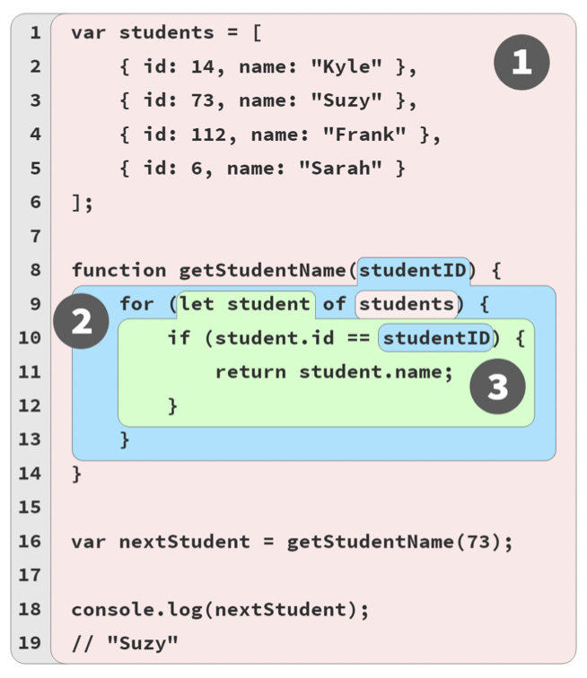
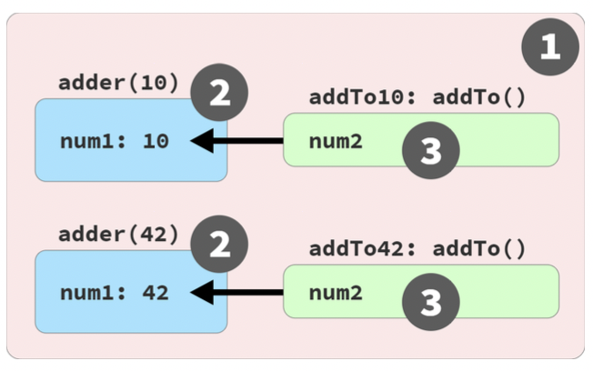
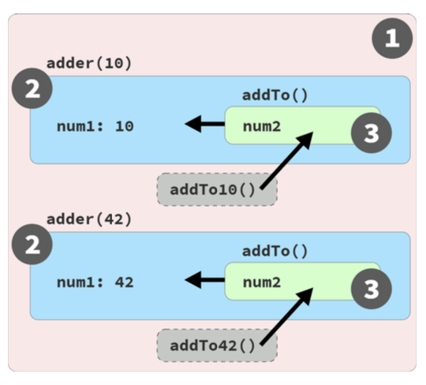

# You Don’t Know JS Yet: Scope & Closures By Kyle Simpson. Summary

### Index

- [Chapter 1: What is the Scope?](#chapter1)
  - [About This Book](#AboutThisBook)
  - [Compiled vs. Interpreted](#CompiledVsInterpreted)
  - [Compiling Code](#CompilingCode)
    - [Required: Two Phases](#TwoPhases)
      - [Early Errors](#EarlyErrors)
      - [Hoisting](#Hoisting)
  - [Compiler Speak](#CompilerSpeak)
    - [Targets](#Targets)
    - [Sources](#Sources)
  - [Cheating: Runtime Scope Modifications](#RuntimeScopeModifications)
  - [Lexical Scope](#LexicalScope)
- [Chapter 2: Illustrating Lexical Scope](#Chapter2)
  - [Marbles, and Buckets, and Bubbles... Oh My!](#Marbles)
  - [A Conversation Among Friends](#ConversationAmongFriends)
  - [Nested Scope](#NestedScope)
    - [Lookup Failures](#LookupFailures)
    - [Undefined Mess](#UndefinedMess)
    - [Global... What!?](#GlobalWhat)
- [Chapter 3: The Scope Chain](#Chapter3)
  - [“Lookup” Is (Mostly) Conceptual](#Lookup)
  - [Shadowing](#Shadowing)
    - [Global Unshadowing Trick](#GlobalUnshadowing)
    - [Illegal Shadowing](#IllegalShadowing)
  - [Function Name Scope](#FunctionNameScope)
  - [Arrow Functions](#ArrowFunctions)
  - [Backing Out](#BackingOut)
- [Chapter 4: Around the Global Scope](#Chapter4)
  - [Why Global Scope?](#WhyGlobalScope)
  - [Where Exactly is this Global Scope?](#WhereExactlyIsThisGlobalScope)
    - [Browser “Window”](#BrowserWindow)
    - [Globals Shadowing Globals](#GlobalsShadowingGlobals)
    - [DOM Globals](#DOMGlobals)
    - [What’s in a (Window) Name?](#WindowName)
    - [Web Workers](#WebWorkers)
    - [Developer Tools Console/REPL](#REPL)
    - [ES Modules (ESM)](#ESM)
    - [Node](#Node)
  - [Global This](#GlobalThis)
- [Chapter 5: The (Not So) Secret Lifecycle of Variables](#Chapter5)
  - [When Can I Use a Variable?](#WhenCanIUseAVariable)
  - [Hoisting: Declaration vs. Expression](#HoistingDeclarationVsExpression)
    - [Variable Hoisting](#VariableHoisting)
    - [Hoisting: Yet Another Metaphor](#HoistingYetAnotherMetaphor)
  - [Re-declaration?](#Redeclaration)
    - [Constants?](#Constants)
    - [Loops](#Loops)
  - [Uninitialized Variables (aka, TDZ)](#UninitializedVariables)
- [Chapter 6: Limiting Scope Exposure](#Chapter6)
  - [Least Exposure](#LeastExposure)
  - [Hiding in Plain (Function) Scope](#HidingInPlainFunctionScope)
    - [Invoking Function Expressions Immediately](#InvokingFunctionExpressionsImmediately)
    - [Function Boundaries](#FunctionBoundaries)
  - [Scoping with Blocks](#ScopingWithBlocks)
    - [_var_ and _let_](#VarAndLet)
    - [Where To let?](#WhereToLet)
    - [What’s the Catch?](#WhatIsTheCatch)
  - [Function Declarations in Blocks (FiB)](#FiB)
  - [Blocked Over](#BlockedOver)
- [Chapter 7: Using Closures](#UsingClosures)
  - [See the Closure](#SeeTheClosure)
    - [Adding Up Closures](#AddingUpClosures)
    - [Live Link, Not a Snapshot](#LiveLinkNotASnapshot)
    - [Observable Definition](#ObservableDefinition)
  - [The Closure Lifecycle and Garbage Collection (GC)](#TheClosureLifecycle)
    - [Per Variable or Per Scope?](#PerVariableOrPerScope)
  - [An Alternative Perspective](#AnAlternativePerspective)
  - [Why Closure?](#WhyClosure)
  - [Closer to Closure](#CloserToClosure)
- [Chapter 8: The Module Pattern](#Chapter8)
  - [Encapsulation and Least Exposure (POLE)](#POLE)
  - [What Is a Module?](#WhatIsAModule)
    - [Namespaces (Stateless Grouping)](#Namespaces)
    - [Data Structures (Stateful Grouping)](#DataStructures)
    - [Modules (Stateful Access Control)](#StatefulAccessControl)
    - [Module Factory (Multiple Instances)](#ModuleFactory)
    - [Classic Module Definition](#ClassicModuleDefinition)
  - [Node CommonJS Modules](#NodeCommonJSModules)
  - [Modern ES Modules (ESM)](#ModernESModules)
- [Appendix A: Exploring Further](#AppendixA)
  - [Implied Scopes](#ImpliedScopes)
  - [Parameter Scope](#ParameterScope)
    - [Function Name Scope](#FunctionNameScope2)
  - [Anonymous vs. Named Functions](#AnonymousVsNamedFunctions)
    - [Explicit or Inferred Names?](#ExplicitOrInferredNames)
    - [Missing Names?](#MissingNames)
    - [Who am I?](#WhoAmI)
    - [Names are Descriptors](#NamesAreDescriptors)
    - [Arrow Functions](#ArrowFunctions2)
    - [IIFE Variations](#IIFEVariations)
  - [Hoisting: Functions and Variables](#HoistingFunctionsAndVariables)
    - [Function Hoisting](#FunctionHoisting)
    - [Variable Hoisting](#VariableHoisting2)
    - [const-antly Confused](#ConstantlyConfused)
    - [_var_ and _let_](#VarAndLet2)
  - [What’s the Deal with TDZ?](#theDealWithTDZ)
    - [Where It All Started](#WhereItAllStarted)
    - [Who let the TDZ Out?](#WhoLetTDZOut)
  - [Are Synchronous Callbacks Still Closures?](#AreSynchronousCallbacksStillClosures)
    - [What is a Callback?](#WhatIsACallback)
    - [Synchronous Callback?](#SynchronousCallback)
    - [Synchronous Closure?](#SynchronousClosure)
    - [Defer to Closure](#DeferToClosure)
  - [Classic Module Variations](#ClassicModuleVariations)
    - [Where’s My API?](#WheresMyAPI)
    - [Asynchronous Module Defintion (AMD)](#AsynchronousModuleDefintion)
    - [Universal Modules (UMD)](#UMD)
- [Appendix B: Practice](#AppendixB)
  - [Buckets of Marbles](#BucketsOfMarbles)
    - [Suggested: Buckets of Marbles](#SuggestedBucketsOfMarbles)
  - [Closure (PART 1)](#ClosurePART1)
    - [A Word About Memory](#AWordAboutMemory)
    - [Suggested: Closure (PART 1)](#SuggestedClosurePART1)
  - [Closure (PART 2)](#ClosurePART2)
    - [Suggested: Closure (PART 2)](#SuggestedClosurePART2)
  - [Closure (PART 3)](#ClosurePART3)
    - [Suggested: Closure (PART 3)](#SuggestedClosurePART3)
  - [Modules](#Modules)
    - [Suggested: Modules](#SuggestedModules)

## <div id="chapter1" />Chapter 1: What’s the Scope?

How does JS know which variables are accessible by any given statement, and how does it handle two variables of the same name?
The answers to questions like these take the form of well-defined rules called scope.

### <div id="AboutThisBook" />About This Book

JS is in fact parsed/compiled in a separate phase **before execution begins**. The code author’s decisions on where to place variables, functions, and blocks with respect to each other are analyzed according to the rules of scope, during the initial parsing/compilation phase.

JS functions are themselves first-class values; they can be assigned and passed around just like numbers or strings. But since these functions hold and access variables, they maintain their original scope no matter where in the program the functions are eventually executed. This is called closure.

Modules are a code organization pattern characterized by public methods that have privileged access (via closure) to hidden variables and functions in the internal scope of the module.

### <div id="CompiledVsInterpreted" />Compiled vs. Interpreted

Code compilation is a set of steps that process the text of your code and turn it into a list of instructions the computer can understand. Typically, the whole source code is transformed at once, and those resulting instructions are saved as output (usually in a file) that can later be executed.

You also may have heard that code can be interpreted, so how is that different from being compiled?

Interpretation performs a similar task to compilation; in that it transforms your program into machine-understandable instructions. But the processing model is different. Unlike a program being compiled all at once, with interpretation the source code is transformed line by line; each line or statement is executed before immediately proceeding to processing the next line of the source code.

Are these two processing models mutually exclusive? Generally, yes.

Interpretation can actually take other forms than just operating line by line on source code text. Modern JS engines actually employ numerous variations of both compilation and interpretation in the handling of JS programs.

### <div id="CompilingCode" />Compiling Code

In classic compiler theory, a program is processed by a compiler in three basic stages:

1. **Tokenizing/Lexing**: breaking up a string of characters into meaningful (to the language) chunks, called tokens. (The difference between tokenizing and lexing is subtle and academic, but it centers on whether or not these tokens are identified in a stateless or stateful way. If the tokenizer were to invoke stateful parsing rules to figure out whether a should be considered a distinct token or just part of another token, that would be **lexing**.)
2. **Parsing**: taking a stream (array) of tokens and turning it into a tree of nested elements, which collectively represent the grammatical structure of the program. This is called an Abstract Syntax Tree (AST).
3. **Code Generation**: taking an AST and turning it into executable code. This part varies greatly depending on the language, the platform it’s targeting, and other factors. The JS engine takes the just described AST for _var a = 2_; and turns it into a set of machine instructions to actually create a variable called _a_ (including reserving memory, etc.), and then store a value into _a_.

The JS engine is vastly more complex than just these three stages. In the process of parsing and code generation, there are steps to optimize the performance of the execution (i.e., collapsing redundant elements). In fact, code can even be re-compiled and re-optimized during the progression of execution.

JS engines don’t have the luxury of an abundance of time to perform their work and optimizations, because JS compilation doesn’t happen in a build step ahead of time, as with other languages. It usually must happen in mere microseconds (or less!) right before the code is executed. To ensure the fastest performance under these constraints, JS engines use all kinds of tricks (like JITs, which lazy compile and even hot re-compile).

#### <div id="TwoPhases" />Required: Two Phases

To state it as simply as possible, the most important observation we can make about processing of JS programs is that it occurs in (at least) two phases: parsing/compilation first, then execution.

The separation of a parsing/compilation phase from the sub-sequent execution phase is observable fact, not theory or opinion. While the JS specification does not require “compilation” explicitly, it requires behavior that is essentially only practical with a compile-then-execute approach.

There are three program characteristics you can observe to prove this to yourself: syntax errors, early errors, and hoisting.

##### <div id="EarlyErrors" />Early Errors

Consider:

```
console.log("Howdy");

saySomething("Hello","Hi");
// Uncaught SyntaxError: Duplicate parameter name not
// allowed in this context

function saySomething(greeting,greeting) {
	"use strict";
	console.log(greeting);
}
```

The _"Howdy"_ message is not printed, despite being a well-formed statement.

the only reasonable explanation is that the code must first be fully parsed before any execution occurs.

##### <div id="Hoisting" />Hoisting

Finally, consider:

```
function saySomething() {
	var greeting = "Hello";
	{
		greeting = "Howdy"; 	// error comes from here
		let greeting = "Hi";
		console.log(greeting);
	}
}

saySomething();
// ReferenceError: Cannot access 'greeting' before
// initialization
```

What’s happening is that the _greeting_ variable for that statement belongs to the declaration on the next line, _let greeting = "Hi"_, rather than to the previous _var greeting = "Hello"_ statement.

The only way the JS engine could know, at the line where the error is thrown, that the next statement would declare a block-scoped variable of the same name (_greeting_) is if the JS engine had already processed this code in an earlier pass, and already set up all the scopes and their variable associations. This processing of scopes and declarations can only accurately be accomplished by parsing the program before execution.

The _ReferenceError_ here technically comes from _greeting = "Howdy"_ accessing the _greeting_ variable too early, a conflict referred to as the Temporal Dead Zone (TDZ).

Could JS parse a program, but then execute that program by interpreting operations represented in the AST (Abstract Syntax Tree) without first compiling the program? Yes, that is possible. But it’s extremely unlikely, mostly because it would be extremely inefficient performance wise.

It’s hard to imagine a production-quality JS engine going to all the trouble of parsing a program into an AST, but not then converting (aka, “compiling”) that AST into the most efficient (binary) representation for the engine to then execute.

But in spirit and in practice, what the engine is doing in processing JS programs is much more alike compilation than not.

Classifying JS as a compiled language is not concerned with the distribution model for its binary (or byte-code) executable representations, but rather in keeping a clear distinction in our minds about the phase where JS code is processed and analyzed; this phase observably and indisputedly happens before the code starts to be executed.

### <div id="CompilerSpeak" />Compiler Speak

With awareness of the two-phase processing of a JS program (compile, then execute), let’s turn our attention to how the JS engine identifies variables and determines the scopes of a program as it is compiled.

```
var students = [
	{ id: 14, name: "Kyle" },
	{ id: 73, name: "Suzy" },
	{ id: 112, name: "Frank" },
	{ id: 6, name: "Sarah" }
];

function getStudentName(studentID) {
	for (let student of students) {
		if (student.id == studentID) {
			return student.name;
		}
	}
}

var nextStudent = getStudentName(73);

console.log(nextStudent);
// Suzy
```

Other than declarations, all occurrences of variables/identifiers in a program serve in one of two “roles”: either they’re the target of an assignment or they’re the source of a value.

"LHS” (aka, _target_) and “RHS” (aka, _source_) for these roles, respectively. As you might guess from the “L” and the “R”, the acronyms mean “Left-Hand Side” and “Right-Hand Side”, as in left and right sides of an = assignment operator. However, assignment targets and sources don’t always literally appear on the left or right of an =, so it’s probably clearer to think in terms of _target_ / _source_ rather than left / right.)

How do you know if a variable is a _target_? Check if there is a value that is being assigned to it; if so, it’s a _target_. If not, then the variable is a _source_.

For the JS engine to properly handle a program’s variables, it must first label each occurrence of a variable as _target_ or _source_.

#### <div id="Targets" />Targets

What makes a variable a target? Consider:

```
students = [ // ..
```

This statement is clearly an assignment operation; remember, the _var students_ part is handled entirely as a declaration at compile time, and is thus irrelevant during execution; we left it out for clarity and focus. Same with the _nextStudent = getStudentName(73)_ statement.

But there are three other target assignment operations in the code that are perhaps less obvious.

```
for (let student of students) {
```

A _function_ declaration is a special case of a target reference.

An identifier _getStudentName_ is declared (at compile time), but the _= function(studentID)_ part is also handled at compilation; the association between _getStudentName_ and the function is automatically set up at the beginning of the scope rather than waiting for an = assignment statement to be executed.

This automatic association of function and variable is referred to as “function hoisting”.

#### <div id="Sources" />Sources

The other variable references must then be _source_ references (because that’s the only other option!).

In _for (let student of students)_, we said that _student_ is a _target_, but _students_ is a _source_ reference.

In case you were wondering, _id_, _name_, and _log_ are all properties, not variable references.

### <div id="RuntimeScopeModifications" />Cheating: Runtime Scope Modifications

It should be clear by now that scope is determined as the program is compiled, and should not generally be affected by runtime conditions. However, in non-strict-mode, there are technically still two ways to cheat this rule, modifying a program’s scopes during runtime.

Neither of these techniques should be used—they’re both dangerous and confusing.

The _eval(..)_ function receives a string of code to compile and execute on the fly during the program runtime. If that string of code has a _var_ or _function_ declaration in it, those declarations will modify the current scope that the _eval(..)_ is currently executing in:

```
function badIdea() {
	eval("var oops = 'Ugh!';");
	console.log(oops);
}
badIdea(); // Ugh!
```

If the _eval(..)_ had not been present, the _oops_ variable in _console.log(oops)_ would not exist, and would throw a _ReferenceError_. But _eval(..)_ modifies the scope of the _badIdea()_ function at runtime. This is bad for many reasons, including the performance hit of modifying the already compiled and optimized scope, every time _badIdea()_ runs.

The second cheat is the _with_ keyword, which essentially dynamically turns an object into a local scope—its properties are treated as identifiers in that new scope’s block:

```
var badIdea = { oops: "Ugh!" };

with (badIdea) {
	console.log(oops); // Ugh!
}
```

The global scope was not modified here, but _badIdea_ was turned into a scope at runtime rather than compile time, and its property _oops_ becomes a variable in that scope. Again, this is a terrible idea, for performance and readability reasons.

### <div id="LexicalScope" />Lexical Scope

If you place a variable declaration inside a function, the compiler handles this declaration as it’s parsing the function, and associates that declaration with the function’s scope. If a variable is block-scope declared (_let_ / _const_), then it’s associated with the nearest enclosing _{ .. }_ block, rather than its enclosing function (as with _var_).

Furthermore, a reference (_target_ or _source_ role) for a variable must be resolved as coming from one of the scopes that are lexically available to it; otherwise the variable is said to be “undeclared” (which usually results in an error!). If the variable is not declared in the current scope, the next outer/enclosing scope will be consulted. This process of stepping out one level of scope nesting continues until either a matching variable declaration can be found, or the global scope is reached and there’s nowhere else to go.

It’s important to note that compilation doesn’t actually do anything in terms of reserving memory for scopes and variables. None of the program has been executed yet.

Instead, compilation creates a map of all the lexical scopes that lays out what the program will need while it executes. You can think of this plan as inserted code for use at runtime, which defines all the scopes (aka, “lexical environments”) and registers all the identifiers (variables) for each scope.

In other words, while scopes are identified during compilation, they’re not actually created until runtime, each time a scope needs to run.

## <div id="Chapter2" />Chapter 2: Illustrating Lexical Scope

The term “lexical” refers to the first stage of compilation (lexing/parsing).

### <div id="Marbles" />Marbles, and Buckets, and Bubbles... Oh My!

One metaphor I’ve found effective in understanding scope is sorting colored marbles into buckets of their matching color.

Imagine you come across a pile of marbles, and notice that all the marbles are colored red, blue, or green. Let’s sort all the marbles, dropping the red ones into a red bucket, green into a green bucket, and blue into a blue bucket. After sorting, when you later need a green marble, you already know the green bucket is where to go to get it.

In this metaphor, the marbles are the variables in our program. The buckets are scopes (functions and blocks), which we just conceptually assign individual colors for our discussion purposes. The color of each marble is thus determined by which color scope we find the marble originally created in.

```
// outer/global scope: RED

var students = [
	{ id: 14, name: "Kyle" },
	{ id: 73, name: "Suzy" },
	{ id: 112, name: "Frank" },
	{ id: 6, name: "Sarah" }
];

function getStudentName(studentID) {
	// function scope: BLUE

	for (let student of students) {
		// loop scope: GREEN
		if (student.id == studentID) {
			return student.name;
		}
	}
}
var nextStudent = getStudentName(73);
console.log(nextStudent); // Suzy
```

The next figure helps visualize the boundaries of the scopes by drawing colored bubbles (aka, buckets) around each:


Each scope bubble is entirely contained within its parent scope bubble—a scope is never partially in two different outer scopes.

Each marble (variable/identifier) is colored based on which bubble (bucket) it’s declared in, not the color of the scope it may be accessed from.

References (non-declarations) to variables/identifiers are allowed if there’s a matching declaration either in the current scope, or any scope above/outside the current scope, but not with declarations from lower/nested scopes.

An expression in the RED(1) bucket only has access to RED(1) marbles, not BLUE(2) or GREEN(3). An expression in the BLUE(2) bucket can reference either BLUE(2) or RED(1) marbles, not GREEN(3). And an expression in the GREEN(3) bucket has access to RED(1), BLUE(2), and GREEN(3) marbles.

We can conceptualize the process of determining these non-declaration marble colors during runtime as a lookup. Since the _students_ variable reference in the _for-loop_ statement on line 9 is not a declaration, it has no color.

The key take-aways from marbles & buckets (and bubbles!):

- Any variable reference that appears in the scope where it was declared, or appears in any deeper nested scopes, will be labeled a marble of that same color unless an intervening scope “shadows” the variable declaration.
- The determination of colored buckets, and the marbles they contain, happens during compilation. This information is used for variable (marble color) “lookups” during code execution.

### <div id="ConversationAmongFriends" />A Conversation Among Friends

Let’s now meet the members of the JS engine that will have conversations as they process our program:

- _Engine_: Responsible for start-to-finish compilation and execution of our JavaScript program.
- _Compiler_: Handles all the dirty work of parsing and code-generation.
- _Scope Manager_: Collects and maintains a lookup list of all the declared variables/identifiers, and enforces a set of rules as to how these are accessible to currently executing code.

```
var students = [
	{ id: 14, name: "Kyle" },
	{ id: 73, name: "Suzy" },
	{ id: 112, name: "Frank" },
	{ id: 6, name: "Sarah" }
];

function getStudentName(studentID) {
	for (let student of students) {
		if (student.id == studentID) {
			return student.name;
		}
	}
}
var nextStudent = getStudentName(73);

console.log(nextStudent);
// Suzy
```

The _var students = [ .. ]_ declaration and initialization-assignment parts. JS treats these as two distinct operations, one which _Compiler_ will handle during compilation, and the other which _Engine_ will handle during execution. The first thing _Compiler_ will do with this program is perform lexing to break it down into tokens, which it will then parse into a tree (AST). Once Compiler gets to code generation, there’s more detail to consider than may be obvious. Here’s the steps _Compiler_ will follow to handle that statement:

1. Encountering _var students_, Compiler will ask _Scope Manager_ to see if a variable named _students_ already exists for that particular scope bucket. If so, _Compiler_ would ignore this declaration and move on. Otherwise, _Compiler_ will produce code that (at execution time) asks _Scope Manager_ to create a new variable called _students_ in that scope bucket.
2. _Compiler_ then produces code for _Engine_ to later execute, to handle the _students\=\[\]_ assignment. The code _Engine_ runs will first ask _Scope Manager_ if there is a variable called _students_ accessible in the current scope bucket. If not, _Engine_ keeps looking elsewhere \(see [“Nested Scope”](#NestedScope) \). Once _Engine_ finds a variable, it assigns the reference of the _[ .. ]_ array to it.

The conversation is a question-and-answer exchange, where _Compiler_ asks the current _Scope Manager_ if an encountered identifier declaration has already been encountered. If “no,” _Scope Manager_ creates that variable in that scope. If the answer is “yes,” then it’s effectively skipped over since there’s nothing more for that _Scope Manager_ to do.

_Compiler_ also signals when it runs across functions or block scopes, so that a new scope bucket and _Scope Manager_ can be instantiated.

Later, when it comes to execution of the program, the conversation will shift to _Engine_ and _Scope Manager_.

_Engine_ first asks the current _Scope Manager_ to look up the hoisted _getStudentName_ identifier, so as to associate the function with it. _Engine_ then proceeds to ask _Scope Manager_ about the _target_ reference for _students_, and so on.

To review and summarize how a statement like _var students = [ .. ]_ is processed, in two distinct steps:

1. _Compiler_ sets up the declaration of the scope variable (since it wasn’t previously declared in the current scope).
2. While _Engine_ is executing, to process the assignment part of the statement, _Engine_ asks _Scope Manager_ to look up the variable, initializes it to _undefined_ so it’s ready to use, and then assigns the array value to it.

### <div id="NestedScope" />Nested Scope

When it comes time to execute the _getStudentName()_ function, _Engine_ asks for a _Scope Manager_ instance for that function’s scope, and it will then proceed to look up the parameter (_studentID_) to assign the _73_ argument value to, and so on.

The function scope for _getStudentName(..)_ is nested inside the global scope. The block scope of the _for-loop_ is similarly nested inside that function scope. Scopes can be lexically nested to any arbitrary depth as the program defines.

Each scope gets its own _Scope Manager_ instance each time that scope is executed (one or more times). Each scope automatically has all its identifiers registered at the start of the scope being executed (this is called “variable hoisting”.)

At the beginning of a scope, if any identifier came from a function declaration, that variable is automatically initialized to its associated function reference. And if any identifier came from a _var_ declaration (as opposed to _let/const_), that variable is automatically initialized to _undefined_ so that it can be used; otherwise, the variable remains _uninitialized_ (aka, in its “TDZ,” see [Chapter 5](#Chapter5)) and cannot be used until its full declaration-and-initialization are executed.

In the _for (let student of students) {_ statement, _students_ is a _source_ reference that must be looked up. But how will that lookup be handled, since the scope of the function will not find such an identifier?

One of the key aspects of lexical scope is that any time an identifier reference cannot be found in the current scope, the next outer scope in the nesting is consulted; that process is repeated until an answer is found or there are no more scopes to consult.

#### <div id="LookupFailures" />Lookup Failures

When _Engine_ exhausts all lexically available scopes (moving outward) and still cannot resolve the lookup of an identifier, an error condition then exists. However, depending on the mode of the program (strict-mode or not) and the role of the variable (i.e., target vs. source; see [Chapter 1](#chapter1)), this error condition will be handled differently.

#### <div id="UndefinedMess" />Undefined Mess

If the variable is a _source_, an unresolved identifier lookup is considered an undeclared (unknown, missing) variable, which always results in a _ReferenceError_ being thrown. Also, if the variable is a _target_, and the code at that moment is running in strict-mode, the variable is considered _undeclared_ and similarly throws a _ReferenceError_.

The error message for an _undeclared_ variable condition, in most JS environments, will look like, _“Reference Error: XYZ is not defined.”_ The phrase “not defined” seems almost identical to the word “undefined,” as far as the English language goes. But these two are very different in JS.

“Not defined” really means “not declared” or, rather, “undeclared,” as in a variable that has no matching formal declaration in any lexically available scope. By contrast, “undefined” really means a variable was found (declared), but the variable otherwise has no other value in it at the moment, so it defaults to the _undefined_ value.

#### <div id="GlobalWhat" />Global... What!?

If the variable is a _target_ and strict-mode is not in effect, a confusing and surprising legacy behavior kicks in. The troublesome outcome is that the global scope’s Scope Manager will just create an accidental global variable to fulfill that target assignment!

Consider:

```
function getStudentName() {
	// assignment to an undeclared variable :(
	nextStudent = "Suzy";
}

getStudentName();

console.log(nextStudent);
// "Suzy" -- oops, an accidental-global variable!
```

This sort of accident (almost certain to lead to bugs eventually) is a great example of the beneficial protections offered by strict-mode, and why it’s such a bad idea not to be using strict-mode. In strict-mode, the _Global Scope Manager_ would instead have throwed a _ReferenceError_..

Assigning to a never-declared variable is an error, so it’s right that we would receive a _ReferenceError_ here.

Never rely on accidental global variables. Always use strict-mode, and always formally declare your variables. You’ll then get a helpful _ReferenceError_ if you ever mistakenly try to assign to a not-declared variable.

## <div id="Chapter3" />Chapter 3: The Scope Chain

The connections between scopes that are nested within other scopes is called the scope chain, which determines the path along which variables can be accessed. The chain is directed, meaning the lookup moves upward/outward only.


### <div id="Lookup" />“Lookup” Is (Mostly) Conceptual

In [Chapter 2](#Chapter2), we described the runtime access of a variable as a “lookup,” where the _Engine_ has to start by asking the current scope’s _Scope Manager_ if it knows about an _identifier/variable_, and proceeding upward/outward back through the chain of nested scopes (toward the global scope) until found, if ever. The lookup stops as soon as the first matching named declaration in a scope bucket is found.

This suggestion of a runtime lookup process works well for conceptual understanding, but **it’s not actually how things usually work in practice**.

The color of a marble’s bucket (aka, meta information of what scope a variable originates from) is usually determined during the initial compilation processing. Because lexical scope is pretty much finalized at that point, a marble’s color will not change based on anything that can happen later during runtime.

Since the marble’s color is known from compilation, and it’s immutable, this information would likely be stored with (or at least accessible from) each variable’s entry in the AST; that information is then used explicitly by the executable instructions that constitute the program’s runtime.

In other words, _Engine_ doesn’t need to look up through a bunch of scopes to figure out which scope bucket a variable comes from. That information is already known! Avoiding the need for a runtime lookup is a key optimization benefit of lexical scope. The runtime operates more performantly without spending time on all these lookups.

Consider a reference to a variable that isn’t declared in any lexically available scopes in the current file, which asserts that each file is its own separate program from the perspective of JS compilation. If no declaration is found, that’s not necessarily an error. Another file (program) in the runtime may indeed declare that variable in the shared global scope.

However, this lookup would only be needed once per variable at most, since nothing else during runtime could later change that marble’s color.

### <div id="Shadowing" />Shadowing

Where having different lexical scope buckets starts to matter more is when you have two or more variables, each in different scopes, with the same lexical names. A single scope cannot have two or more variables with the same name; such multiple references would be assumed as just one variable.

So if you need to maintain two or more variables of the same name, you must use separate (often nested) scopes. And in that case, it’s very relevant how the different scope buckets are laid out.

Consider:

```
var studentName = "Suzy";

function printStudent(studentName) {
	studentName = studentName.toUpperCase();
	console.log(studentName);
}

printStudent("Frank");
// FRANK

printStudent(studentName);
// SUZY

console.log(studentName);
// Suzy
```

This is a key aspect of lexical scope behavior, called shadowing. The BLUE(2) _studentName_ variable (parameter) shadows the RED(1) _studentName_. So, the parameter is shadowing the (shadowed) global variable. Repeat that sentence to yourself a few times to make sure you have the terminology straight!

That’s why the re-assignment of _studentName_ affects only the inner (parameter) variable: the BLUE(2) _studentName_, not the global RED(1) _studentName_.

When you choose to shadow a variable from an outer scope, one direct impact is that from that scope inward/downward (through any nested scopes) it’s now impossible for any marble to be colored as the shadowed variable.

Any _studentName_ identifier reference will correspond to that parameter variable, never the global _studentName_ variable. It’s lexically impossible to reference the global _studentName_ anywhere inside of the _printStudent(..)_ function (or from any nested scopes).

#### <div id="GlobalUnshadowing" />Global Unshadowing Trick

Please beware: leveraging the technique I’m about to describe is not very good practice, as it’s limited in utility, confusing for readers of your code, and likely to invite bugs to your program.

It is possible to access a global variable from a scope where that variable has been shadowed, but not through a typical lexical identifier reference.

In the global scope, _var_ declarations and _function_ declarations also expose themselves as properties (of the same name as the identifier) on the global object—essentially an object representation of the global scope. If you’ve written JS for a browser environment, you probably recognize the global object as window. That’s not entirely accurate, but it’s good enough for our discussion.

Consider this program, specifically executed as a standalone _.js_ file in a browser environment:

```
var studentName = "Suzy";

function printStudent(studentName) {
	console.log(studentName);
	console.log(window.studentName);
}

printStudent("Frank");
// "Frank"
// "Suzy"
```

Notice the _window.studentName_ reference? This expression is accessing the global variable _studentName_ as a property on _window_ (which we’re pretending for now is synonymous with the global object). That’s the only way to access a shadowed variable from inside a scope where the shadowing variable is present.

The _window.studentName_ is a mirror of the global _studentName_ variable, not a separate snapshot copy. Changes to one are still seen from the other, in either direction. You can think of _window.studentName_ as a _getter/setter_ that accesses the actual _studentName_ variable. As a matter of fact, you can even add a variable to the global scope by creating/setting a property on the global object.

This little “trick” only works for accessing a global scope variable (not a shadowed variable from a nested scope), and even then, only one that was declared with _var_ or _function_.

Other forms of global scope declarations do not create mirrored global object properties:

```
var one = 1;
let notOne = 2;
const notTwo = 3;
class notThree {}

console.log(window.one);		// 1
console.log(window.notOne);		// undefined
console.log(window.notTwo);		// undefined
console.log(window.notThree);	// undefined
```

Variables (no matter how they’re declared!) that exist in any other scope than the global scope are completely inaccessible from a scope where they’ve been shadowed:

```
var special = 42;

function lookingFor(special) {
	// The identifier `special` (parameter) in this
	// scope is shadowed inside keepLooking(), and
	// is thus inaccessible from that scope.

	function keepLooking() {
		var special = 3.141592;
		console.log(special);
		console.log(window.special);
	}

	keepLooking();
}

lookingFor(112358132134);
// 3.141592
// 42
```

_special: special_ is copying the value of the _special_ parameter variable into another container (a property of the same name). Of course, if you put a value in another container, shadowing no longer applies (unless another was shadowed, too!). But that doesn’t mean we’re accessing the parameter special; it means we’re accessing the copy of the value it had at that moment, by way of another container.

Mutating the contents of the object value via a reference copy is not the same thing as lexically accessing the variable itself.

#### <div id="IllegalShadowing" />Illegal Shadowing

Not all combinations of declaration shadowing are allowed. _let_ can shadow _var_, but _var_ cannot shadow _let_:

```
function something() {
	var special = "JavaScript";
	{
		let special = 42; // totally fine shadowing
		// ..
	}
}

function another() {
	// ..
	{
		let special = "JavaScript";
		{
			var special = "JavaScript";
			// ^^^ Syntax Error

			// ..
		}
	}
}
```

Notice in the _another()_ function, the inner _var special_ declaration is attempting to declare a function-wide -_special_, which in and of itself is fine.

The syntax error description in this case indicates that special has already been defined, but that error message is a little misleading.

The real reason it’s raised as a _SyntaxError_ is because the _var_ is basically trying to “cross the boundary” of (or hop over) the _let_ declaration of the same name, which is not allowed.

That boundary-crossing prohibition effectively stops at each function boundary, so this variant raises no exception:

```
function another() {
	// ..

	{
		let special = "JavaScript";

		ajax("https://some.url",function callback(){
			// totally fine shadowing
			var special = "JavaScript";
			// ..
		});
	}
}
```

Summary: _let_ (in an inner scope) can always shadow an outer scope’s _var_. _var_ (in an inner scope) can only shadow an outer scope’s _let_ if there is a function boundary in between.

### <div id="FunctionNameScope" />Function Name Scope

As you’ve seen by now, a _function_ declaration looks like this:

```
function askQuestion() {
	// ..
}
```

A function declaration will create an identifier in the enclosing scope (in this case, the global scope) named _askQuestion_.

```
var askQuestion = function(){
	// ..
};
```

The same is true for the variable _askQuestion_ being created. But since it’s a function expression a function definition used as value instead of a standalone declaration the function itself will not “hoist”.

One major difference between function declarations and function expressions is what happens to the name identifier of the function.

```
var askQuestion = function ofTheTeacher(){
	// ..
};
```

For formal _function_ declarations, the name identifier ends up in the outer/enclosing scope, so it may be reasonable to assume that’s true here. But _ofTheTeacher_ is declared as an identifier **inside the function itself**:

```
var askQuestion = function ofTheTeacher() {
	console.log(ofTheTeacher);
};

askQuestion();
// function ofTheTeacher()...

console.log(ofTheTeacher);
// ReferenceError: ofTheTeacher is not defined
```

Actually, _ofTheTeacher_ is not exactly in the scope of the function.

Not only is _ofTheTeacher_ declared inside the function rather than outside, but it’s also defined as read-only:

```
var askQuestion = function ofTheTeacher() {
	"use strict";
	ofTheTeacher = 42;
	//..
};

askQuestion();
// TypeError
```

Because we used strict-mode, the assignment failure is reported as a _TypeError_; in non- strict-mode, such an assignment fails silently with no exception.

What about when a function expression has no name identifier?

```
var askQuestion = function(){
	// ..
};
```

A _function_ expression with a name identifier is referred to as a “named function expression,” but one without a name identifier is referred to as an “anonymous function expression.” Anonymous function expressions clearly have no name identifier that affects either scope.

### <div id="ArrowFunctions" />Arrow Functions

ES6 added an additional function expression form to the language, called “arrow functions”:

```
var askQuestion = () => {
	// ..
};

```

The _=>_ arrow function doesn’t require the word _function_ to define it. Also, the _( .. )_ around the parameter list is optional in some simple cases. Likewise, the _{ .. }_ around the function body is optional in some cases. And when the _{ .. }_ are omitted, a _return_ value is sent out without using a _return_ keyword.

Arrow functions are _lexically_ anonymous, meaning they have no directly related identifier that references the function.

The assignment to _askQuestion_ creates an inferred name of “askQuestion”, but that’s **not the same thing as being non-anonymous**:

```
var askQuestion = () => {
	// ..
};
askQuestion.name; // askQuestion
```

Arrow functions achieve their syntactic brevity at the expense of having to mentally juggle a bunch of variations for different forms/conditions.

```
() => 42;
id => id.toUpperCase();
(id,name) => ({ id, name });

(...args) => {
	return args[args.length - 1];
};
```

Other than being anonymous (and having no declarative form), _=>_ arrow functions have the same lexical scope rules as _function_ functions do. An arrow function, with or without _{ .. }_ around its body, still creates a separate, inner nested bucket of scope. Variable declarations inside this nested scope bucket behave the same as in a function scope.

### <div id="BackingOut" />Backing Out

When a function (declaration or expression) is defined, a new scope is created. The positioning of scopes nested inside one another creates a natural scope hierarchy throughout the program, called the scope chain. The scope chain controls variable access, directionally oriented upward and outward.

Each new scope offers a clean slate, a space to hold its own set of variables. When a variable name is repeated at different levels of the scope chain, shadowing occurs, which prevents access to the outer variable from that point inward.

## <div id="Chapter4" />Chapter 4: Around the Global Scope

The vast majority of work is now done inside of functions and modules rather than globally.

Is it good enough to just assert, “Avoid using the global scope,” and be done with it?

### <div id="WhyGlobalScope" />Why Global Scope?

It’s likely no surprise to readers that most applications are composed of multiple (sometimes many!) individual JS files. So how exactly do all those separate files get stitched together in a single runtime context by the JS engine?

With respect to browser-executed applications, there are three main ways.

First, if you’re directly using ES modules (not transpiling them into some other module-bundle format), these files are loaded individually by the JS environment. Each module then imports references to whichever other modules it needs to access. The separate module files cooperate with each other exclusively through these shared imports, without needing any shared outer scope.

Second, if you’re using a bundler in your build process, all the files are typically concatenated together before delivery to the browser and JS engine, which then only processes one big file. Even with all the pieces of the application co-located in a single file, some mechanism is necessary for each piece to register a name to be referred to by other pieces, as well as some facility for that access to occur.

In some build setups, the entire contents of the file are wrapped in a single enclosing scope, such as a wrapper function, universal module (UMD). Each piece can register itself for access from other pieces by way of local variables in that shared scope.

```
(function wrappingOuterScope(){
	var moduleOne = (function one(){
		// ..
	})();

	var moduleTwo = (function two(){
		// ..
		function callModuleOne() {
			moduleOne.someMethod();
		}
		// ..
	})();
})();
```

And finally, the third way: whether a bundler tool is used for an application, or whether the (non-ES module) files are simply loaded in the browser individually (via _\<script\>_ tags or other dynamic JS resource loading), if there is no single surrounding scope encompassing all these pieces, the global scope is the only way for them to cooperate with each other.

A bundled file of this sort often looks something like this:

```
var moduleOne = (function one(){
	// ..
})();

var moduleTwo = (function two(){
	// ..

	function callModuleOne() {
		moduleOne.someMethod();
	}

	// ..
})();
```

If these files are loaded separately as normal standalone _.js_ files in a browser environment, each top-level variable declaration will end up as a global variable, since the global scope is the only shared resource between these two separate files—they’re independent programs, from the perspective of the JS engine.

In addition to (potentially) accounting for where an application’s code resides during runtime, and how each piece is able to access the other pieces to cooperate, the global scope is also where:

- JS exposes its built-ins:
  - primitives: _undefined_, _null_, _Infinity_, _NaN_
  - natives: _Date()_, _Object()_, _String()_, etc.
  - global functions: _eval()_, _parseInt()_, etc.
  - namespaces: _Math_, _Atomics_, _JSON_
  - friends of JS: _Intl_, _WebAssembly_
- The environment hosting the JS engine exposes its own built-ins:
  - _console_ (and its methods)
  - the _DOM_ (_window_, _document_, etc)
  - timers (_setTimeout(..)_, etc)
  - web platform APIs: _navigator_, _history_, _geolocation_, _WebRTC_, etc.

These are just some of the many globals your programs will interact with.

Most developers agree that the global scope shouldn’t just be a dumping ground for every variable in your application. That’s a mess of bugs just waiting to happen. But it’s also undeniable that the global scope is an important glue for practically every JS application.

### <div id="WhereExactlyIsThisGlobalScope" />Where Exactly is this Global Scope?

It might seem obvious that the global scope is located in the outermost portion of a file; that is, not inside any function or other block. But it’s not quite as simple as that.

Different JS environments handle the scopes of your programs, especially the global scope, differently. It’s quite common for JS developers to harbor misconceptions without even realizing it.

#### <div id="BrowserWindow" />Browser “Window”

With respect to treatment of the global scope, the purest environment JS can be run in is as a standalone _.js_ file loaded in a web page environment in a browser. I don’t mean “pure” as in nothing automatically added—lots may be added! — but rather in terms of minimal intrusion on the code or interference with its expected global scope behavior.

Consider this .js file:

```
var studentName = "Kyle";

function hello() {
	console.log(`Hello, ${ studentName }!`);
}

hello();
// Hello, Kyle!
```

This code may be loaded in a web page environment using an inline _\<script\>_ tag, a _\<script src\=..\>_ script tag in the markup, or even a dynamically created \<script\> DOM element. In all three cases, the _studentName_ and _hello_ identifiers are declared in the global scope.

That means if you access the global object (commonly, _window_ in the browser), you’ll find properties of those same names there:

```
var studentName = "Kyle";

function hello() {
	console.log(`Hello, ${ window.studentName }!`);
}

window.hello();
// Hello, Kyle!
```

That’s the default behavior one would expect from a reading of the JS specification: the outer scope is the global scope and _studentName_ is legitimately created as global variable.

That’s what I mean by pure. But unfortunately, that won’t always be true of all JS environments you encounter, and that’s often surprising to JS developers.

#### <div id="GlobalsShadowingGlobals" />Globals Shadowing Globals

Recall the discussion of shadowing (and global unshadowing) from Chapter 3, where one variable declaration can override and prevent access to a declaration of the same name from an outer scope.

An unusual consequence of the difference between a global variable and a global property of the same name is that, within just the global scope itself, a global object property can be shadowed by a global variable:

```
window.something = 42;

let something = "Kyle";

console.log(something);
// Kyle

console.log(window.something);
// 42
```

The _let_ declaration adds a something global variable but not a global object property (see [Chapter 3](#Chapter3)). The effect then is that the something lexical identifier shadows the something global object property.

It’s almost certainly a bad idea to create a divergence between the global object and the global scope. Readers of your code will almost certainly be tripped up.

Always use _var_ for globals. Reserve _let_ and _const_ for block scopes.

#### <div id="DOMGlobals" />DOM Globals

One surprising behavior in the global scope you may encounter with browser-based JS applications: a DOM element with an id attribute automatically creates a global variable that references it.

Consider this markup:

```
<ul id="my-todo-list">
   <li id="first">Write a book</li>
   ..
</ul>
```

And the JS for that page could include:

```
first;
// <li id="first">..</li>

window["my-todo-list"];
// <ul id="my-todo-list">..</ul>
```

If the _id_ value is a valid lexical name (like _first_), the lexical variable is created. If not, the only way to access that global is through the global object (_window[..]_).

The auto-registration of all id-bearing DOM elements as global variables is an old legacy browser behavior that nevertheless must remain because so many old sites still rely on it. My advice is never to use these global variables, even though they will always be silently created.

#### <div id="WindowName" />What’s in a (Window) Name?

Another global scope oddity in browser-based JS:

```
var name = 42;

console.log(name, typeof name);
// "42" string
```

_window\.name_ is a predefined “global” in a browser context; it’s a property on the global object, so it seems like a normal global variable (yet it’s anything but “normal”).

We used _var_ for our declaration, which does not shadow the predefined name global property. That means, effectively, the _var-_ declaration is ignored, since there’s already a global scope object property of that name. As we discussed earlier, had we used let name, we would have shadowed window\.name with a separate global name variable.

But the truly surprising behavior is that even though we assigned the number 42 to name (and thus window\.name), when we then retrieve its value, it’s a string "42"! In this case, the weirdness is because name is actually a pre-defined getter/setter on the window object, which insists on its value being a string value. Yikes!

With the exception of some rare corner cases like DOM element ID’s and window\.name, JS running as a standalone file in a browser page has some of the most pure global scope behavior we will encounter.

#### <div id="WebWorkers" />Web Workers

Web Workers are a web platform extension on top of browser-JS behavior, which allows a JS file to run in a completely separate thread (operating system wise) from the thread that’s running the main JS program.

Since these Web Worker programs run on a separate thread, they’re restricted in their communications with the main application thread, to avoid/limit race conditions and other complications. Web Worker code does not have access to the DOM, for example. Some web APIs are, however, made available to the worker, such as _navigator_.

Since a Web Worker is treated as a wholly separate program, it does not share the global scope with the main JS program.

However, the browser’s JS engine is still running the code, so we can expect similar purity of its global scope behavior. Since there is no DOM access, the window alias for the global scope doesn’t exist.

In a Web Worker, the global object reference is typically made using _self_:

```
var studentName = "Kyle";
let studentID = 42;

function hello() {
	console.log(`Hello, ${ self.studentName }!`);
}

self.hello();
// Hello, Kyle!

self.studentID;
// undefined
```

Just as with main JS programs, _var_ and _function_ declarations create mirrored properties on the global object (aka, _self_), where other declarations (_let_, _etc_) do not.

So again, the global scope behavior we’re seeing here is about as pure as it gets for running JS programs.

#### <div id="REPL" />Developer Tools Console/REPL

Developer Tools don’t create a completely adherent JS environment. They do process JS code, but they also lean in favor of the _UX_ interaction being most friendly to developers (aka, developer experience, or _DX_).

In some cases, favoring _DX_ when typing in short JS snippets, over the normal strict steps expected for processing a full JS program, produces observable differences in code behavior between programs and tools.

With respect to our discussions here about scope, such observable differences in behavior may include:

- The behavior of the global scope
- Hoisting
- Block-scoping declarators (_let_ / _const_) when used in the outermost scope

Although it might seem, while using the console/REPL, that statements entered in the outermost scope are being processed in the real global scope, that’s not quite accurate. Observed behavior may deviate from the JS specification.

The take-away is that Developer Tools, while optimized to be convenient and useful for a variety of developer activities, are not suitable environments to determine or verify explicit and nuanced behaviors of an actual JS program context.

#### <div id="ESM" />ES Modules (ESM)

ES6 introduced first-class support for the module pattern. One of the most obvious impacts of using ESM is how it changes the behavior of the observably top-level scope in a file.

```
Var studentName = "Kyle";

function hello() {
	console.log(`Hello, ${ studentName }!`);
}

hello();
// Hello, Kyle!

export hello;
```

If that code is in a file that’s loaded as an ES module, it will still run exactly the same. However, the observable effects, from the overall application perspective, will be different.

Despite being declared at the top level of the (module) file, in the outermost obvious scope, _studentName_ and _hello_ are not global variables. Instead, they are module-wide, or if you prefer, “module-global.”

However, in a module there’s no implicit “module-wide scope object” for these top-level declarations to be added to as properties, as there is when declarations appear in the top-level of non-module JS files. This is not to say that global variables cannot exist or be accessed in such programs. It’s just that global variables don’t get created by declaring variables in the top-level scope of a module.

The module’s top-level scope is descended from the global scope, almost as if the entire contents of the module were wrapped in a function.

ESM encourages a minimization of reliance on the global scope, where you import whatever modules, you may need for the current module to operate. As such, you less often see usage of the global scope or its global object.

However, as noted earlier, there are still plenty of JS and web globals that you will continue to access from the global scope, whether you realize it or not!

#### <div id="Node" />Node

One aspect of Node that often catches JS developers off-guard is that Node treats every single _.js_ file that it loads, including the main one you start the Node process with, as a module (ES module or CommonJS module). The practical effect is that the top level of your Node programs **is never actually the global scope**, the way it is when loading a non-module file in the browser..

```
var studentName = "Kyle";

function hello() {
	console.log(`Hello, ${ studentName }!`);
}

hello();
// Hello, Kyle!

module.exports.hello = hello;
```

Before processing, Node effectively wraps such code in a function, so that the var and function declarations are contained in that wrapping function’s scope, not treated as global variables.

Envision the preceding code as being seen by Node as this (illustrative, not actual):

```
function Module(module,require,__dirname,...) {
	var studentName = "Kyle";

	function hello() {
		console.log(`Hello, ${ studentName }!`);
	}

	hello();
	// Hello, Kyle!

	module.exports.hello = hello;
}
```

Here we add _studentName_ as a property on the global object, and then in the _console.log(..)_ statement we’re able to access _studentName_ as a normal global variable.

Remember, the identifier global is not defined by JS; it’s specifically defined by Node.

### <div id="GlobalThis" />Global This

Reviewing the JS environments we’ve looked at so far, a program may or may not:

- Declare a global variable in the top-level scope with _var_ or _function_ declarations—or _let_, _const_, and _class_.
- Also add global variables declarations as properties of the global scope object if _var_ or _function_ are used for the declaration.
- Refer to the global scope object (for adding or retrieving global variables, as properties) with _window_, _self_, or _global_.

Yet another “trick” for obtaining a reference to the global scope object looks like:

```
const theGlobalScopeObject =
    (new Function("return this"))();
```

As of ES2020, JS has finally defined a standardized reference to the global scope object, called _globalThis_. So, subject to the recency of the JS engines your code runs in, you can use _globalThis_ in place of any of those other approaches.

We could even attempt to define a cross-environment polyfill that’s safer across pre-global. This JS environments, such as:

```
const theGlobalScopeObject =
	(typeof globalThis != "undefined") ? globalThis :
	(typeof global != "undefined") ? global :
	(typeof window != "undefined") ? window :
	(typeof self != "undefined") ? self :
	(new Function("return this"))();
```

That’s certainly not ideal, but it works if you find yourself needing a reliable global scope reference.

## <div id="Chapter5" />Chapter 5: The (Not So) Secret Lifecycle of Variables

JS’s particular flavor of lexical scope is rich with nuance in how and when variables come into existence and become available to the program.

### <div id="WhenCanIUseAVariable" />When Can I Use a Variable?

Consider:

```
greeting();
// Hello!

function greeting() {
	console.log("Hello!");
}
```

This code works fine. You may have seen or even written code like it before. But did you ever wonder how or why it works?

Recall [Chapter 1](#chapter1) points out that all identifiers are registered to their respective scopes during compile time. Moreover, every identifier is created at the beginning of the scope it belongs to, every time that scope is entered.

The term most commonly used for a variable being visible from the beginning of its enclosing scope, even though its declaration may appear further down in the scope, is called _hoisting_.

We can see an identifier called _greeting_ from the beginning of the scope, but why can we call the _greeting()_ function before it’s been declared?

In other words, how does the variable greeting have any value (the function reference) assigned to it, from the moment the scope starts running? The answer is a special characteristic of formal function declarations, called function hoisting. When a function declaration’s name identifier is registered at the top of its scope, it’s additionally autoinitialized to that function’s reference. That’s why the function can be called throughout the entire scope!

One key detail is that both function hoisting and _var_-flavored variable hoisting attach their name identifiers to the nearest enclosing function scope (or, if none, the global scope), not a block scope.

Declarations with _let_ and _const_ still hoist. But these two declaration forms attach to their enclosing block rather than just an enclosing function as with _var_ and _function_ declarations.

### <div id="HoistingDeclarationVsExpression" />Hoisting: Declaration vs. Expression

Function hoisting only applies to formal _function_ declarations (specifically those which appear outside of blocks.

```
greeting();
// TypeError

var greeting = function greeting() {
	console.log("Hello!");
};
```

A _TypeError_ means we’re trying to do something with a value that is not allowed. Depending on your JS environment, the error message would say something like, “‘undefined’ is not a function,” or more helpfully, “‘greeting’ is not a function.”

In addition to being hoisted, variables declared with _var_ are also automatically initialized to _undefined_ at the beginning of their scope—again, the nearest enclosing function, or the global. Once initialized, they’re available to be used (assigned to, retrieved from, etc.) throughout the whole scope.

A _function_ declaration is hoisted and initialized to its function value (again, called function hoisting). A _var_ variable is also hoisted, and then auto-initialized to _undefined_. Any subsequent function expression assignments to that variable don’t happen until that assignment is processed during runtime execution.

#### <div id="VariableHoisting" />Variable Hoisting

Let’s look at another example of variable hoisting:

```
greeting = "Hello!";
console.log(greeting);
// Hello!

var greeting = "Howdy!";
```

Though _greeting_ isn’t declared until line _5_, it’s available to be assigned to as early as line _1_. Why?

There’s two necessary parts to the explanation:

- The identifier is hoisted,
- and it’s automatically initialized to the value _undefined_ from the top of the scope.

Using variable hoisting of this sort probably feels unnatural, and many readers might rightly want to avoid relying on it in their programs. But should all hoisting (including function hoisting) be avoided?

#### <div id="HoistingYetAnotherMetaphor" />Hoisting: Yet Another Metaphor

Here we are faced with yet another: hoisting itself. Rather than hoisting being a concrete execution step the JS engine performs, it’s more useful to think of hoisting as a visualization of various actions JS takes in setting up the program before execution.

The JS engine will actually rewrite that program before execution, so that it looks more like this:

```
var greeting; 				// hoisted declaration
greeting = "Hello!"; 		// the original line 1
console.log(greeting); 		// Hello!
greeting = "Howdy!"; 		// `var` is gone!
```

The hoisting (metaphor) proposes that JS pre-processes the original program and re-arranges it a bit, so that all the declarations have been moved to the top of their respective scopes, before execution. Moreover, the hoisting metaphor asserts that function declarations are, in their entirety, hoisted to the top of each scope. Consider:

```
studentName = "Suzy";
greeting();
// Hello Suzy!

function greeting() {
	console.log(`Hello ${ studentName }!`);
}
var studentName;
```

The “rule” of the hoisting metaphor is that function declarations are hoisted first, then variables are hoisted immediately after all the functions. Thus, the hoisting story suggests that program is re-arranged by the JS engine to look like this:

```
function greeting() {
	console.log(`Hello ${ studentName }!`);
}
var studentName;

studentName = "Suzy";
greeting();
// Hello Suzy!
```

Hoisting as a mechanism for re-ordering code may be an attractive simplification, but it’s not accurate. The JS engine doesn’t actually re-arrange the code. It can’t magically look ahead and find declarations; the only way to accurately find them, as well as all the scope boundaries in the program, would be to fully parse the code.

Guess what parsing is? The first phase of the two-phase processing! There’s no magical mental gymnastics that gets around that fact.

I assert that hoisting should be used to refer to the compile-time operation of generating runtime instructions for the automatic registration of a variable at the beginning of its scope, each time that scope is entered.

That’s a subtle but important shift, from hoisting as a runtime behavior to its proper place among compile-time tasks.

### <div id="Redeclaration" />Re-declaration?

What do you think happens when a variable is declared more than once in the same scope? Consider:

```
var studentName = "Frank";
console.log(studentName);
// Frank

var studentName; console.log(studentName); // ???
```

If you consider this program from the perspective of the hoisting metaphor, the code would be re-arranged like this for execution purposes:

```
var studentName;
var studentName; 		// clearly a pointless no-op!

studentName = "Frank";
console.log(studentName);
// Frank

console.log(studentName);
// Frank
```

Since hoisting is actually about registering a variable at the beginning of a scope, there’s nothing to be done in the middle of the scope where the original program actually had the second _var studentName_ statement. It’s just a no-op(eration), a pointless statement.

It’s also important to point out that _var studentName_; doesn’t mean _var studentName = undefined;_, as most assume. Let’s prove they’re different by considering this variation of the program:

```
var studentName = "Frank";
console.log(studentName); // Frank

var studentName;
console.log(studentName); // Frank <--- still!

// let's add the initialization explicitly
var studentName = undefined;
console.log(studentName); // undefined <--- see!?
```

See how the explicit _\= undefined_ initialization produces a different outcome than assuming it happens implicitly when omitted?

A repeated _var_ declaration of the same identifier _name_ in a scope is effectively a do-nothing operation. Here’s another illustration, this time across a function of the same name:

```
var greeting;

function greeting() {
	console.log("Hello!");
}

// basically, a no-op
var greeting;

typeof greeting; 		// "function"
var greeting = "Hello!";

typeof greeting; 		// "string"
```

What about repeating a declaration within a scope using _let_ or _const_?

```
let studentName = "Frank";

console.log(studentName);

let studentName = "Suzy";
```

This program will not execute, but instead immediately throw a _SyntaxError_. Depending on your JS environment, the error message will indicate something like: “_studentName_ has already been declared.” In other words, this is a case where attempted “re-declaration” is explicitly not allowed!

It’s not just that two declarations involving _let_ will throw this error. If either declaration uses _let_, the other can be either _let_ or _var_, and the error will still occur, as illustrated with these two variations:

```
var studentName = "Frank";
let studentName = "Suzy";
```

and:

```
let studentName = "Frank";
var studentName = "Suzy";
```

In both cases, a _SyntaxError_ is thrown on the second declaration. In other words, the only way to “re-declare” a variable is to use _var_ for all (two or more) of its declarations.

“Re-declaration” of variables is seen by some, including many on the TC39 body, as a bad habit that can lead to program bugs. So, when ES6 introduced _let_, they decided to prevent “re- declaration” with an error.

#### <div id="Constants" />Constants?

The _const_ keyword is more constrained than _let_. Like _let_, _const_ cannot be repeated with the same identifier in the same scope. But there’s actually an overriding technical reason why that sort of “re-declaration” is disallowed, unlike _let_ which disallows “re-declaration” mostly for stylistic reasons.

The _const_ keyword requires a variable to be initialized, so omitting an assignment from the declaration results in a _SyntaxError_:

```
const empty; 	// SyntaxError
```

_const_ declarations create variables that cannot be re-assigned

```
const studentName = "Frank";
console.log(studentName);
// Frank

studentName = "Suzy"; // TypeError
```

The _studentName_ variable cannot be re-assigned because it’s declared with a _const_.

The error thrown when re-assigning _studentName_ is a _TypeError_, not a _SyntaxError_.

Syntax errors represent faults in the program that stop it from even starting execution. Type errors represent faults that arise during program execution.

So, if _const_ declarations cannot be re-assigned, and _const_ declarations always require assignments, then we have a clear technical reason why _const_ must disallow any “re-declarations”: any _const_ “re-declaration” would also necessarily be a const re-assignment, which can’t be allowed!

```
const studentName = "Frank";

// obviously this must be an error
const studentName = "Suzy";
```

Since _const_ “re-declaration” must be disallowed (on those technical grounds), TC39 essentially felt that _let_ “re-declaration” should be disallowed as well.

#### <div id="Loops" />Loops

```
var keepGoing = true;
while (keepGoing) {
	let value = Math.random();
	if (value > 0.5) {
		keepGoing = false;
	}
}
```

Is _value_ being “re-declared” repeatedly in this program? Will we get errors thrown? No.

All the rules of scope (including “re-declaration” of _let_-created variables) are applied per scope instance. In other words, each time a scope is entered during execution, everything resets.

Each loop iteration is its own new scope instance, and within each scope instance, _value_ is only being declared once. So, there’s no attempted “re-declaration,” and thus no error.

What if the _value_ declaration in the previous snippet were changed to a _var_?

```
var keepGoing = true;
while (keepGoing) {
	var value = Math.random();
	if (value > 0.5) {
		keepGoing = false;
	}
}
```

Is _value_ being “re-declared” here, especially since we know var allows it? No. Because _var_ is not treated as a block-scoping declaration, it attaches itself to the global scope. So, there’s just one _value_ variable, in the same scope as _keepGoing_ (global scope, in this case). No “re-declaration” here, either!

One way to keep this all straight is to remember that _var_, _let_, and _const_ keywords are effectively removed from the code by the time it starts to execute. They’re handled entirely by the compiler.

If you mentally erase the declarator keywords and then try to process the code, it should help you decide if and when (re-)declarations might occur.

What about “re-declaration” with other loop forms, like _for_-loops?

```
for (let i = 0; i < 3; i++) {
	let value = i * 10;
	console.log(`${ i }: ${ value }`);
}

// 0: 0
// 1: 10
// 2: 20
```

It should be clear that there’s only one value declared per scope instance. But what about _i_? Is it being “re-declared”?

To answer that, consider what scope _i_ is in. It might seem like it would be in the outer (in this case, global) scope, but it’s not. It’s in the scope of _for_-loop body, just like _value_ is. In fact, you could sorta think about that loop in this more verbose equivalent form:

```
{
	// a fictional variable for illustration
	let $$i = 0;

	for ( /* nothing */; $$i < 3; $$i++) {
		// here's our actual loop `i`!
		let i = $$i;

		let value = i * 10;
		console.log(`${ i }: ${ value }`);
	}
	// 0: 0
	// 1: 10
	// 2: 20
}
```

Now it should be clear: the _i_ and _value_ variables are both declared exactly once per scope instance. No “re-declaration” here.

What about other _for_-loop forms?  
Let’s explore how _const_ impacts these looping constructs. Consider:

```
var keepGoing = true;
while (keepGoing) {
	// ooo, a shiny constant!
	const value = Math.random();
	if (value > 0.5) {
		keepGoing = false;
	}
}
```

Just like the _let_ variant of this program we saw earlier, _const_ is being run exactly once within each loop iteration, so it’s safe from “re-declaration” troubles. But things get more complicated when we talk about _for_-loops.

_for..in_ and _for..of_ are fine to use with _const_:

```
for (const index in students) {
	// this is fine
}

for (const student of students) {
	// this is also fine
}
```

But not the general _for_-loop:

```
for (const i = 0; i < 3; i++) {
	// oops, this is going to fail with
	// a Type Error after the first iteration
}
```

Let’s mentally “expand” that loop:

```
{
	// a fictional variable for illustration
	const $$i = 0;

	for ( ; $$i < 3; $$i++) {
		// here's our actual loop `i`!
		const i = $$i;
		// ..
	}
}
```

Our _i_ is indeed just created once inside the loop. That’s not the problem. The problem is the conceptual \$\$i that must be incremented each time with the \$\$i\+\+ expression. That’s re-assignment (not “re-declaration”), which isn’t allowed for constants.

The straightforward answer is: _const_ can’t be used with the classic _for_-loop form because of the required re-assignment.

Interestingly, if you don’t do re-assignment, then it’s valid:

```
var keepGoing = true;

for (const i = 0; keepGoing; /* nothing here */ ) {
	keepGoing = (Math.random() > 0.5);
	// ..
}
```

That works, but it’s pointless. There’s no reason to declare _i_ in that position with a _const_, since the whole point of such a variable in that position is to be used for counting iterations. Just use a different loop form, like a _while_ loop, or use a _let_.

### <div id="UninitializedVariables" />Uninitialized Variables (aka, TDZ)

With _var_ declarations, the variable is “hoisted” to the top of its scope. But it’s also automatically initialized to the _undefined_ value, so that the variable can be used throughout the entire scope.

However, _let_ and _const_ declarations are not quite the same in this respect. Consider:

```
console.log(studentName);
// ReferenceError

let studentName = "Suzy";
```

The result of this program is that a _ReferenceError_ is thrown on the first line.

That error message is quite indicative of what’s wrong: _studentName_ exists on line 1, but it’s not been initialized, so it cannot be used yet.

```
studentName = "Suzy"; 	// let's try to initialize it!
// ReferenceError

console.log(studentName);
let studentName;
```

How do we initialize an uninitialized variable? For _let/const_, the only way to do so is with an assignment attached to a declaration statement.

```
let studentName = "Suzy";
console.log(studentName); // Suzy
```

We are initializing the _studentName_ (in this case, to _"Suzy"_ instead of _undefined_) by way of the _let_ declaration statement form that’s coupled with an assignment.

Alternatively:

```
/ ..

let studentName;
// or:
// let studentName = undefined;

// ..

studentName = "Suzy";

console.log(studentName);
// Suzy
```

_var studentName_ automatically initializes at the top of the scope, where _let studentName_ does not.

Remember that we’ve asserted a few times so far that _Compiler_ ends up removing any _var/let/const_ declarators, replacing them with the instructions at the top of each scope to register the appropriate identifiers.

We see that an additional nuance is that Compiler is also adding an instruction in the middle of the program, at the point where the variable _studentName_ was declared, to handle that declaration’s auto-initialization. We cannot use the variable at any point prior to that initialization occuring. The same goes for _const_ as it does for _let_.

The term coined by TC39 to refer to this period of time from the entering of a scope to where the auto-initialization of the variable occurs is: Temporal Dead Zone (TDZ).

The TDZ is the time window where a variable exists but is still uninitialized, and therefore cannot be accessed in any way. Only the execution of the instructions left by Compiler at the point of the original declaration can do that initialization. After that moment, the TDZ is done, and the variable is free to be used for the rest of the scope.

Only _let_ and _const_ have an observable TDZ.  
By the way, “temporal” in TDZ does indeed refer to _time_ not _position_ in code.

Consider:

```
askQuestion();
// ReferenceError

let studentName = "Suzy";

function askQuestion() {
	console.log(`${ studentName }, do you know?`);
}
```

Even though positionally the _console.log(..)_ referencing _studentName_ comes after the _let studentName_ declaration, timing wise the _askQuestion()_ function is invoked before the _let_ statement is encountered, while _studentName_ is still in its TDZ! Hence the error.

There’s a common misconception that TDZ means _let_ and _const_ do not hoist. This is an inaccurate, or at least slightly misleading, claim. They definitely hoist.

The actual difference is that _let/const_ declarations do not automatically initialize at the beginning of the scope, the way _var_ does. The debate then is if the auto-initialization is part of hoisting, or not? Auto-registration of a variable at the top of the scope (i.e., what I call “hoisting”) and auto-initialization at the top of the scope (to _undefined_) are distinct operations and shouldn’t be lumped together under the single term “hoisting.”

We’ve already seen that _let_ and _const_ don’t auto-initialize at the top of the scope. But let’s prove that _let_ and _const_ do hoist (auto-register at the top of the scope), courtesy of our friend shadowing

```
var studentName = "Kyle";

{
	console.log(studentName);
	// ???

	// ..

	let studentName = "Suzy";

	console.log(studentName);
	// Suzy
}
```

If _let studentName_ didn’t hoist to the top of the scope, then the first _console.log(..)_ should print _"Kyle"_, right? At that moment, it would seem, only the outer _studentName_ exists, so that’s the variable _console.log(..)_ should access and print.

But instead, the first _console.log(..)_ throws a TDZ error, because in fact, the inner scope’s _studentName_ was hoisted (auto-registered at the top of the scope). What didn’t happen (yet!) was the auto-initialization of that inner _studentName_; it’s still uninitialized at that moment, hence the TDZ violation!

So to summarize, TDZ errors occur because _let/const_ declarations do hoist their declarations to the top of their scopes, but unlike _var_, they defer the auto-initialization of their variables until the moment in the code’s sequencing where the original declaration appeared. This window of time (hint: temporal), whatever its length, is the TDZ.

How can you avoid TDZ errors?

My advice: always put your _let_ and _const_ declarations at the top of any scope. Shrink the TDZ window to zero (or near zero) length, and then it’ll be moot.

## <div id="Chapter6" />Chapter 6: Limiting Scope Exposure

### <div id="LeastExposure" />Least Exposure

Software engineering articulates a fundamental discipline, typically applied to software security, called “The Principle of Least Privilege” (POLP). 1 And a variation of this principle that applies to our current discussion is typically labeled as “Least Exposure” (POLE).

POLP expresses a defensive posture to software architecture: components of the system should be designed to function with least privilege, least access, least exposure. If each piece is connected with minimum-necessary capabilities, the over-all system is stronger from a security standpoint, because a compromise or failure of one piece has a minimized impact on the rest of the system.

In following POLE, what do we want to minimize the exposure of? Simply: the variables registered in each scope.

When variables used by one part of the program are exposed to another part of the program, via scope, there are three main hazards that often arise:

- **Naming Collisions**: if you use a common and useful variable/function name in two different parts of the program, but the identifier comes from one shared scope (like the global scope), then name collision occurs.
- **Unexpected Behavior**: if you expose variables/functions whose usage is otherwise private to a piece of the program, it allows other developers to use them in ways you didn’t intend, which can violate expected behavior and cause bugs.
- **Unintended Dependency**: if you expose variables/functions unnecessarily, it invites other developers to use and depend on those otherwise private pieces.

POLE, as applied to variable/function scoping, essentially says, default to exposing the bare minimum necessary, keeping everything else as private as possible. Declare variables in as small and deeply nested of scopes as possible, rather than placing everything in the global (or even outer function) scope.

If you design your software accordingly, you have a much greater chance of avoiding (or at least minimizing) these three hazards.

### <div id="HidingInPlainFunctionScope" />Hiding in Plain (Function) Scope

It should now be clear why it’s important to hide our variable and function declarations in the lowest (most deeply nested) scopes possible.

What about hiding _var_ or _function_ declarations in scopes? That can easily be done by wrapping a function scope around a declaration.

Let’s consider an example where function scoping can be useful.

```
var cache = {};

function factorial(x) {
	if (x < 2) return 1;
	if (!(x in cache)) {
		cache[x] = x * factorial(x - 1);
    }
    return cache[x];
}

factorial(6);
// 720

cache;

// {
// 		"2": 2,
// 		"3": 6,
// 		"4": 24,
// 		"5": 120,
// 		"6": 720
// }

factorial(7);
// 5040
```

We’re storing all the computed factorials in cache so that across multiple calls to _factorial(..)_, the previous computations remain. But the _cache_ variable is pretty obviously a private detail of how _factorial(..)_ works, not something that should be exposed in an outer scope—especially not the global scope.

fixing this over-exposure issue is not as simple as hiding the cache variable inside _factorial(..)_.

Since we need cache to survive multiple calls, it must be located in a scope outside that function. So what can we do?

Define another middle scope (between the outer/global scope and the inside of _factorial(..)_) for cache to be located:

```
// outer/global scope

function hideTheCache() {
	// "middle scope", where we hide `cache`
	var cache = {};

	return factorial;

	// **********************

	function factorial(x) {
		// inner scope
		if (x < 2) return 1;
		if (!(x in cache)) {
			cache[x] = x * factorial(x - 1);
        }
        return cache[x];
	}
}

var factorial = hideTheCache();

factorial(6);
// 720

factorial(7);
// 5040
```

The _hideTheCache()_ function serves no other purpose than to create a scope for cache to persist in across multiple calls to _factorial(..)_. But for _factorial(..)_ to have access to cache, we have to define _factorial(..)_ inside that same scope. Then we return the function reference, as a value from _hideTheCache()_, and store it in an outer scope variable, also named _factorial_. Now as we call _factorial(..)_ (multiple times!), its persistent cache stays hidden yet accessible only to _factorial(..)!_

The illustrated technique—caching a function’s computed output to optimize performance when repeated calls of the same inputs are expected— is quite common in the Functional Programming (FP) world, canonically referred to as “memoization”; this caching relies on closure. Also, there are memory usage concerns. FP libraries will usually provide an optimized and vetted utility for memoization of functions, which would take the place of _hideTheCache(..)_ here. Memoization is beyond the scope.

Rather than defining a new and uniquely named _function_ each time one of those scope-only-for-the-purpose-of-hiding-a-variable situations occurs, a perhaps better solution is to use a function expression:

```
var factorial = (function hideTheCache() {
	var cache = {};

	function factorial(x) {
		if (x < 2) return 1;
		if (!(x in cache)) {
			cache[x] = x * factorial(x - 1);
        }
        return cache[x];
    }

	return factorial;
})();

factorial(6);
// 720

factorial(7);
// 5040
```

What happens to the _name_ identifier from a _function_ expression. Since _hideTheCache(..)_ is defined as a _function_ expression instead of a _function_ declaration, its _name_ is in its own scope—essentially the same scope as _cache_—rather than in the outer/global scope.

That means we can name every single occurrence of such a function expression the exact same name, and never have any collision.

In fact, we could just leave off the name entirely—thus defining an “anonymous function expression” instead.

#### <div id="InvokingFunctionExpressionsImmediately" />Invoking Function Expressions Immediately

Notice that we surrounded the entire function expression in a set of _( .. )_, and then on the end, we added that second _()_ parentheses set; that’s actually calling the function expression we just defined.

This common pattern has a (very creative!) name: Immediately Invoked Function Expression (IIFE).

An IIFE is useful when we want to create a scope to hide variables/functions. Since it’s an expression, it can be used in any place in a JS program where an expression is allowed.

For comparison, here’s an example of a standalone IIFE:

```
// outer scope

(function(){
	// inner hidden scope
})();

// more outer scope
```

Unlike earlier with _hideTheCache()_, where the outer surrounding _(..)_ were noted as being an optional stylistic choice, for a standalone IIFE they’re required; they distinguish the function as an expression, not a statement. For consistency, however, always surround an IIFE function with _( .. )_.

#### <div id="FunctionBoundaries" />Function Boundaries

Beware that using an IIFE to define a scope can have some unintended consequences, depending on the code around it. Because an IIFE is a full function, the function boundary alters the behavior of certain statements/constructs.

For example, a return statement in some piece of code would change its meaning if an IIFE is wrapped around it, because now the return would refer to the IIFE’s function. Non-arrow function IIFEs also change the binding of a _this_ keyword. And statements like break and continue won’t operate across an IIFE function boundary to control an outer loop or block.

So, if the code you need to wrap a scope around has _return_, _this_, _break_, or _continue_ in it, an IIFE is probably not the best approach. In that case, you might look to create the scope with a block instead of a function.

### <div id="ScopingWithBlocks" />Scoping with Blocks

In general, any _{ .. }_ curly-brace pair which is a statement will act as a block, but not necessarily as a scope.

A block only becomes a scope, if necessary, to contain its block-scoped declarations (i.e., _let_ or _const_). Consider:

```
{
	// not necessarily a scope (yet)

	// ..

	// now we know the block needs to be a scope
	let thisIsNowAScope = true;

	for (let i = 0; i < 5; i++) {
		// this is also a scope, activated each
		// iteration
		if (i % 2 == 0) {
			// this is just a block, not a scope
			console.log(i);
		}
	}
}
// 0 2 4
```

Not all _{ .. }_ curly-brace pairs create blocks:

- Object literals use \_{ .. } \_curly-brace pairs to delimit their key-value lists, but such object values are not scopes.
- _class_ uses _{ .. }_ curly-braces around its body definition, but this is not a block or scope.
- A _function_ uses _{ .. }_ around its body, but this is not technically a block—it’s a single statement for the _function_ body. It is, however, a (function) scope.
- The _{ .. }_ curly-brace pair on a switch statement (around the set of case clauses) does not define a block/scope.

An explicit block of this sort—if it has no declarations, it’s not actually a scope— serves no operational purpose, though it can still be useful as a semantic signal.

In most languages that support block scoping, an explicit block scope is an extremely common pattern for creating a narrow slice of scope for one or a few variables.

For example:

```
if (somethingHappened) {
	// this is a block, but not a scope
	{
		// this is both a block and an
		// explicit scope
		let msg = somethingHappened.message();
		notifyOthers(msg);
	}
	// ..

	recoverFromSomething();
}
```

Here, the _{ .. }_ curly-brace pair inside the _if_ statement is an even smaller inner explicit block scope for _msg_, since that variable is not needed for the entire _if_ block.

To minimize the risk of TDZ errors with _let/const_ declarations, always put those declarations at the top of their scope.

If you find yourself placing a _let_ declaration in the middle of a scope, first think, “Oh, no! TDZ alert!” If this _let_ declaration isn’t needed in the first half of that block, you should use an inner explicit block scope to further narrow its exposure!

Another example with an explicit block scope:

```
function getNextMonthStart(dateStr) {
	var nextMonth, year;

	{
		let curMonth;
		[ , year, curMonth ] = dateStr.match(
			/(\d{4})-(\d{2})-\d{2}/
			) || [];
        nextMonth = (Number(curMonth) % 12) + 1;
	}

	if (nextMonth == 1) {
		year++;
	}

	return `${ year }-${
		String(nextMonth).padStart(2,"0")
		}-01`;
}
getNextMonthStart("2019-12-25"); // 2020-01-01
```

Let’s first identify the scopes and their identifiers:

1. The outer/global scope has one identifier, the function _getNextMonthStart(..)_.
2. The function scope for _getNextMonthStart(..)_ has three: _dateStr(parameter)_, _nextMonth_, and _year_.
3. The _{..}_ curly-brace pair defines an inner block scope that includes one variable: _curMonth_.

The benefits of the POLE principle are best achieved when you adopt the mindset of minimizing scope exposure by default, as a habit. If you follow the principle consistently even in the small cases, it will serve you more as your programs grow.

Let’s now look at an even more substantial example:

```
function sortNamesByLength(names) {
	var buckets = [];

	for (let firstName of names) {
		if (buckets[firstName.length] == null) {
			buckets[firstName.length] = [];
        }
        buckets[firstName.length].push(firstName);
    }

    // a block to narrow the scope
    {
	    let sortedNames = [];

		for (let bucket of buckets) {
			if (bucket) {
				// sort each bucket alphanumerically
				bucket.sort();

				// append the sorted names to our
				// running list
				 sortedNames = [
					 ...sortedNames,
					 ...bucket
				];
			}
		}
		return sortedNames;
	}
}

sortNamesByLength([
	"Sally",
	"Suzy",
	"Frank",
	"John",
	"Jennifer",
	"Scott"
]);

// [ "John", "Suzy", "Frank", "Sally",
//   "Scott", "Jennifer" ]
```

#### <div id="VarAndLet" />var and let

Any variable that is needed across all (or even most) of a function should be declared so that such usage is obvious.

Stylistically, _var_ has always, from the earliest days of JS, signaled “variable that belongs to a whole function.” As we asserted in “Lexical Scope”, _var_ attaches to the nearest enclosing function scope, no matter where it appears. That’s true even if _var_ appears inside a block:

```
function diff(x,y) {
	if (x > y) {
		var tmp = x; 		// `tmp` is function-scoped
		x = y;
		y = tmp;
	}
	return y - x;
}
```

Even though _var_ is inside a block, its declaration is function- scoped (to _diff(..)_), not block-scoped. While you can declare _var_ inside a block (and still have it be function-scoped), I would recommend against this approach except in a few specific cases. Otherwise, _var_ should be reserved for use in the top-level scope of a function.

Why not just use _let_ in that same location? Because _var_ is visually distinct from _let_ and therefore signals clearly, “this variable is function-scoped.” Using _let_ in the top-level scope, especially if not in the first few lines of a function, and when all the other declarations in blocks use _let_, does not visually draw attention to the difference with the function-scoped declaration.

_var_ better communicates function-scoped than _let_ does, and _let_ both communicates (and achieves!) block-scoping where _var_ is insufficient.

There are other semantic and operational reasons to choose _var_ or _let_ in different scenarios.

#### <div id="WhereToLet" />Where To let?

My advice to reserve var for (mostly) only a top-level function scope means that most other declarations should use _let_.

The way to decide is not based on which keyword you want to use. The way to decide is to ask, “What is the most minimal scope exposure that’s sufficient for this variable?”

Once that is answered, you’ll know if a variable belongs in a block scope or the function scope.

If a declaration belongs in a block scope, use _let_. If it belongs in the function scope, use _var_.

An example that was historically based on _var_ but which should now pretty much always use _let_ is the _for_ loop:

```
for (var i = 0; i < 5; i++) {
	// do something
}
```

No matter where such a loop is defined, the i should basically always be used only inside the loop, in which case POLE dictates it should be declared with let instead of var:

```
for (let i = 0; i < 5; i++) {
	// do something
}
```

Almost the only case where switching a _var_ to a _let_ in this way would “break” your code is if you were relying on accessing the loop’s iterator (_i_) outside/after the loop, such as:

```
for (var i = 0; i < 5; i++) {
	if (checkValue(i)) {
		break;
	}
}

if (i < 5) {
	console.log("The loop stopped early!");
}
```

This usage pattern is not terribly uncommon, but most feel it smells like poor code structure. A preferable approach is to use another outer-scoped variable for that purpose:

```
var lastI;

for (let i = 0; i < 5; i++) {
	lastI = i;
	if (checkValue(i)) {
		break;
	}
}

if (lastI < 5) {
	console.log("The loop stopped early!");
}
```

#### <div id="WhatIsTheCatch" />What’s the Catch?

So far, we’ve asserted that _var_ and parameters are function-scoped, and _let/const_ signal block-scoped declarations. There’s one little exception to call out: the _catch_ clause.

The _catch_ clause has used an additional (little-known) block- scoping declaration capability:

```
try {
	doesntExist();
}
catch (err) {
	console.log(err);
	// ReferenceError: 'doesntExist' is not defined
    // ^^^^ message printed from the caught exception

	let onlyHere = true;
	var outerVariable = true;
}

console.log(outerVariable); 	// true

console.log(err);
// ReferenceError: 'err' is not defined
// ^^^^ this is another thrown (uncaught) exception
```

The _err_ variable declared by the _catch_ clause is block-scoped to that block. This _catch_ clause block can hold other block- scoped declarations via _let_. But a _var_ declaration inside this block still attaches to the outer function/global scope.

ES2019 (recently, at the time of writing) changed _catch_ clauses so their declaration is optional; if the declaration is omitted, the _catch_ block is no longer (by default) a scope; it’s still a block, though!

So, if you need to react to the condition that an exception occurred (so you can gracefully recover), but you don’t care about the _error_ value itself, you can omit the _catch_ declaration:

```
try {
	doOptionOne();
}
catch { // catch-declaration omitted
	doOptionTwoInstead();
}
```

### <div id="FiB" />Function Declarations in Blocks (FiB)

We’ve seen now that declarations using _let_ or _const_ are block-scoped, and _var_ declarations are function-scoped. So, what about function declarations that appear directly inside blocks? As a feature, this is called “FiB.”

```
if (false) {
	function ask() {
		console.log("Does this run?");
    }
}
ask();
```

Depending on which JS environment you try that code snippet in, you may get different results! This is one of those few crazy areas where existing legacy behavior betrays a predictable outcome.

The JS specification says that function declarations inside of blocks are block-scoped. However, most browser-based JS engines (including v8, which comes from Chrome but is also used in Node) will behave as the _ask()_ call might fail with a _TypeError_ exception, because the ask identifier exists, but it’s _undefined_ (since the _if_ statement doesn’t run) and thus not a callable function. Meaning the identifier is scoped outside the _if_ block but the _function_ value is not automatically initialized, so it remains _undefined_.

One of the most common use cases for placing a function declaration in a block is to conditionally define a function one way or another (like with an _if..else_ statement) depending on some environment state.

```
if (typeof Array.isArray != "undefined") {
	function isArray(a) {
		return Array.isArray(a);
	}
}
else {
	function isArray(a) {
		return Object.prototype.toString.call(a)
			== "[object Array]";
	}
}
```

Always place function declarations anywhere in the top-level scope of a function (or in the global scope). Avoid conditionally defining functions if at all possible. Our discussion about FiB is about avoiding _function_ **declarations** in blocks.

### <div id="BlockedOver" />Blocked Over

The point of lexical scoping rules in a programming language is so we can appropriately organize our program’s variables, both for operational as well as semantic code communication purposes.

And one of the most important organizational techniques is to ensure that no variable is over-exposed to unnecessary scopes.

<div id="UsingClosures" />Chapter 7: Using Closures

The least exposure principle (POLE). Closure builds on this approach: for variables we need to use over time, instead of placing them in larger outer scopes, we can encapsulate (more narrowly scope) them but still preserve access from inside functions, for broader use. Functions remember these referenced scoped variables via closure. Closure underlies major programming paradigms, including Functional Programming (FP), modules, and even a bit of class-oriented design.

### <div id="SeeTheClosure" />See the Closure

Closure is originally a mathematical concept, from lambda calculus. Closure is a behavior of functions and only functions. An _object_ cannot have closure, nor does a _class_ have closure (though its functions/methods might). Only _functions_ have closure.

For closure to be observed, a function must be invoked, and specifically it must be invoked in a different branch of the scope chain from where it was originally defined. A function executing in the same scope it was defined would not exhibit any observably different behavior with or without closure being possible; by the observational perspective and definition, that is not closure.

Let’s look at some code, annotated with its relevant scope bubble colors (see [Chapter 2](#Chapter2)):

```
// outer/global scope: RED(1)

function lookupStudent(studentID) {
	// function scope: BLUE(2)

	var students = [
		{ id: 14, name: "Kyle" },
		{ id: 73, name: "Suzy" },
		{ id: 112, name: "Frank" },
		{ id: 6, name: "Sarah" }
	];

	return function greetStudent(greeting){
		// function scope: GREEN(3)

		var student = students.find(
			student => student.id == studentID
		);

		return `${ greeting }, ${ student.name }!`;
	};
}

var chosenStudents = [
	lookupStudent(6),
	lookupStudent(112)
];

// accessing the function's name:
chosenStudents[0].name;
// greetStudent

chosenStudents[0]("Hello");
// Hello, Sarah!

chosenStudents[1]("Howdy");
// Howdy, Frank!
```

While _greetStudent(..)_ does receive a single argument as the parameter named _greeting_, it also makes reference to both _students_ and _studentID_, identifiers which come from the enclosing scope of _lookupStudent(..)_. Each of those references from the inner function to the variable in an outer scope is called a closure. In academic terms, each instance of _greetStudent(..)_ closes over the outer variables _students_ and _studentID_.

Closure allows _greetStudent(..)_ to continue to access those outer variables even after the outer scope is finished.

#### <div id="AddingUpClosures" />Adding Up Closures

Closure is associated with an instance of a function, rather than its single lexical definition. Every time the outer _adder(..)_ function runs, a new inner _addTo(..)_ function instance is created, and for each new instance, a new closure. Each inner function instance in our program has its own closure over its own instance of the scope environment from that execution of _adder(..)_.

Even though closure is based on lexical scope, which is handled at compile time, closure is observed as a runtime characteristic of function instances.

```
function adder(num1) {
	return function addTo(num2){
		return num1 + num2;
	};
}

var add10To = adder(10);
var add42To = adder(42);

add10To(15); // 25
add42To(9); // 51
```

#### <div id="LiveLinkNotASnapshot" />Live Link, Not a Snapshot

Closure is actually a live link, preserving access to the full variable itself. We’re not limited to merely reading a value; the closed-over variable can be updated (re-assigned) as well! By closing over a variable in a function, we can keep using that variable (read and write) as long as that function reference exists in the program, and from anywhere we want to invoke that function.

Remember, the emphasis in our definition of closure is observability. If a closure exists (in a technical, implementation, or academic sense) but it cannot be observed in our programs, does it matter? No.

To reinforce this point, let’s look at some examples that are not observably based on closure.

For example, invoking a function that makes use of lexical scope lookup:

```
function say(myName) {
	var greeting = "Hello";
	output();

	function output() {
		console.log(
			`${ greeting }, ${ myName }!`
		);
	}
}

say("Kyle");
// Hello, Kyle!
```

The inner function _output()_ accesses the variables _greeting_ and _myName_ from its enclosing scope. But the invocation of _output()_ happens in that same scope, where of course _greeting_ and _myName_ are still available; that’s just lexical scope, not closure.

No function can ever be invoked in any part of the scope chain that is not a descendant of the global scope.

Consider:

```
var students = [
	{ id: 14, name: "Kyle" },
	{ id: 73, name: "Suzy" },
	{ id: 112, name: "Frank" },
	{ id: 6, name: "Sarah" }
];

function getFirstStudent() {
	return function firstStudent(){
		return students[0].name;
	};
}

var student = getFirstStudent();

student();
// Kyle
```

The inner _firstStudent()_ function does reference _students_, which is a variable outside its own scope. But since _students_ happens to be from the global scope, no matter where that function is invoked in the program, its ability to access _students_ is nothing more special than normal lexical scope.

All function invocations can access global variables, regardless of whether closure is supported by the language or not. Global variables don’t need to be closed over.

Variables that are merely present but never accessed don’t result in closure:

```
function lookupStudent(studentID) {
	return function nobody(){
		var msg = "Nobody's here yet.";
		console.log(msg);
    };
}

var student = lookupStudent(112);

student();
// Nobody's here yet.
```

The inner function nobody() doesn’t close over any outer variables.

#### <div id="ObservableDefinition" />Observable Definition

Closure is observed when a function uses variable(s) from outer scope(s) even while running in a scope where those variable(s) wouldn’t be accessible.

The key parts of this definition are:

- Must be a function involved
- Must reference at least one variable from an outer scope
- Must be invoked in a different branch of the scope chain from the variable(s)

### <div id="TheClosureLifecycle" />The Closure Lifecycle and Garbage Collection (GC)

Since closure is inherently tied to a function instance, its closure over a variable lasts as long as there is still a reference to that function.

If ten functions all close over the same variable, and over time nine of these function references are discarded, the lone remaining function reference still preserves that variable. Once that final function reference is discarded, the last closure over that variable is gone, and the variable itself is GC’d.

Closure can unexpectedly prevent the GC of a variable that you’re otherwise done with, which leads to run-away memory usage over time. That’s why it’s important to discard function references (and thus their closures) when they’re not needed anymore.

<div id="PerVariableOrPerScope" />Per Variable or Per Scope?

Conceptually, closure is per variable rather than per scope. But the reality is more complicated than that. Closure must be per scope, implementation wise, and then an optional optimization trims down the scope to only what was closed over (a similar outcome as per variable closure).

In cases where a variable holds a large value (like an object or array) and that variable is present in a closure scope, if you don’t need that value anymore and don’t want that memory held, it’s safer (memory usage) to manually discard the value rather than relying on closure optimization/GC.

The takeaway: it’s important to know where closures appear in our programs, and what variables are included. We should manage these closures carefully so we’re only holding onto what’s minimally needed and not wasting memory.

###<div id="AnAlternativePerspective" />An Alternative Perspective

Reviewing our working definition for closure, the assertion is that functions are “first-class values” that can be passed around the program, just like any other value. Closure is the link-association that connects that function to the scope/variables outside of itself, no matter where that function goes.

```
// outer/global scope: RED(1)

function adder(num1) {
	// function scope: BLUE(2)

	return function addTo(num2){
		// function scope: GREEN(3)
		return num1 + num2;
	};
}

var add10To = adder(10);
var add42To = adder(42);

add10To(15); // 25
add42To(9);	 // 51
```

Our current perspective suggests that wherever a function is passed and invoked, closure preserves a hidden link back to the original scope to facilitate the access to the closed-over variables. The next figure illustrates this notion:



But there’s another way of thinking about closure, and more precisely the nature of functions being passed around, that may help deepen the mental models.

This alternative model de-emphasizes “functions as first-class values,” and instead embraces how functions (like all non-primitive values) are held by reference in JS, and assigned/passed by reference-copy.

We can envision that function instances actually just stay in place in their own scope environment, of course with their scope-chain intact.

What gets sent to the RED(1) scope is just a reference to the in-place function instance, rather than the function instance itself. The next figure depicts the inner function instances remaining in place, pointed to by the RED(1) _addTo10_ and _addTo42_ references, respectively:



Closure instead describes the magic of keeping alive a function instance, along with its whole scope environment and chain, for as long as there’s at least one reference to that function instance floating around in any other part of the program.

That definition of closure is less observational and a bit less familiar-sounding compared to the traditional academic perspective.

The previous model is not wrong at describing closure in JS. It’s just more conceptually inspired, an academic perspective on closure. By contrast, the alternative model could be described as a bit more implementation focused, how JS actually works.

Both perspectives/models are useful in understanding closure.

### <div id="WhyClosure" />Why Closure?

Creating a function instance that encapsulates some information inside (via closure), the function-with-stored-in-formation can later be used directly without needing to re-provide that input. This makes that part of the code cleaner, and also offers the opportunity to label partially applied functions with better semantic names.

### <div id="CloserToClosure" />Closer to Closure

We explored two models for mentally tackling closure:

- Observational: closure is a function instance remembering its outer variables even as that function is passed to and invoked in other scopes.
- Implementational: closure is a function instance and its scope environment preserved in-place while any references to it are passed around and invoked from other scopes.

Summarizing the benefits to our programs:

- Closure can improve efficiency by allowing a function instance to remember previously determined information instead of having to compute it each time.
- Closure can improve code readability, bounding scope-exposure by encapsulating variable(s) inside function instances, while still making sure the information in those variables is accessible for future use.

## <div id="Chapter8" />Chapter 8: The Module Pattern

Modules are inherently built from what we’ve already covered: the payoff for your efforts in learning lexical scope and closure.

### <div id="POLE" />Encapsulation and Least Exposure (POLE)

The goal of encapsulation is the bundling or co-location of information (data) and behavior (functions) that together serve a common purpose.

The spirit of encapsulation can be realized in something as simple as using separate files to hold bits of the overall program with common purpose.

For many, it feels natural to consolidate everything that constitutes the search results list—even beyond code, including presentational markup and styling— into a single unit of program logic, something tangible we can interact with. And then we label that collection the “SearchList” component.

Another key goal is the control of visibility of certain aspects of the encapsulated data and functionality. The least privilege principle (POLE), which seeks to defensively guard against various dangers of scope over-exposure; these affect both variables and functions. In JS, we most often implement visibility control through the mechanics of lexical scope. The idea is to group alike program bits together, and selectively limit programmatic access to the parts we consider private details. What’s not considered private is then marked as public, accessible to the whole program.

The natural effect of this effort is better code organization. It’s easier to build and maintain software when we know where things are, with clear and obvious boundaries and connection points.

### <div id="WhatIsAModule" />What Is a Module?

A module is a collection of related data and functions (often referred to as methods in this context), characterized by a division between hidden private details and public accessible details, usually called the “public API.”

### <div id="Namespaces" />Namespaces (Stateless Grouping)

If you group a set of related functions together, without data, then you don’t really have the expected encapsulation a module implies. The better term for this grouping of stateless functions is a namespace:

```
// namespace, not module
var Utils = {
	cancelEvt(evt) {
		evt.preventDefault();
        evt.stopPropagation();
        evt.stopImmediatePropagation();
    },
    wait(ms) {
	    return new Promise(function c(res){
		    setTimeout(res,ms);
		});
	},
	isValidEmail(email) {
		return /[^@]+@[^@.]+\.[^@.]+/.test(email);
	}
};
```

_Utils_ here is a useful collection of utilities, yet they’re all state-independent functions.

#### <div id="DataStructures" />Data Structures (Stateful Grouping)

Even if you bundle data and stateful functions together, if you’re not limiting the visibility of any of it, then you’re stopping short of the POLE aspect of encapsulation.

```
// data structure, not module
var Student = {
	records: [
		{ id: 14, name: "Kyle", grade: 86 },
        { id: 73, name: "Suzy", grade: 87 },
        { id: 112, name: "Frank", grade: 75 },
        { id: 6, name: "Sarah", grade: 91 }
    ],
    getName(studentID) {
	    var student = this.records.find(
		    student => student.id == studentID
		);
		return student.name;
	}
};

Student.getName(73);
// Suzy
```

Since records is publicly accessible data, not hidden behind a public API, Student here isn’t really a module.

Student does have the data-and-functionality aspect of encapsulation, but not the visibility-control aspect.

#### <div id="StatefulAccessControl" />Modules (Stateful Access Control)

To embody the full spirit of the module pattern, we not only need grouping and state, but also access control through visibility (private vs. public).

Let’s turn Student from the previous section into a module.

```
var Student = (function defineStudent(){
	var records = [
		{ id: 14, name: "Kyle", grade: 86 },
        { id: 73, name: "Suzy", grade: 87 },
        { id: 112, name: "Frank", grade: 75 },
        { id: 6, name: "Sarah", grade: 91 }
    ];

	var publicAPI = {
		getName
	};

	return publicAPI;

	// ************************

	function getName(studentID) {
		var student = records.find(
			student => student.id == studentID
        );
        return student.name;
    }
})();

Student.getName(73); // Suzy
```

_Student_ is now an instance of a module. It features a public API with a single method: _getName(..)_. This method is able to access the private hidden records data.

You don’t have to return an object with a function as one of its properties. You could just return a function directly, in place of the object. That still satisfies all the core bits of a classic module.

By virtue of how lexical scope works, defining variables and functions inside your outer module definition function makes everything by default private. Only properties added to the public API object returned from the function will be exported for external public use.

The use of an IIFE implies that our program only ever needs a single central instance of the module, commonly referred to as a “singleton.”

#### <div id="ModuleFactory" />Module Factory (Multiple Instances)

But if we did want to define a module that supported multiple instances in our program, we can slightly tweak the code:

```
// factory function, not singleton IIFE
function defineStudent() {
	var records = [
		{ id: 14, name: "Kyle", grade: 86 },
        { id: 73, name: "Suzy", grade: 87 },
        { id: 112, name: "Frank", grade: 75 },
        { id: 6, name: "Sarah", grade: 91 }
    ];

	var publicAPI = {
		getName
	};

	return publicAPI;

	// ************************

	function getName(studentID) {
		var student = records.find(
			student => student.id == studentID
		);
		return student.name;
	}
}

var fullTime = defineStudent();
fullTime.getName(73); 			// Suzy
```

Rather than specifying defineStudent() as an IIFE, we just define it as a normal standalone function, which is commonly referred to in this context as a “module factory” function.

#### <div id="ClassicModuleDefinition" />Classic Module Definition

So, to clarify what makes something a classic module:

- There must be an outer scope, typically from a module factory function running at least once.
- The module’s inner scope must have at least one piece of hidden information that represents state for the module.
- The module must return on its public API a reference to at least one function that has closure over the hidden.
- module state (so that this state is actually preserved).

### <div id="NodeCommonJSModules" />Node CommonJS Modules

CommonJS modules are file-based; one module per file.

```
module.exports.getName = getName;

// ************************

var records = [
	{ id: 14, name: "Kyle", grade: 86 },
	{ id: 73, name: "Suzy", grade: 87 },
	{ id: 112, name: "Frank", grade: 75 },
	{ id: 6, name: "Sarah", grade: 91 }
];

function getName(studentID) {
	var student = records.find(
		student => student.id == studentID
    );
    return student.name;
}
```

The _records_ and _getName_ identifiers are in the top-level scope of this module, but that’s not the global scope. As such, everything here is by default private to the module.

To expose something on the public API of a CommonJS module, you add a property to the empty object provided. In some older legacy code, you may run across references to just a bare exports, but for code clarity you should always fully qualify that reference with the module. Prefix.

If you want to assign multiple exports at once, using object literal style definition, you can do this:

```
Object.assign(module.exports,{
	// .. exports ..
});
```

What’s happening here is defining the _{ .. }_ object literal with your module’s public API specified, and then _Object.assign(..)_ is performing a shallow copy of all those properties onto the existing module.exports object, instead of replacing it This is a nice balance of convenience and safer module behavior.

To include another module instance into your module/program, use Node’s _require(..)_ method.

CommonJS modules behave as singleton instances, similar to the IIFE module definition style presented before.

_require(..)_ is an all-or-nothing mechanism; it includes a reference of the entire exposed public API of the module.

<div id="ModernESModules" />Modern ES Modules (ESM)

The ESM format shares several similarities with the CommonJS format. ESM is file-based, and module instances are singletons, with everything private by default. One notable difference is that ESM files are assumed to be strict-mode, without needing a "use strict" pragma at the top. There’s no way to define an ESM as non-strict-mode.

Instead of _module.exports_ in CommonJS, ESM uses an export keyword to expose something on the public API of the module. The _import_ keyword replaces the _require(..)_ statement.

```
export getName;

// ************************

var records = [
	{ id: 14, name: "Kyle", grade: 86 },
	{ id: 73, name: "Suzy", grade: 87 },
	{ id: 112, name: "Frank", grade: 75 },
	{ id: 6, name: "Sarah", grade: 91 }
];

function getName(studentID) {
	var student = records.find(
		student => student.id == studentID
    );
    return student.name;
}
```

ESM offers a fair bit of variation on how the export statements can be specified. For example:

```
export function getName(studentID) {
	// ..
}
```

Another allowed variation:

```
export default function getName(studentID) {
	// ..
}
```

This is a so-called “default export,” which has different semantics from other exports. In essence, a “default export” is a shorthand for consumers of the module when they import, giving them a terser syntax when they only need this single default API member.

Non-default exports are referred to as “named exports.”

The _import_ keyword like _export_, it must be used only at the top level of an ESM outside of any blocks or functions also has a number of variations in syntax. The first is referred to as “named import”:

```
import { getName } from "/path/to/students.js";

getName(73); // Suzy
```

As you can see, this form imports only the specifically named public API members from a module. A named _import_ can also be renamed with the _as_ keyword:

```
import { default as getName, /* .. others .. */ }
	from "/path/to/students.js";

getName(73); // Suzy
```

If _getName_ is a “default export” of the module, we can import it like this:

```
import getName from "/path/to/students.js";

getName(73); // Suzy
```

If you want to mix a default _import_ with other named imports:

```
import { default as getName, /* .. others .. */ }
	from "/path/to/students.js";

getName(73); // Suzy
```

By contrast, the other major variation on import is called “namespace import”:

```
import * as Student from "/path/to/students.js";

Student.getName(73); // Suzy
```

As is likely obvious, the \* imports everything exported to the API, default and named, and stores it all under the single namespace identifier as specified. This approach most closely matches the form of classic modules for most of JS’s history.

## <div id="AppendixA" />Appendix A: Exploring Further

### <div id="ImpliedScopes" />Implied Scopes

Scopes are sometimes created in non-obvious places. In practice, these implied scopes don’t often impact your program behavior, but it’s still useful to know they’re happening. Keep an eye out for the following surprising scopes:

- Parameter scope
- Function name scope

#### <div id="ParameterScope" />Parameter Scope

Function parameters are basically the same as locally declared variables in the function scope. But that’s not always true.

Consider:

```
// outer/global scope: RED(1)

function getStudentName(studentID) {
	// function scope: BLUE(2)

	// ..
}
```

Here, _studentID_ is a considered a “simple” parameter, so it does behave as a member of the BLUE(2) function scope. But if we change it to be a non-simple parameter, that’s no longer technically the case. Parameter forms considered non-simple include parameters with default values, rest parameters (using ...), and destructured parameters.

Consider:

```
function getStudentName(studentID = maxID, maxID) {
	// ..
}
```

This code produces a TDZ error ([Chapter 5](#Chapter5)). The reason is that _maxID_ is declared in the parameter scope, but it’s not yet been initialized because of the order of parameters. If the parameter order is flipped, no TDZ error occurs:

```
function getStudentName(maxID,studentID = maxID) {
	// ..
}
```

The complication gets even more in the weeds if we introduce a function expression into the default parameter position, which then can create its own closure ([Chapter 7](Chapter7)) over parameters in this implied parameter scope:

```
function whatsTheDealHere(id,defaultID = () => id) {
	id = 5;
	console.log( defaultID() );
}

whatsTheDealHere(3);
// 5
```

That snippet probably makes sense, because the _defaultID()_ arrow function closes over the _id_ parameter/variable, which we then re-assign to _5_. But now let’s introduce a shadowing definition of _id_ in the function scope:

```
function whatsTheDealHere(id,defaultID = () => id) {
	var id = 5;
	console.log( defaultID() );
}

whatsTheDealHere(3);
// 3
```

Uh oh! The _var id = 5_ is shadowing the _id_ parameter, but the closure of the _defaultID()_ function is over the parameter, not the shadowing variable in the function body. This proves there’s a scope bubble around the parameter list. But it gets even crazier than that!

```
function whatsTheDealHere(id,defaultID = () => id) {
	var id;

	console.log(`local variable 'id': ${ id }`);
	console.log(
		`parameter 'id' (closure): ${ defaultID() }`
	);

	console.log("reassigning 'id' to 5");
    id = 5;

	console.log(`local variable 'id': ${ id }`);
	console.log(
		`parameter 'id' (closure): ${ defaultID() }`
	);
}

whatsTheDealHere(3);
// local variable 'id': 3   <--- Huh!? Weird!
// parameter 'id' (closure): 3
// reassigning 'id' to 5
// local variable 'id': 5
// parameter 'id' (closure): 3
```

The strange bit here is the first console message. At that moment, the shadowing _id_ local variable has just been _var id_ declared.

In this specific corner case (for legacy compat reasons), JS doesn’t auto-initialize id to undefined, but rather to the value of the id parameter _(3)_!

My advice to avoid getting bitten by these weird nuances:

- Never shadow parameters with local variables
- Avoid using a default parameter function that closes over any of the parameters

<div id="FunctionNameScope2" />Function Name Scope

The name of a function expression is added to the function’s own scope.

```
var askQuestion = function ofTheTeacher(){
	// ..
};
```

It’s true that _ofTheTeacher_ is not added to the enclosing scope (where _askQuestion_ is declared), but it’s also not just added to the scope of the function, the way you’re likely assuming. It’s another strange corner case of implied scope.

The name identifier of a function expression is in its own implied scope, nested between the outer enclosing scope and the main inner function scope.

```
var askQuestion = function ofTheTeacher(){
	// why is this not a duplicate declaration error?
	let ofTheTeacher = "Confused, yet?";
};
```

The _let_ declaration form does not allow re-declaration. But this is perfectly legal shadowing, not re-declaration, because the two _ofTheTeacher_ identifiers are in separate scopes.

Never shadow function name identifiers.

### <div id="AnonymousVsNamedFunctions" />Anonymous vs. Named Functions

Functions can be expressed either in named or anonymous form. It’s vastly more common to use the anonymous form, but is that a good idea?

As you contemplate naming your functions, consider:

- Name inference is incomplete
- Lexical names allow self-reference
- Names are useful descriptions
- Arrow functions have no lexical names
- IIFEs also need names

#### <div id="ExplicitOrInferredNames" />Explicit or Inferred Names?

Every function in your program has a purpose. If it doesn’t have a purpose, take it out, because you’re just wasting space. If it does have a purpose, there is a name for that purpose.

First of all, “anonymous” showing up in stack traces is just not all that helpful to debugging:

```
btn.addEventListener("click",function(){
	setTimeout(function(){
		["a",42].map(function(v){
			console.log(v.toUpperCase());
		});
	},100);
});

// Uncaught TypeError: Cannot read property
// 'toUpperCase' of null
//      at myProgram.js:4
//      at Array.map (<anonymous>)
//      at myProgram.js:3
```

Compare to what is reported if I give the functions names:

```
btn.addEventListener("click",function onClick(){
	setTimeout(function waitAMoment(){
		["a",42].map(function allUpper(v){
			console.log(v.toUpperCase());
		});
	},100);
});

// Uncaught TypeError: v.toUpperCase is not a function
//      at allUpper (myProgram.js:4)
//      at Array.map (<anonymous>)
//      at waitAMoment (myProgram.js:3)
```

See how _waitAMoment_ and _allUpper_ names appear and give the stack trace more useful information/context for debugging? The program is more debuggable if we use reasonable names for all our functions.

By the way, let’s make sure we’re on the same page about what a named function is:

```
function thisIsNamed() {
	// ..
}

ajax("some.url",function thisIsAlsoNamed(){
	// ..
});

var notNamed = function(){
	// ..
};

makeRequest({
    data: 42,
    cb /* also not a name */: function(){
	    // ..
	}
});
```

“But wait!”, you say. Some of those are named, right!?

```
var notNamed = function(){
	// ..
};

var config = {
	cb: function(){
		// ..
	}
};

notNamed.name;
// notNamed

config.cb.name;
// cb
```

These are referred to as _inferred_ names. Inferred names are fine, but they don’t really address the full concern I’m discussing.

#### <div id="MissingNames" />Missing Names?

```
function ajax(url,cb) {
	console.log(cb.name);
}

ajax("some.url",function(){
	// ..
});
// ""
```

Oops. Anonymous _function_ expressions passed as callbacks are incapable of receiving an inferred name, so _cb.name_ holds just the empty string _""._ The vast majority of all function expressions, especially anonymous ones, are used as callback arguments; none of these get a _name_. So, relying on _name_ inference is incomplete, at best.

And it’s not just callbacks that fall short with inference:

```
var config = {};

config.cb = function(){
	// ..
};

config.cb.name;
// ""

var [ noName ] = [ function(){} ];
noName.name
// ""
```

And even if a _function_ expression does get an inferred name, that still doesn’t count as being a full named function.

#### <div id="WhoAmI" />Who am I?

Without a lexical name identifier, the function has no internal way to refer to itself. Self-reference is important for things like recursion and event handling:

```
// broken
runOperation(function(num){
	if (num <= 1) return 1;
	return num * oopsNoNameToCall(num - 1);
});

// also broken
btn.addEventListener("click",function(){
	console.log("should only respond to one click!");
	btn.removeEventListener("click",oopsNoNameHere);
});
```

You could declare a variable in an enclosing scope that references the function, but this variable is controlled by that enclosing scope.

#### <div id="NamesAreDescriptors" />Names are Descriptors

Leaving off a name from a function makes it harder for the reader to tell what the function’s purpose is, at a quick glance. They have to read more of the code, including the code inside the function, and the surrounding code outside the function, to figure it out.

The JS engine doesn’t care about the name. But human readers of your code absolutely do. The author of code should figure out a good descriptive name and add it to the code.

If you can’t figure out a good name, you likely don’t understand the function and its purpose yet. The function is perhaps poorly designed, or it does too many things, and should be re-worked. Once you have a well-designed, single-purpose function, its proper name should become evident.

Here’s a trick I use: while first writing a function, if I don’t fully understand its purpose and can’t think of a good name to use, I just use TODO as the name.

Any name you omit is making the program harder to read, harder to debug, harder to extend and maintain later.

<div id="ArrowFunctions2" />Arrow Functions

Arrow functions are always anonymous, even if (rarely) they’re used in a way that gives them an inferred name.

Don’t use them as a general replacement for regular functions. They’re more concise, yes, but that brevity comes at the cost of omitting key visual delimiters that help our brains quickly parse out what we’re reading.

Arrow functions have a purpose, but that purpose is not to save keystrokes. Arrow functions have lexical this behavior.

Briefly: arrow functions don’t define a this identifier key-word at all. If you use a this inside an arrow function, it behaves exactly as any other variable reference, which is that the scope chain is consulted to find a function scope (non-arrow function) where it is defined, and to use that one.

In other words, arrow functions treat this like any other lexical variable.

If you’re used to hacks like _var self = this_, or if you prefer to call _.bind(this)_ on inner function expressions, just to force them to inherit a this from an outer function like it was a lexical variable, then _=>_ arrow functions are absolutely the better option. They’re designed specifically to fix that problem.

So, in the rare cases you need lexical this, use an arrow function.

You should expend additional effort to mitigate the readability cost, such as more descriptive variable names and code comments.

#### <div id="IIFEVariations" />IIFE Variations

All functions should have names. That includes IIFEs.

```
var getStudents = (function StoreStudentRecords(){
	var studentRecords = [];
	return function getStudents() {
		// ..
	}
})();
```

I named the IIFE _StoreStudentRecords_ because that’s what it’s doing: storing student records. Every IIFE should have a name. No exceptions.

IIFEs are typically defined by placing _( .. )_ around the function expression. But that’s not the only way to define an IIFE. There are other syntactic ways to avoid being parsed as a declaration:

```
!function thisIsAnIIFE(){
	// ..
}();

+function soIsThisOne(){
	// ..
}();

~function andThisOneToo(){
	// ..
}();
```

The !, +, ∼, and several other unary operators (operators with one operand) can all be placed in front of function to turn it into an expression. Then the final _()_ call is valid, which makes it an IIFE.

Defining a standalone IIFE:

```
void function yepItsAnIIFE() {
	// ..
}();
```

The benefit of void is, it clearly communicates at the beginning of the function that this IIFE won’t be returning any value.

### <div id="HoistingFunctionsAndVariables" />Hoisting: Functions and Variables

Give hoisting a deeper level of consideration by considering the merits of:

- Executable code first, function declarations last
- Semantic placement of variable declarations

#### <div id="FunctionHoisting" />Function Hoisting

To review, this program works because of function hoisting:

```
getStudents();

// ..

function getStudents() {
	// ..
}
```

The _function_ declaration is hoisted during compilation. Why is this useful? The reason I prefer to take advantage of function hoisting is that it puts the executable code in any scope at the top, and any further declarations (functions) below. This means it’s easier to find the code that will run in any given area, rather than having to scroll and scroll, hoping to find a trailing _}_ marking the end of a scope/function somewhere.

<div id="VariableHoisting2" />Variable Hoisting

Even though _let_ and _const_ hoist, you cannot use those variables in their TDZ, the following discussion only applies to _var_ declarations. In almost all cases, I completely agree that variable hoisting is a bad idea:

```
pleaseDontDoThis = "bad idea";

// much later
var pleaseDontDoThis;
```

While that kind of inverted ordering was helpful for function hoisting, here I think it usually makes code harder to reason about.

But there’s one exception that I’ve found, somewhat rarely, in my own coding. It has to do with where I place my var declarations inside a CommonJS module definition.

```
// dependencies
var aModuleINeed = require("very-helpful");
var anotherModule = require("kinda-helpful");

// public API
var publicAPI = Object.assign(module.exports,{
	getStudents,
	addStudents,
	// ..
});

// ********************************
// private implementation

var cache = { };
var otherData = [ ];

function getStudents() {
	// ..
}

function addStudents() {
	// ..
}
```

Notice how the _cache_ and _otherData_ variables are in the “private” section of the module layout? That’s because I don’t plan to expose them publicly.

#### <div id="ConstantlyConfused" />const-antly Confused

\_const \_prevent re-assignment and value immutability isn’t at all the same thing as assignment immutability.

_const_ (and _let_) are supposed to be used in blocks, and blocks are supposed to be short.

#### <div id="VarAndLet2" />var and let

The fact is, you should be using both _var_ and _let_ in your programs. They are not interchangeable: you shouldn’t use _var_ where a _let_ is called for, but you also shouldn’t use _let_ where a _var_ is most appropriate.

Always use _var_ in the top-level scope of any function, regardless of whether that’s at the beginning, middle, or end of the function. I also use _var_ in the global scope, though I try to minimize usage of the global scope.

If you see a _let_, it tells you that you’re dealing with a localized declaration. If you see _var_, it tells you that you’re dealing with a function-wide declaration. Simple as that.

```
function commitAction() {
	do {
		let result = commit();
		var done = result && result.code == 1;
	} while (!done);
}
```

Here, _result_ is clearly only used inside the block, so we use _let_. But _done_ is a bit different. It’s only useful for the loop, but the while clause cannot see _let_ declarations that appear inside the loop. So, we compromise and use _var_, so that _done_ is hoisted to the outer scope where it can be seen.

```
function getStudents() {
	try {
		// not really a block scope
		var records = fromCache("students");
	}
	catch (err) {
		// oops, fall back to a default
		var records = [];
	}
	// ..
}
```

A little superpower of _var_. Not only can it escape the unintentional _try..catch_ blocks, but it’s allowed to appear multiple times in a function’s scope. You can’t do that with _let_. It’s not bad, it’s actually a little helpful feature. Think of _var_ more like a declarative annotation that’s reminding you, each usage, where the variable comes from.

```
function getStudents() {
	var data = [];

	// do something with data
    // .. 50 more lines of code ..

	// purely an annotation to remind us
	var data;

	// use data again
	// ..
}
```

The ability to safely “re-declare” (annotate) with _var_ helps make sure I can tell where my _data_ is coming from, no matter where I am in the function.

### <div id="theDealWithTDZ" />What’s the Deal with TDZ?

Some breadcrumbs in the TDZ origin story:

- _consts_ should never change
- It’s all about time
- Should _let_ behave more like _const_ or _var_?

#### <div id="WhereItAllStarted" />Where It All Started

TDZ comes from _const_, actually.

```
let greeting = "Hi!";

{
	// what should print here?
	console.log(greeting);

	// .. a bunch of lines of code ..

	// now shadowing the `greeting` variable
	let greeting = "Hello, friends!";

	// ..
}
```

That’s not very intuitive, JS-like behavior. So _let_ and _const_ have to hoist to the top of the block, visible throughout.

But if _let_ and _const_ hoist to the top of the block (like _var_ hoists to the top of a function), why don’t _let_ and _const_ auto-initialize (to _undefined_) the way _var_ does? Here was the main concern:

```
{
	// what should print here?
	console.log(studentName);

	// later

	const studentName = "Frank";

	// ..
}
```

Let’s imagine that _studentName_ not only hoisted to the top of this block, but was also auto-initialized to _undefined_. For the first half of the block, _studentName_ could be observed to have the _undefined_ value, such as with our _console.log(..)_ statement. Once the _const studentName = .._ statement is reached, now _studentName_ is assigned _"Frank"_. From that point forward, _studentName_ can’t ever be re-assigned.

But, is it strange or surprising that a constant observably has two different values, first _undefined_, then _"Frank"_? That does seem to go against what we think a constant means; it should only ever be observable with one value.

But the variable has to exist throughout the whole scope. What do we do with the period of time from when it first exists (beginning of scope) and when it’s assigned its value?

We call this period of time the “dead zone,” as in the “temporal dead zone” (TDZ).

#### <div id="WhoLetTDZOut" />Who let the TDZ Out?

My counter-argument would be: if you’re favoring consistency, be consistent with _var_ instead of _const_; _let_ is definitely more like _var_ than _let_. That’s especially true since they had already chosen consistency with _var_ for the whole hoisting-to-the-top-of-the-scope thing. Let _const_ be its own unique deal with a TDZ, and let the answer to TDZ purely be: just avoid the TDZ by always declaring your constants at the top of the scope.

### <div id="AreSynchronousCallbacksStillClosures" />Are Synchronous Callbacks Still Closures?

[Chapter 7](#Chapter7) presented two different models for tackling closure:

- Closure is a function instance remembering its outer variables even as that function is passed around and invoked in other scopes.
- Closure is a function instance and its scope environment being preserved in- place while any references to it are passed around and invoked from other scopes.

These models are not wildly divergent, but they do approach from a different perspective. And that different perspective changes what we identify as a closure.

Don’t get lost following this rabbit trail through closures and callbacks:

- Calling back to what (or where)?
- Maybe “synchronous callback” isn’t the best label
- IIF functions don’t move around, why would they need closure?
- Deferring over time is key to closure

#### <div id="WhatIsACallback" />What is a Callback?

Let’s first consider an asynchronous callback, a function reference that will be invoked at some future later point. What does “callback” mean, in this case?

It means that the current code has finished or paused, suspended itself, and that when the function in question is invoked later, execution is entering back into the suspended program, resuming it. Specifically, the point of re-entry is the code that was wrapped in the function reference:

```
setTimeout(function waitForASecond(){
	// this is where JS should call back into
	// the program when the timer has elapsed
},1000);

// this is where the current program finishes
// or suspends
```

In this context, “calling back” makes a lot of sense. The JS engine is resuming our suspended program by calling back in at a specific location. OK, so a callback is asynchronous.

#### <div id="SynchronousCallback" />Synchronous Callback?

But what about synchronous callbacks? Consider:

```
function getLabels(studentIDs) {
	return studentIDs.map(
		function formatIDLabel(id){
			return `Student ID: ${
				String(id).padStart(6)
			}`;
		}
	);
}

getLabels([ 14, 73, 112, 6 ]);
// [
//     "Student ID: 000014",
//     "Student ID: 000073",
//     "Student ID: 000112",
//     "Student ID: 000006"
// ]
```

Should we refer to _formatIDLabel(..)_ as a callback? Is the _map(..)_ utility really calling back into our program by invoking the function we provided?

There’s nothing to call back into per se, because the program hasn’t paused or exited. We’re passing a function (reference) from one part of the program to another part of the program, and then it’s immediately invoked.

There’s other established terms that might match what we’re doing—passing in a function (reference) so that another part of the program can invoke it on our behalf. You might think of this as Dependency Injection (DI) or Inversion of Control (IoC).

DI can be summarized as passing in necessary part(s) of functionality to another part of the program so that it can invoke them to complete its work.

IoC is a pretty similar, related concept. Inversion of control means that instead of the current area of your program controlling what’s happening, you hand control off to another part of the program.

Martin Fowler cites IoC as the difference between a framework and a library: with a library, you call its functions; with a framework, it calls your functions.

In the context of our discussion, either DI or IoC could work as an alternative label for a synchronous callback.

Let’s refer to (the functions formerly known as) synchronous callbacks, as inter-invoked functions (IIFs). These kinds of functions are inter-invoked, meaning: another entity invokes them, as opposed to IIFEs, which invoke themselves immediately.

What’s the relationship between an asynchronous callback and an IIF? An asynchronous callback is an IIF that’s invoked asynchronously instead of synchronously.

#### <div id="SynchronousClosure" />Synchronous Closure?

Now that we’ve re-labeled synchronous callbacks as IIFs, we can return to our main question: are IIFs an example of closure? Obviously, the IIF would have to reference variable(s) from an outer scope for it to have any chance of being a closure. The _formatIDLabel(..)_ IIF from earlier does not reference any variables outside its own scope, so it’s definitely not a closure.

What about an IIF that does have external references, is that closure?

```
function printLabels(labels) {
	var list = document.getElementByID("labelsList");

	labels.forEach(
		function renderLabel(label){
			var li = document.createELement("li");
			li.innerText = label;
			list.appendChild(li);
		}
	);
}

```

The inner _renderLabel(..)_ IIF references _list_ from the enclosing scope, so it’s an IIF that could have closure. But here’s where the definition/model we choose for closure matters:

- If _renderLabel(..)_ is a function that gets passed somewhere else, and that function is then invoked, then yes, _renderLabel(..)_ is exercising a closure, because closure is what preserved its access to its original scope chain.
- But if, as in the alternative conceptual model from [Chapter 7](#Chapter7), _renderLabel(..)_ stays in place, and only a reference to it is passed to _forEach(..)_, is there any need for closure to preserve the scope chain of render- _Label(..)_, while it executes synchronously right inside its own scope?

No. That’s just normal lexical scope. To understand why, consider this alternative form of _print-Labels(..)_:

```
function printLabels(labels) {
	var list = document.getElementByID("labelsList");

	for (let label of labels) {
		// just a normal function call in its own
		// scope, right? That's not really closure!
		renderLabel(label);
	}

	 // **************

	function renderLabel(label) {
		var li = document.createELement("li");
		li.innerText = label;
		list.appendChild(li);
	}
}
```

These two versions of _printLabels(..)_ are essentially the same.

The latter one is definitely not an example of closure, at least not in any useful or observable sense. It’s just lexical scope. The former version, with _forEach(..)_ calling our function reference, is essentially the same thing. It’s also not closure, but rather just a plain ol’ lexical scope function call.

#### <div id="DeferToClosure" />Defer to Closure

This is a interesting scenario where manual currying can be used:

```
function printLabels(labels) {
	var list = document.getElementByID("labelsList");
	var renderLabel = renderTo(list);

	// definitely closure this time!
	labels.forEach( renderLabel(label) );

	 // **************

	function renderTo(list) {
		return function createLabel(label){
			var li = document.createELement("li");
			li.innerText = label;
			list.appendChild(li);
		};
	}
}
```

The inner function _createLabel(..)_, which we assign to renderLabel, is closed over list, so closure is definitely being utilized.

### <div id="ClassicModuleVariations" />Classic Module Variations

The classic module pattern, which can look like this:

```
var StudentList = (function defineModule(Student){
	var elems = [];

	var publicAPI = {
		renderList() {
			// ..
		}
	};

	return publicAPI;

})(Student);
```

Notice that we’re passing _Student_ (another module instance) in as a dependency. But there’s lots of useful variations on this module form you may encounter. Some hints for recognizing these variations:

- Does the module know about its own API?
- Even if we use a fancy module loader, it’s just a classic module
- Some modules need to work universally

#### <div id="WheresMyAPI" />Where’s My API?

First, most classic modules don’t define and use a publicAPI the way I have shown in this code. Instead, they typically look like:

```
var StudentList = (function defineModule(Student){
	var elems = [];

	return {
		renderList() {
			// ..
		}
	};
})(Student);
```

The only difference here is directly returning the object that serves as the public API for the module, as opposed to first saving it to an inner _publicAPI_ variable.

But I strongly prefer, and always use myself, the former _publicAPI_ form. Two reasons:

- _publicAPI_ is a semantic descriptor that aids readability by making it more obvious what the purpose of the object is.
- Storing an inner _publicAPI_ variable that references the same external public API object returned, can be useful if you need to access or modify the API during the lifetime of the module.

#### <div id="AsynchronousModuleDefintion" />Asynchronous Module Defintion (AMD)

Another variation on the classic module form is AMD-style modules (popular several years back), such as those supported by the RequireJS utility:

```
define([ "./Student" ],function StudentList(Student){
	var elems = [];

	return {
		renderList() {
			// ..
		}
	};
});
```

If you look closely at _StudentList(..)_, it’s a classic module factory function. Inside the machinery of _define(..)_ (provided by RequireJS), the _StudentList(..)_ function is executed, passing to it any other module instances declared as dependencies. The _return_ value is an object representing the public API for the module.

#### <div id="UMD" />Universal Modules (UMD)

Here’s the typical structure of a UMD:

```
(function UMD(name,context,definition){
	// loaded by an AMD-style loader?
	if (
		typeof define === "function" &&
		define.amd
	){
		define(definition);
    }
	// in Node?
	else if (
		typeof module !== "undefined" &&
		module.exports
	){
		module.exports = definition(name,context);
	}
	// assume standalone browser script
	else {
		context[name] = definition(name,context);
	}
})("StudentList",this,function DEF(name,context){

	var elems = [];

	return {
		renderList() {
			// ..
		}
	};
});
```

Though it may look a bit unusual, UMD is really just an IIFE.

## <div id="AppendixB" />Appendix B: Practice

### <div id="BucketsOfMarbles" />Buckets of Marbles

This exercise asks you to write a program—any program!— that contains nested functions and block scopes, which satisfies these constraints:

- If you color all the scopes (including the global scope!) different colors, you need at least six colors. Make sure to add a code comment labeling each scope with its color. BONUS: identify any implied scopes your code may have.
- Each scope has at least one identifier.
- Contains at least two function scopes and at least two block scopes.
- At least one variable from an outer scope must be shadowed by a nested scope variable (see [Chapter 3](#Chapter3)).
- At least one variable reference must resolve to a variable declaration at least two levels higher in the scope chain.

#### <div id="SuggestedBucketsOfMarbles" />Suggested: Buckets of Marbles

The Buckets of Marbles Exercise can be solved like this:

```
// RED(1)
const howMany = 100;

// Sieve of Eratosthenes
function findPrimes(howMany) {
	// BLUE(2)
	var sieve = Array(howMany).fill(true);
	var max = Math.sqrt(howMany);

	for (let i = 2; i < max; i++) {
		// GREEN(3)
		if (sieve[i]) {
			// ORANGE(4)
			let j = Math.pow(i,2);
			for (let k = j; k < howMany; k += i) {
				// PURPLE(5)
				sieve[k] = false;
			}
		}
	}

	return sieve
		.map(function getPrime(flag,prime){
			// PINK(6)
			if (flag) return prime;
			return flag;
		})
		.filter(function onlyPrimes(v){
			// YELLOW(7)
			return !!v;
		})
		.slice(1);
}

findPrimes(howMany);
// [
//		2,3,5,7,11,13,17,
//		19, 23, 29, 31, 37, 41,
//      43, 47, 53, 59, 61, 67,
//      71, 73, 79, 83, 89, 97
// ]
```

### <div id="ClosurePART1" />Closure (PART 1)

Let’s first practice closure with some common computer-math operations: determining if a value is prime (has no divisors other than 1 and itself), and generating a list of prime factors (divisors) for a given number.
For example:

```
isPrime(11);	// true
isPrime(12);	// false

factorize(11);	// [ 11 ]
factorize(12);	// [ 3, 2, 2 ] --> 3+2+2=12
```

The first part of this exercise is to use closure to implement a cache to remember the results of _isPrime(..)_, so that the primality (true or false) of a given number is only ever computed once. Hint: we already showed this sort of caching in [Chapter 6](#Chapter6) with _factorial(..)_.

#### <div id="AWordAboutMemory" />A Word About Memory

If most every call will have a unique input, and the cache is essentially never used to any benefit, this is an inappropriate technique to employ.

It also might be a good idea to have a more sophisticated caching approach, such as an LRU (least recently used) cache, that limits its size; as it runs up to the limit, an LRU evicts the values that are... well, least recently used!

#### <div id="SuggestedClosurePART1" />Suggested: Closure (PART 1)

The Closure Exercise (PART 1), for _isPrime(..)_ and _factorize(..)_, can be solved like this:

```
var isPrime = (function isPrime(v){
	var primes = {};

	return function isPrime(v) {
		if (v in primes) {
			return primes[v];
		}
		if (v <= 3) {
			return (primes[v] = v > 1);
		}
		if (v % 2 == 0 || v % 3 == 0) {
			return (primes[v] = false);
		}
		let vSqrt = Math.sqrt(v);
		for (let i = 5; i <= vSqrt; i += 6) {
			if (v % i == 0 || v % (i + 2) == 0) {
				return (primes[v] = false);
			}
		}
		return (primes[v] = true);
	};
})();

var factorize = (function factorize(v){
	var factors = {};

	return function findFactors(v) {
		if (v in factors) {
			return factors[v];
		}
		if (!isPrime(v)) {
			let i = Math.floor(Math.sqrt(v));
			while (v % i != 0) {
				i--;
			}
			return (factors[v] = [
				...findFactors(i),
				...findFactors(v / i)
            ]);
        }
        return (factors[v] = [v]);
   };
})();
```

The general steps used for each utility:

1.  Wrap an IIFE to define the scope for the cache variable to reside.
2.  In the underlying call, first check the cache, and if a result is already known, return.
3.  At each place where a return was happening originally, assign to the cache and just return the results of that assignment operation—this is a space savings trick mostly just for brevity in the book.

### <div id="ClosurePART2" />Closure (PART 2)

In this exercise, we’re going to again practice closure by defining a _toggle(..)_ utility that gives us a value toggler.

You will pass one or more values (as arguments) into _toggle(..)_, and get back a function. That returned function will alternate/rotate between all the passed-in values in order, one at a time, as it’s called repeatedly.

```
function toggle(/* .. */){
	// ..
}

var hello = toggle("hello");
var onOff = toggle("on", "off");
var speed = toggle("slow", "medium", "fast");

hello();		// "hello"
hello();		// "hello"

onOff();		// "on"
onOff();		// "off"
onOff();		// "on"

speed();		// "slow"
speed();		// "medium"
speed();		// "fast"
```

#### <div id="SuggestedClosurePART2" />Suggested: Closure (PART 2)

The Closure Exercise (PART 2) _toggle(..)_ can be solved like this:

```
function toggle(...vals) {
	var unset = {};
	var cur = unset;

	return function next(){
		// save previous value back at
		// the end of the list
		if (cur != unset) {
			vals.push(cur);
        }
        cur = vals.shift();
        return cur;
    };
}

var hello = toggle("hello");
var onOff = toggle("on","off");
var speed = toggle("slow","medium","fast");

hello();		// "hello"
hello(); 		// "hello"

onOff();		// "on"
onOff();		// "off"
onOff(); 		// "on"

speed();		// "slow"
speed();		// "medium"
speed();		// "fast"
speed();		// "slow"
```

<div id="ClosurePART3" />Closure (PART 3)

In this third and final exercise on closure, we’re going to implement a basic calculator. The _calculator()_ function will produce an instance of a calculator that maintains its own state, in the form of a function (_calc(..)_, below):

```
function calculator(){
	// ..
}

var calc = calculator();
```

#### <div id="SuggestedClosurePART3" />Suggested: Closure (PART 3)

The Closure Exercise (PART 3) _calculator()_ can be solved like this:

```
// from earlier:
//
// function useCalc(..) { .. }
// function formatTotal(..) { .. }

function calculator() {
	var currentTotal = 0;
	var currentVal = "";
	var currentOper = "=";

	return pressKey;

	// ********************

	function pressKey(key){
		// number key?
		if (/\d/.test(key)) {
			currentVal += key;
			return key;
		}

		// operator key?
		else if (/[+*/-]/.test(key)) {
			// multiple operations in a series?
			if (
				currentOper != "=" &&
				currentVal != ""
			){
				// implied '=' keypress
				pressKey("=");
	        }
	        else if (currentVal != "") {
		        currentTotal = Number(currentVal);
		    }
		    currentOper = key;
		    currentVal = "";
		    return key;
		}
		// = key?
		else if (
			key == "=" &&
			currentOper != "="
		){
			currentTotal = op(
				currentTotal,
				currentOper,
				Number(currentVal)
            );
            currentOper = "=";
            currentVal = "";
            return formatTotal(currentTotal);
        }
        return "";
    };

	function op(val1,oper,val2) {
		var ops = {
			// NOTE: using arrow functions
            // only for brevity in the book
            "+": (v1,v2) => v1 + v2,
            "-": (v1,v2) => v1 - v2,
            "*": (v1,v2) => v1 * v2,
            "/": (v1,v2) => v1 / v2
        };
        return ops[oper](val1,val2);
    }
}

var calc = calculator();

useCalc(calc,"4+3=");	// 4+3=7
useCalc(calc,"+9=");	// +9=16
useCalc(calc,"*8=");	// *5=128

useCalc(calc,"7*2*3=");	// 7*2*3=42
useCalc(calc,"1/0=");	// 1/0=ERR
useCalc(calc,"+3=");	// +3=ERR
useCalc(calc,"51=");	// 51
```

### <div id="Modules" />Modules

This exercise is to convert the calculator from Closure (PART 3) into a module.

We’re not adding any additional functionality to the calculator, only changing its interface. Instead of calling a single function _calc(..)_, we’ll be calling specific methods on the public API for each “keypress” of our calculator. The outputs stay the same.

This module should be expressed as a classic module factory function called _calculator()_, instead of a singleton IIFE, so that multiple calculators can be created if desired.

The public API should include the following methods:

- _number(..)_ (input: the character/number “pressed”)
- _plus()_
- _minus()_
- _mult()_
- _div()_
- _eq()_

Usage would look like:

```
var calc = calculator();

calc.number("4");		// 4
calc.plus();			// +
calc.number("7");		// 7
calc.number("3");		// 3
calc.minus();			// -
calc.number("2");		// 2
calc.eq();				// 75
```

#### <div id="SuggestedModules" />Suggested: Modules

The Modules Exercise _calculator()_ can be solved like this:

```
// from earlier:
//
function useCalc(calc,keys) {
	var keyMappings = {
		"+": "plus",
		"-": "minus",
		"*": "mult",
		"/": "div",
		"=": "eq"
	};

	return [...keys].reduce(
		function showDisplay(display,key){
			var fn = keyMappings[key] || "number";
			var ret = String( calc[fn](key) );
			return (
				display +
				(
					(ret != "" && key == "=") ?
						"=" :
						""
					)+
					ret
				);
		},
		""
	);
}


// function formatTotal(..) { .. }

function calculator() {
	var currentTotal = 0;
	var currentVal = "";
	var currentOper = "=";

	var publicAPI = {
		number,
		eq,
		plus() {
			return operator("+");
		},
		minus() {
			return operator("-");
		},
		mult() {
			return operator("*");
		},
		div() {
			return operator("/");
		}
	};

	return publicAPI;

	// ********************

	function number(key) {
		// number key?
		if (/\d/.test(key)) {
			currentVal += key;
			return key;
		}
	}

	function eq() {
		// = key?
		if (currentOper != "=") {
			currentTotal = op(
				currentTotal,
                currentOper,
                Number(currentVal)
            );
            currentOper = "=";
            currentVal = "";
            return formatTotal(currentTotal);
        }
        return "";
	}

	function operator(key) {
		// multiple operations in a series?
		if (
			currentOper != "=" &&
			currentVal != ""
		){
			// implied '=' keypress
			eq();
		}
		else if (currentVal != "") {
			currentTotal = Number(currentVal);
		}
		currentOper = key;
		currentVal = "";
		return key;
	}

	function op(val1,oper,val2) {
		var ops = {
			// NOTE: using arrow functions
            // only for brevity in the book
            "+": (v1,v2) => v1 + v2,
            "-": (v1,v2) => v1 - v2,
            "*": (v1,v2) => v1 * v2,
            "/": (v1,v2) => v1 / v2
        };
        return ops[oper](val1,val2);
    }
}

var calc = calculator();

useCalc(calc,"4+3=");		// 4+3=7
useCalc(calc,"+9=");		// +9=16
useCalc(calc,"*8=");		// *5=128
useCalc(calc,"7*2*3=");		// 7*2*3=42
useCalc(calc,"1/0=");		// 1/0=ERR
useCalc(calc,"+3=");		// +3=ERR
useCalc(calc,"51=");		// 51

```
