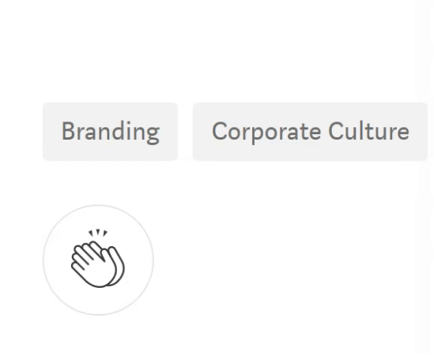
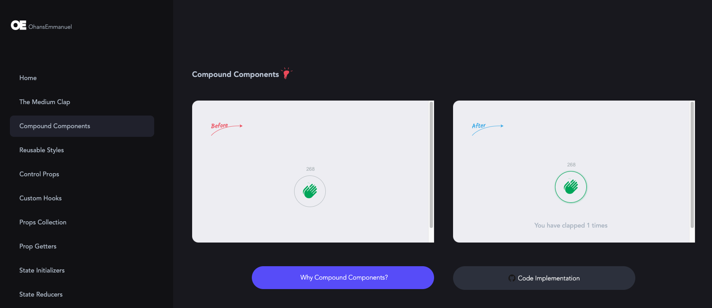

<h1 align="center"> The complete guide to advanced React Component patterns </h1>

In this course I have developed an app that replicates the [Medium](https://medium.com/) Clap, using different React design patterns.

## Medium Clap

The left side of the app allows you to select which implementation you want to observe. Each implementation has a similar behavior but, the design pattern is different for each one.

The used React patterns are listed below:

- Custom Hooks: Foundational Pattern.
- Compund Components
- Extensible Styles
- Control Props
- Custom Hooks
- Props Collection
- Prop Getters
- State Initializers
- State Reducers

<a href='https://react-component-patterns-sandraenciso.vercel.app/' target='_blank'>Live Demo ✨</a> 

