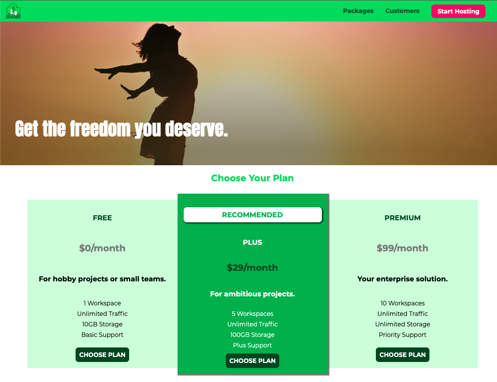
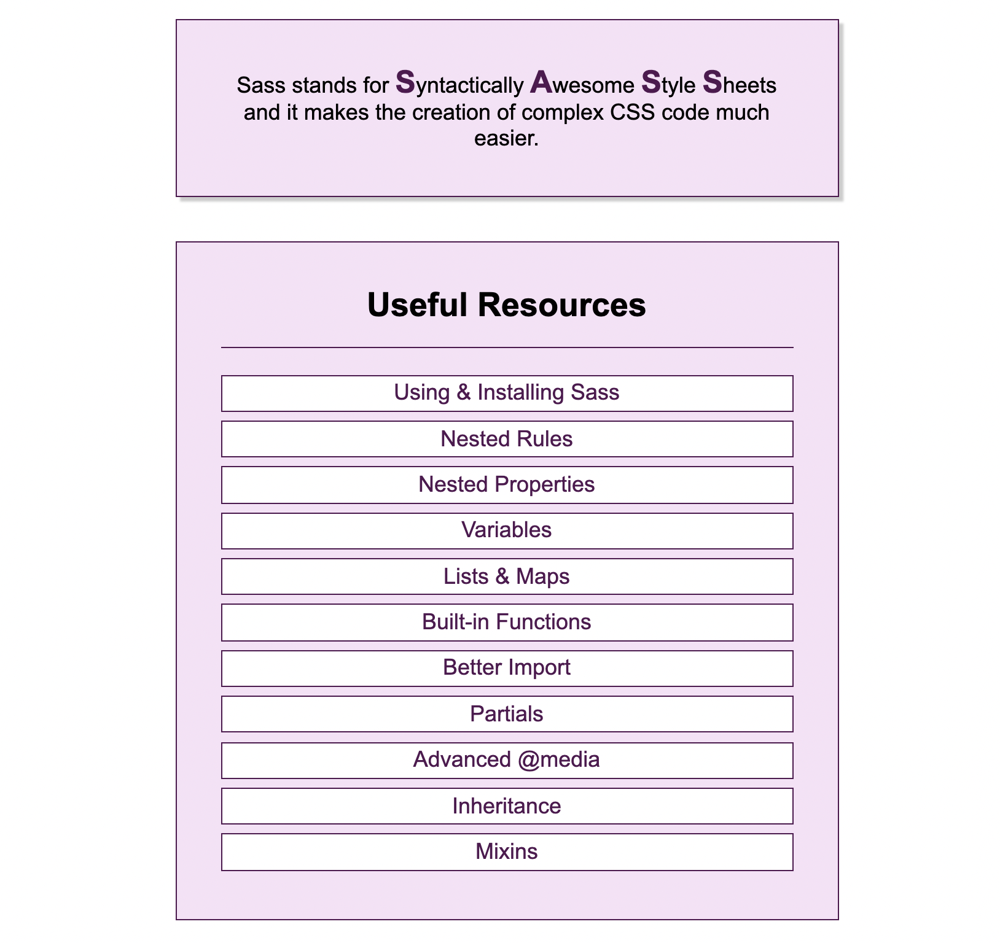

<h1 align="center"> CSS the complete guide </h1>

In this course, I have developed a host website using pure CSS and a small project using SASS.

## uHost website

This project is a responsive website sample from a hosting company, its interface was made with pure CSS and with a little help of javascript.

<a href='https://uhost-sandraenciso.vercel.app/' target=_blank'>Live Demo ✨</a> 
<a href='./css-project/' target='_blank'>Code 📂</a>

## SASS project

A little table created with SCSS, that contains useful links that redirect you to style rules SASS website.

<a href='https://scss-project-sandraenciso.vercel.app/' target=_blank'>Live Demo ✨</a> 
<a href='./scss-project/' target='_blank'>Code 📂</a>

