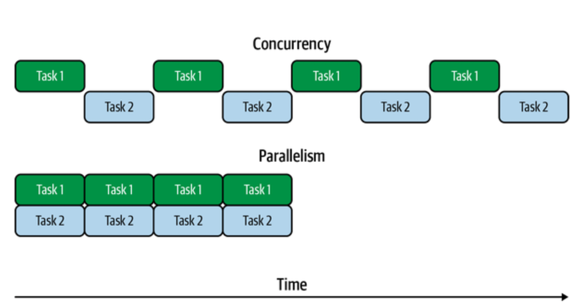

### Content

- [Chapter 1: Introduction](#chapter1)
  - [What Are Threads?](#WhatAreThreads)
  - [Concurrency Versus Parallelism](#ConcurrencyVersusParallelism)
  - [Single-Threaded JavaScript](#SingleThreadedJavaScript)
  - [Hidden Threads](#HiddenThreads)
  - [Threads in C: Get Rich with Happy Coins](#ThreadsinCGetRichwithHappycoin)
    - [With Only the Main Thread](#WithOnlytheMainThread)
    - [With Four Worker Threads](#WithFourWorkerThreads)

## <div id="chapter1"  />Chapter 1: Introduction

PCs in the 1980s typically had a single 8-bit CPU core and not a whole lot of memory. You typically could only run a single program at one time.

Eventually, people wanted to run more than one program at once, and multitasking was born. This allowed operating systems to run several programs at the same time by switching execution between them. Programs could decide when it would be an appropriate time to let another program run by yielding execution to the operating system. This approach is called _cooperative multitasking._

In a cooperative multitasking environment, when a program fails to yield execution for any reason, no other program can continue executing. This interruption of other programs is not desirable, so eventually, operating systems moved toward _preemptive multitasking_. In this model, the operating system would determine which program would run on the CPU at which time, using its own notion of scheduling.

To this day, almost every operating system uses this approach, even on multi-core systems, because we generally have more programs running than we have CPU cores.

Even today, in some high-level languages the appropriate way to run multiple tasks at once is to run additional processes. In some languages, like Ruby and Python, there’s a _global interpreter lock (GIL)_, meaning only one thread can be executing at a given time. While this makes memory management far more practical, it makes multithreaded programming not as attractive to programmers, and instead, multiple processes are employed.

Until fairly recently, JavaScript was a language where the only multitasking mechanisms available were splitting tasks up and scheduling their pieces for later execution, and in the case of Node.js, running additional processes. Multithreaded JavaScript. Today, in all major JavaScript environments, we have access to threads.

### <div id='WhatAreThreads'/>What Are Threads?

In all modern operating systems, all units of execution outside the kernel are organized into processes and threads. Without adding threads or additional processes, only one _instruction_ is executed at a time, in the appropriate order as prescribed by the program code.

A program may spawn additional processes, which have their own memory space. These processes do not share memory (unless it’s mapped in via additional system calls) and have their own instruction pointers, meaning each one can be executing a different instruction at the same time. If the processes are being executed on the same core, the processor may switch back and forth between processes, temporarily stopping execution for that one process while another one executes.

A thread is just like a process, except that it shares memory space with the process that it belongs to. A process can have many threads, and each one has its own instruction pointer.

In order for threads to be useful, they need to be able to coordinate with each other. This means they have to be able to do things like wait for things to happen on other threads and get data from them. As discussed, we have a shared memory space between threads, and with some other basic primitives, systems for passing messages between threads can be constructed.

### <div id='ConcurrencyVersusParallelism'/>Concurrency Versus Parallelism

It’s important to distinguish between concurrency and parallelism. These are closely related terms that can mean very similar things depending on the circumstances.

_Concurrency_
: Tasks are run in overlapping time.

_Parallelism_
: Tasks are run at exactly the same time.

<p align="center">

</p>

Threads do not automatically provide parallelism. The system hardware must allow for this by having multiple CPU cores, and the operating system scheduler must decide to run the threads on separate CPU cores. On single-core systems, or systems with more threads running than CPU cores, multiple threads may be run on a single CPU concurrently by switching between them at appropriate times.

It’s important to also think about this in terms of timing because threads are typically added to a program to increase performance. If your system is only allowing for concurrency due to only having a single CPU core available or being already loaded with other tasks, then there may not be any perceived benefit to using extra threads. In fact, the overhead of synchronization and context-switching between the threads may end up making the program perform even worse.

### <div id='SingleThreadedJavaScript'/>Single-Threaded JavaScript

Historically, the platforms that JavaScript ran on did not provide any thread support, so the language was thought of as single-threaded. Whenever you hear someone say that JavaScript is single-threaded, they’re referring to this historical background and the programming style that it naturally lent itself to. It’s true that, despite the title of this book, the language itself does not have any built-in functionality to create threads. Even such basics as setTimeout() aren’t actually JavaScript features. Instead, environments the virtual machine (VM) is embedded in, such as Node.js or browsers, provide these via environment-specific APIs.

Instead of threads as a concurrency primitive, most JavaScript code is written in an event-oriented manner operating on a single execution thread. As various events like user interactions or I/O happen, they trigger the execution of functions previously set to run upon these events. These functions are typically called _callbacks_ and are at the core of how asynchronous programming is done in Node.js and the browser. Even in promises or the **async/await** syntax, callbacks are the underlying primitive. It’s important to recognize that callbacks are not running in parallel, or alongside any other code. When code in a callback is running, that’s the only code that’s currently running.

It’s often easy to think of operations happening in parallel, when in fact they’re happening concurrently.

In the absence of threads, there’s only one JavaScript environment to work with. This means one instance of the VM, one instruction pointer, and one instance of the garbage collector.

In browsers, each frame in a web page has a realm for all of the JavaScript within it. Because each frame has its own copy of Object and other primitives within it, you’ll notice that they have their own inheritance trees, and **instanceof** might not work as you expect it to when operating on objects from different realms. This is demonstrated in the next example.

```js
// Objects from a different frame in a browser

const iframe = document.createElement("iframe");
document.body.appendChild(iframe);
const FrameObject = iframe.contentWindow.Object; // 1

console.log(Object === FrameObject); // 2
console.log(new Object() instanceof FrameObject); // 3
console.log(FrameObject.name); // 4
```

1. The global object inside the iframe is accessible with the _contentWindow_ property.
2. This returns false, so the _Object_ inside the frame is not the same as in the main frame.
3. _Instanceof_ evaluates to false, as expected since they’re not the same _Object_.
4. Despite all this, the constructors have the same name property.

In Node.js, realms can be constructed with the vm.createContext() function. In Node.js realms are called Contexts. All the same rules and properties applying to browser frames also apply to Contexts, but in Contexts, you don’t have access to any global properties or anything else that might be in scope in your Node.js files. If you want to use these features, they need to be manually passed in to the Context.

```js
// Objects from a new Context in Node.js
const vm = require("vm");
const ContextObject = vm.runInNewContext("Object"); // 1

console.log(Object === ContextObject); // 2
console.log(new Object() instanceof ContextObject); // 3
console.log(ContextObject.name); // 4
```

1. We can get objects from a new context using _runInNewContext_.
2. This returns _false_, so as with browser iframes, _Object_ inside the context is not the same as in the main context.
3. Similarly, _instanceof_ evaluates to false.
4. Once again, the constructors have the same name property.

In any of these realm cases, it’s important to note that we still only have one instruction pointer, and code from only one realm is running at a time, because we’re still only talking about single-threaded execution.

### <div id='HiddenThreads'/> Hidden Threads

While your JavaScript code may run, at least by default, in a single-threaded environment, that doesn’t mean the process running your code is single-threaded. It’s a common misconception that Node.js is a single-threaded process.

Modern JavaScript engines like V8 use separate threads to handle garbage collection and other features that don’t need to happen in line with JavaScript execution. In addition, the platform runtimes themselves may use additional threads to provide other features.

You should never assume that just because JavaScript is single-threaded that only one thread will be used by your JavaScript application.

### <div id='ThreadsinCGetRichwithHappycoin'/> Threads in C: Get Rich with Happycoin

Threads are obviously not unique to JavaScript. They’re a long-standing concept at the operating system level, independent of languages.

C is an obvious choice here because the C interface for threads is what underlies most thread implementations in higher-level languages, even if there may seem to be different semantics.

Let’s start with an example. Imagine a proof-of-work algorithm for a simple and impractical cryptocurrency called Happycoin, as follows:

1. Generate a random unsigned 64-bit integer.
2. Determine whether or not the integer is happy.
3. If it’s not happy, it’s not a Happycoin.
4. If it’s not divisible by 10,000, it’s not a Happycoin. 5. Otherwise, it’s a Happycoin.

A number is happy if it eventually goes to 1 when replacing it with the sum of the squares of its digits, and looping until either the 1 happens, or a previously seen number arises.

#### <div id='WithOnlytheMainThread'/>With Only the Main Thread

```c
/*ch1-c-threads/happycoin.c*/
#include  <inttypes.h>
#include  <stdbool.h>
#include  <stdio.h>
#include  <stdlib.h>
#include  <time.h>

uint64_t  random64(uint32_t  *  seed) {
	uint64_t result;
	uint8_t * result8 = (uint8_t *)&result; /*1*/

	for (size_t i = 0; i < sizeof(result); i++) {
		result8[i] = rand_r(seed);
	}
	return result;
}
```

1. This line uses pointers. The short version of what’s going on here is that result8 is an array of eight 8-bit unsigned integers, backed by the same memory as result, which is a single 64-bit unsigned integer.

Now let’s add our happy number calculation

```c
/*ch1-c-threads/happycoin.c*/
uint64_t  sum_digits_squared(uint64_t  num) {
	uint64_t total = 0;
	while (num > 0) {
		uint64_t num_mod_base = num % 10;
		total += num_mod_base * num_mod_base;
		num = num / 10;
	}
	return total;
}

bool  is_happy(uint64_t  num) {
	while (num != 1 && num != 4) {
		num = sum_digits_squared(num);
	}
	return num == 1;
}

bool  is_happycoin(uint64_t  num) {
	return is_happy(num) && num % 10000 == 0;
}
```

Let’s wrap this all up in our _main()_ function

```c
/*ch1-c-threads/happycoin.c*/
int  main() {
	uint32_t seed = time(NULL);
	int count = 0;
	for (int i = 1; i < 10000000; i++) {
		uint64_t random_num = random64(&seed);
		if (is_happycoin(random_num)) {
			printf("%" PRIu64 " ", random_num);
			count++;
		}
	}
	printf("\ncount %d\n", count);
	return 0;
}
```

First, we need a seed for the random number generator. The current time is as suitable a seed as any, so we’ll use that via _time()_. Then, we’ll loop 10,000,000 times, first getting a random number from _random64()_, then checking if it’s a Happycoin. If it is, we’ll increment the _count_ and print the number out. The weird _PRIu64_ syntax in the _printf()_ call is necessary for properly printing out 64-bit unsigned integers. When the loop completes, we print out the count and exit the program.

It takes a nontrivial amount of time to run this program; about 2 seconds on a run-of-the-mill computer. This is a case where threads can be useful to speed things up because many iterations of the same largely mathematical operation are being run.

Let’s go ahead and convert this example to a multithreaded program.

#### <div id='WithFourWorkerThreads'/> With Four Worker Threads

The _pthread_create()_ function is use to create a thread. A function is passed in that will be executed on that thread. Program flow continues on the main thread. The program can wait for a thread’s completion by calling _pthread_join()_ on it. You can pass arguments to the function being run on the thread via _pthread_create()_ and get return values from _pthread_join()_.

Make a copy of your existing happycoin.c and name it happycoin-threads.c. Then in the new file, insert the code under the last #include in the file.

```c
#include  <pthread.h>

struct happy_result {
	size_t count;
	uint64_t * nums;
};
```

Now, go ahead and delete the whole main() function because we’re about to replace it. First, let’s add our _get_happycoins()_ function

```c
void  *  get_happycoins(void  *  arg) {
	int attempts = *(int *)arg; /*1*/
	int limit = attempts/10000;
	uint32_t seed = time(NULL);
	uint64_t * nums = malloc(limit * sizeof(uint64_t));
	struct happy_result * result = malloc(sizeof(struct happy_result));
	result->nums = nums;
	result->count = 0;

	for (int i = 1; i < attempts; i++) {
		if (result->count == limit) {
			break;
		}
		uint64_t random_num = random64(&seed);
		if (is_happycoin(random_num)) {
			result->nums[result->count++] = random_num;
		}
	}
	return (void *)result;
}
```

1. This weird pointer casting thing basically says “treat this arbitrary pointer as a pointer to an int, and then get me the value of that int.”

Once the loop is done, we return the _struct_ as a pointer, which we cast as _void \*_ to satisfy the function signature. This is how information is passed back to the main thread, which will make sense of it.

This demonstrates one of the key properties of threads that we don’t get from processes, which is the shared memory space.

Thanks to virtual memory, the memory address might refer to something else entirely in the main process. Instead of passing a pointer, we’d have to pass the entire value back over the _IPC (interprocess communication)_ channel, which can introduce performance overhead. Since we’re using threads instead of processes, we can just use the pointer, so that the main thread can use it just the same.

In a great multitude of cases, it’s necessary to properly manage how threads access shared memory via synchronization; otherwise, some unpredictable results may occur.

Now, let’s wrap this up with the _main()_ function.

```c
#define  THREAD_COUNT 4
int main() {
	pthread_t thread [THREAD_COUNT];

	int attempts = 10000000/THREAD_COUNT;
	int count = 0;
	for (int i = 0; i < THREAD_COUNT; i++) {
		pthread_create(&thread[i], NULL, get_happycoins, &attempts);
	}

	for (int j = 0; j < THREAD_COUNT; j++) {
		struct happy_result * result;
		pthread_join(thread[j], (void **)&result);
		count += result->count;
		for (int k = 0; k < result->count; k++) {
			printf("%" PRIu64 " ", result->nums[k]);
		}
	}
	printf("\ncount %d\n", count);
	return 0;
}
```

First, we’ll declare our four threads as an array on the stack. Then, we divide our desired number of attempts (10,000,000) by the number of threads. This is what will be passed to _get_happycoins()_ as an argument, which we see inside the first loop, which creates each of the threads with _pthread_create()_, passing in the number of attempts per thread as an argument. In the next loop, we wait for each of the threads to finish their execution with _pthread_join()_. Then we can print the results and the total from all the threads, just like we would in the single- threaded example.

We could print the results as soon as they’re ready on the thread that’s doing the work, but if we do that, the results may clobber each other in the output.

Any programming language supporting threads is going to provide some mechanisms for creating and destroying threads, passing messages in between, and interacting with data that’s shared between the threads.
