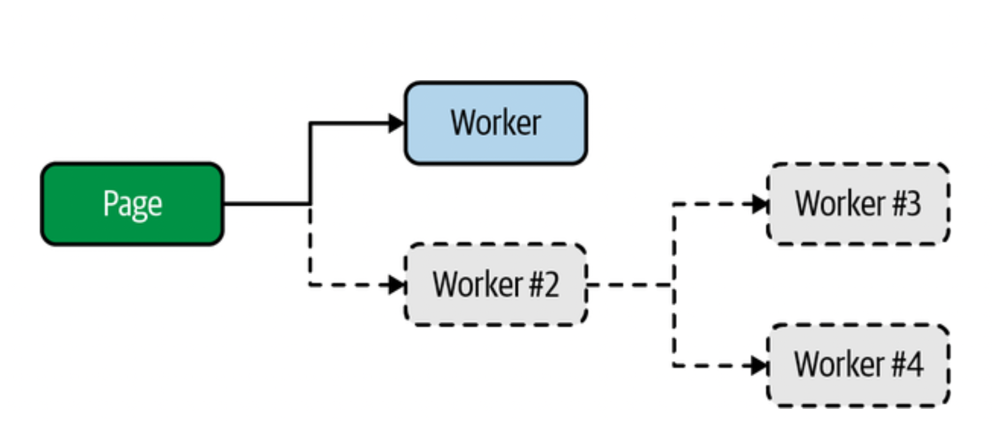

### Content

- [Chapter 2: Browsers](#chapter2)
  - [Dedicated Workers](#DedicatedWorkers)
    - [Dedicated Worker Hello World](#DedicatedWorkerHelloWorld)
    - [Advanced Dedicated Worker Usage](#AdvancedDedicatedWorkerUsage)
  - [Shared Workers](#SharedWorkers)
    - [Shared Worker Hello World](#SharedWorkerHelloWorld)
    - [Advanced Shared Worker Usage](#AdvancedSharedWorkerUsage)
  - [Service Workers](#ServiceWorkers)
    - [Service Worker Hello World](#ServiceWorkerHelloWorld)
    - [Advanced Service Worker Concepts](#AdvancedServiceWorkerConcepts)
  - [Message Passing Abstractions](#MessagePassingAbstractions)
    - [The PRC Pattern](#TheRPCPattern)
    - [The Command Dispatcher Pattern](#TheCommandDispatcherPattern)
    - [Putting It All Together](#PuttingItAllTogether)

## <div id='chapter2'/>Chapter 2. Browsers

Not every engine implements JavaScript the same way. Certainly, browser vendors attempt to implement JavaScript features in the same manner, but bugs do happen.

### <div id='DedicatedWorkers'/>Dedicated Workers

Web workers allow you to spawn a new environment for executing JavaScript in. Communication occurs between these two environments by using a pattern called **message passing**.

It’s possible for a JavaScript environment to spawn more than one web worker, and a given web worker is free to spawn even more web workers.

There is more than one type of web worker, the simplest of which is the dedicated worker.

#### <div id='DedicatedWorkerHelloWorld'/>Dedicated Worker Hello World

The relationship between page and worker that you are building is displayed in the next figure:

<p align="center">

</p>

Now let's create a single worker, but a hierarchy of workers is also achievable.

First, create an index.html file. JavaScript that runs in the browser needs to first be loaded by a web page, and this file represents the basis of that web page.

```html
<html>
  <head>
    <title>Web Workers Hello World</title>
    <script src="main.js"></script>
  </head>
</html>
```

All it is doing is setting a title and loading a single JavaScript file named main.js. The more interesting part is what’s inside the main.js file.

```js
//main.js
console.log("hello from main.js");

const worker = new Worker("worker.js"); // 1

worker.onmessage = (msg) => {
  // 2
  console.log("message received from worker", msg.data);
};

worker.postMessage("message sent to worker"); // 3

console.log("hello from end of main.js");
```

1. Instantiation of a new dedicated worker.
2. A message handler is attached to the worker.
3. A message is passed into the worker

The first thing that happens in this file is that a call to _console.log()_ is made. The next thing that happens is that a new dedicated worker gets instantiated. This is done by calling _new Worker(filename)_. Once called, the JavaScript engine begins the download (or cache lookup) for the appropriate file in the background.

Next, a handler for the _message_ event is attached to the worker. This is done by assigning a function to the _.onmessage_ property of the dedicated worker. When a message is received, that function gets called. The argument provided to the function is an instance of _MessageEvent_. It comes with a bunch of properties, but the one that’s most interesting is the _.data property_. This represents the object that was returned from the dedicated worker.

Finally, a call to the dedicated worker’s _.postMessage()_ method is made. This is how the JavaScript environment that instantiates the dedicated worker is able to communicate with the dedicated worker. In this case a basic string has been passed into the dedicated worker. There are restrictions on what kind of data can be passed into this method.

Now that your main JavaScript file is finished, you’re ready to create the file that will be executed within the dedicated worker.

```js
console.log("hello from worker.js");

self.onmessage = (msg) => {
  console.log("message from main", msg.data);
  postMessage("message sent from worker");
};
```

In this file a single global function named _onmessage_ is defined and a function is assigned to it. This _onmessage_ function, inside the dedicated worker, is called when the _worker.postMessage()_ method is called from outside the dedicated worker. This assignment could also have been written as _onmessage =_ or even _var onmessage =_, but using _const onmessage =_ or _let onmessage =_ or even declaring _function onmessage_ won’t work. The _self_ identifier is an alias for _globalThis_ inside a web worker where the otherwise familiar _window_ isn’t available.

There are some additional rules when it comes to loading a dedicated worker script file. The file that is loaded must be in the same origin that the main JavaScript environment is running in. Also, browsers won’t allow you to run dedicated workers when JavaScript runs using the _file:// protocol_, which is a fancy way of saying you can’t simply double-click the _index.html_ file and view the application running. Instead, you’ll need to run your application from a web server.

if you have a recent Node.js installed, you can run the following command to start a very basic web server locally:

```
$ npx serve
```

Once executed, this command spins up a server that hosts files from the local filesystem. It also displays the URL that the server is available as.

Example console output:

| Log                                                    |       Location |
| :----------------------------------------------------- | -------------: |
| hello from main.js                                     |    main.js:1:9 |
| hello from end of main.js                              |   main.js:11:9 |
| hello from worker.js                                   |  worker.js:1:9 |
| message from main, message sent to worker              | worker.js:4:11 |
| message received from worker, message sent from worker |   main.js:6:11 |

This output confirms the order in which the messages have been executed. First, the _main.js_ file is loaded, and its output is printed. The worker is instantiated and configured, its _postMessage()_ method is called, and then the last message gets printed as well. Next, the _worker.js_ file is run, and its message handler is called, printing a message. It then calls _postMessage()_ to send a message back to _main.js_. Finally, the _onmessage_ handler for the dedicated worker is called in _main.js_, and the final message is printed.

#### <div id='AdvancedDedicatedWorkerUsage'/> Advanced Dedicated Worker Usage

Loading new JavaScript code is done either by loading a script with a _\<script\>_ tag, or by making an _XHR_ request and using the _eval()_ function with a string representing the code. When it comes to dedicated workers, you can’t inject a _\<script\>_ tag into the _DOM_ because there’s no _DOM_ associated with the worker.

Instead, you can make use of the _importScripts()_ function, which is a global function only available within web workers.

These scripts will be loaded from the same origin as the web page. These scripts are loaded in a synchronous manner, so code that follows the function call will run after the scripts are loaded.

Instances of _Worker_ inherit from _EventTarget_ and have some generic methods for dealing with events. The _Worker class_ provides the most important methods on the instance. The following is a list of these methods.

_worker.postMessage(msg)_
: This sends a message to the worker that is handled by the event loop before invoking the _self.onmessage_ function, passing in msg.

_worker.onmessage_
: If assigned, it is in turn invoked when the _self.postMessage_ function inside the worker is called.

_worker.onerror_
: If assigned, it is invoked when an error is thrown inside the worker. A single _ErrorEvent_ argument is provided, having _.colno_, _.lineno_, _.filename_, and _.message_ properties. This error will bubble up unless you call _err.preventDefault()_.

_worker.onmessageerror_
: If assigned, this is invoked when the worker receives a message that it cannot deserialize.

_worker.terminate()_
: If called, the worker terminates immediately. Future calls to _worker.postMessage()_ will silently fail.

Inside the dedicated worker, the global _self_ variable is an instance of _WorkerGlobalScope_. The most notable addition is the _importScripts()_ function for injecting new _JavaScript_ files. Some of the high-level communication APIs like _XMLHttpRequest_, _WebSocket_, and _fetch()_ are available. Useful functions that aren’t necessarily part of _JavaScript_ but are rebuilt by every major engine, like _setTimeout()_, _setInterval()_, _atob()_, and _btoa()_, are also available. The two data-storage APIs, _localStorage_ and _indexedDB_, are available.

Generally, APIs that modify the global state of the web page aren’t available.

When instantiating a dedicated worker, there is an optional second argument for specifying the options for the worker. The instantiation takes on the following signature:

```js
const worker = new Worker(filename, options);
```

The options argument is an object that can contain the properties listed here:

_type_
: Either _classic_ (default), for a _classic_ JavaScript file, or _module_, to specify an ECMAScript Module (ESM).

_credentials_
: This value determines if _HTTP_ credentials are sent with the request to get the worker file. The value can be omit to exclude the credentials, _same-origin_ to send credentials (but only if the origin matches), or _include_ to always send the credentials.

_name_
: This names a dedicated worker and is mostly used for debugging. The value is provided in the worker as a global named _name_.

### <div id='SharedWorkers'/> Shared Workers

A **shared worker** is another type of web worker, but what makes it special is that a shared worker can be accessed by different browser environments, such as different windows (tabs), across iframes, and even from different web workers. They also have a different self within the worker, being an instance of _SharedWorkerGlobalScope_.

Shared workers can be used to hold a semipersistent state that is maintained when other windows connect to it. For example, if Window 1 tells the shared worker to write a value, then Window 2 can ask the shared worker to read that value back. Refresh Window 1 and the value is still maintained. Refresh Window 2 and it’s also retained.

|                                                                                                                     <p  style='color:red'/>_WARNING_</p>                                                                                                                      |
| :---------------------------------------------------------------------------------------------------------------------------------------------------------------------------------------------------------------------------------------------------------------------------: |
| A shared worker JavaScript file is cached while multiple windows are using it; refreshing a page won’t necessarily reload your changes. Instead, you’ll need to close other open browser windows, then refresh the remaining window, to get the browser to run your new code. |

#### <div id='SharedWorkerHelloWorld'/> Shared Worker Hello World

A shared worker is “keyed” based on its location in the current origin. There is a way to create different shared worker instances using the same JavaScript file.

The relationship between the page and the worker that you are building is displayed in the figure below:

<p align="center">

</p>

Now, it's time to create some files in a directory named ch2-shared-workers/ for shared worker example.

```html
<!-- red.html -->
<html>
  <head>
    <title>Shared Workers Red</title>
    <script src="red.js"></script>
  </head>
</html>
```

Much like the HTML file you created in the previous section, this one just sets a title and loads a JavaScript file.

Once that’s done, create another HTML file:

```html
<!-- blue.html -->
<html>
  <head>
    <title>Shared Workers Blue</title>
    <script src="blue.js"></script>
  </head>
</html>
```

For this example you’re going to work with two separate HTML files, each representing a new JavaScript environment that will be available on the same origin. Technically, you could have reused the same HTML file in both windows, but we want to make it very explicit that none of the state is going to be associated with the HTML files or the red/blue JavaScript files.

Next, you’re ready to create the first JavaScript file loaded directly by an HTML file.

```js
// red.js
console.log("red.js");

const worker = new SharedWorker("shared-worker.js"); // 1

worker.port.onmessage = (event) => {
  // 2
  console.log("EVENT", event.data);
};
```

1. Instantiate the shared worker
2. Note the _worker.port_ property for communications

This JavaScript file is rather basic. What it does is instantiate a shared worker instance by calling _new SharedWorker()_. After that it adds a handler for message events that are emitted from the shared worker. When a message is received, it is simply printed to the console.

Unlike with _Worker_ instances, where you called _.onmessage_ directly, with _SharedWorker_ instances you’ll make use of the _.port property_.

Next, copy and paste the _red.js_ file and name it _blue.js_. Update the _console.log()_ call to print _blue.js_.

Finally, create a _shared-worker.js_ file. This is where most of the magic will happen.

```js
const ID = Math.floor(Math.random() * 999999); // 1
console.log("shared-worker.js", ID);

const ports = new Set(); // 2
self.onconnect = (event) => {
  // 3
  const port = event.ports[0];
  ports.add(port);
  console.log("CONN", ID, ports.size);

  port.onmessage = (event) => {
    // 4
    console.log("MESSAGE", ID, event.data);
    for (let p of ports) {
      // 5
      p.postMessage([ID, event.data]);
    }
  };
};
```

1. Random ID for debugging
2. Singleton list of ports
3. Connection event handler
4. Callback when a new message is received
5. Messages are dispatched to each window

The first thing that happens in this file is that a random ID value is generated. This value is printed in the console and later passed to the calling JavaScript environments.

An event listener for the message event is also attached to the port. Much like the _onmessage_ method you used previously with the _Worker_ instance, this method is called when one of the external JavaScript environments calls the applicable _.postMessage()_ method. When a message is received, the code prints the ID value and the data that was received.

The event listener also dispatches the message back to the calling environments. It does this by iterating the _ports_ set, calling the _.postMessage()_ method for each of the encountered ports. Since this method only takes a single argument, an array is passed in to sort of emulate multiple arguments. The first element of this array is the ID value again, and the second is the data that was passed in.

With most popular _WebSockets_ packages, an event is triggered when a connection is made, and the connection argument can then have a message listener attached to it.

Then, run your server and once the page has loaded, you should see the messages listed in the next table displayed in your console.

| Log                     | Location              |
| ----------------------- | --------------------- |
| red.js                  | red.js:1:9            |
| shared-worker.js 278794 | shared-worker.js:2:9  |
| CONN 278794 1           | shared-worker.js:9:11 |

In our case we can see that the _red.js_ file was executed, that this particular _shared-worker.js_ instance generated an ID of 278794, and that there is currently a single window connected to this shared worker.

Next, open another browser window. Again, open the web inspector first, switch to the Console tab, paste the base URL that was provided by the serve command, and then add _/blue.html_ to the end of the URL.

Once the page loads, you should only see a single message printed in the console output stating that the _blue.js_ file was executed. At this point it’s not too interesting. But switch back to the previous window you had opened for the _red.html_ page.

You should see that the new log listed in the next table has been added.

| Log           | Location              |
| ------------- | --------------------- |
| CONN 278794 2 | shared-worker.js:9:11 |

Now things are getting a little exciting. The shared worker environment now has two references to a _MessagePort_ instance pointing to two separate windows. At the same time, two windows have references to _MessagePort_ instances for the same shared worker.

Switch focus to the console window and type in the following command:

```js
worker.port.postMessage("hello, world");
```

Press Enter to execute that line of JavaScript. You should see a message in the first console that is generated in the shared worker, a message in the first console from _red.js_, and a message in the second window’s console from _blue.js_. In our case we see the outputs listed in the table below.

| Log                                   | Location               | Console |
| :------------------------------------ | :--------------------- | :------ |
| MESSAGE 278794 hello, world           | shared-worker.js:12:13 | 1       |
| EVENT Array [ 278794, “hello, world”] | red.js:6:11            | 1       |
| EVENT Array [ 278794, “hello, world”] | blue.js:6:11           | 2       |

At this point you’ve successfully sent a message from the JavaScript environment available in one window to the JavaScript environment in a shared worker, and then passed a message from the worker to two separate windows.

#### <div id='AdvancedSharedWorkerUsage'/> Advanced Shared Worker Usage

The shared worker instances do have access to a _connect_ event, which can be handled with the _self.onconnect()_ method. Notably missing, especially if you’re familiar with WebSockets, is a _disconnect_ or _close_ event.

One thing you can do to address this is to add an event listener in your main JavaScript environments (i.e., _red.js_ and _blue.js_) that fires when the page is being torn down. Have this event listener pass a special message to the shared worker. Within the shared worker, when the message is received, remove the port from the list of ports. Here’s an example of how to do this:

```js
// main JavaScript file
window.addEventListener("beforeunload", () => {
  worker.port.postMessage("close");
});

// shared worker
port.onmessage = (event) => {
  if (event.data === "close") {
    ports.delete(port);
    return;
  }
};
```

If the _beforeunload_ event doesn’t fire, or if an error happens when it’s fired, or if the page crashes in an unanticipated way, this can lead to expired port references sticking around in the shared worker.

Interacting with ports that no longer have a valid JavaScript associated with them doesn’t have much of a side effect.

The full constructor for the _SharedWorker_ class looks like this:

```js
const worker = new SharedWorker(filename, nameOrOptions);
```

Much like with a _Worker_ instance, the name of the worker is available inside the worker as _self.name_.

You can think of these shared worker instances as being “keyed” by not only their URL but also their name. This may be why the signature changes between a _Worker_ and a _SharedWorker_, as the name is much more important for the latter.

Other than the ability to replace the options argument with a string name, the options argument for a _SharedWorker_ is exactly the same as it is for a _Worker_.

You can even create multiple shared workers that point to the same instance, assuming the URLs and names match. When this happens, both of the _SharedWorker_ instances’ _.port_ properties are able to receive messages.

These _SharedWorker_ instances are definitely capable of maintaining state between page loads. However, that state would be lost if both pages were refreshed simultaneously, one closed and the other refreshed, or if both were closed.

### <div id='ServiceWorkers'/> Service Workers

A service worker functions as a sort of proxy that sits between one or more web pages running in the browser and the server. A service worker can exist and run in the background even when a page isn’t necessarily still open.

Service workers are primarily intended for performing cache management of a website or a single page application. You really shouldn’t use service workers just for the purpose of offloading CPU-intensive work to another thread.

Service workers expose a larger API than that of the other web workers, though their primary use case is not for offloading heavy computation from the main thread.

Browsers will only allow service workers to run on a web page that has been served using the HTTPS protocol. A service worker instance can’t communicate between a normal and Incognito window.

|                                                                                                                                                                                                          Debugging Service Workers                                                                                                                                                                                                          |
| :-----------------------------------------------------------------------------------------------------------------------------------------------------------------------------------------------------------------------------------------------------------------------------------------------------------------------------------------------------------------------------------------------------------------------------------------: |
| To get into the inspector panels for your service worker instances, you’ll need to go somewhere else. In Firefox, open the address bar and visit about:debugging#/runtime/this-firefox. The more robust page is located at chrome://serviceworker-internals/. It contains a listing of service workers, their status, and basic log output. The other one is at chrome://inspect/#service- workers, and it contains a lot less information. |

#### <div id='ServiceWorkerHelloWorld'/> Service Worker Hello World

In this section you’re going to build a very basic service worker that intercepts all HTTP requests sent from a basic web page. Most of the requests will pass through to the server unaltered. However, requests made to a specific resource will instead return a value that is calculated by the service worker itself.

The first file you’ll need is again an HTML file. Make a new directory named ch2-service-workers/

```html
<!-- index.html -->
<html>
  <head>
    <title>Service Workers Example</title>
    <script src="main.js"></script>
  </head>
</html>
```

This is a rather basic file that just loads your application’s JavaScript file, which comes next. Create a file named _main.js_.

```js
/*main.js*/
navigator.serviceWorker.register("/sw.js", {
  // 1
  scope: "/",
});

navigator.serviceWorker.oncontrollerchange = () => {
  // 2
  console.log("controller change");
};

async function makeRequest() {
  // 3
  const result = await fetch("/data.json");
  const payload = await result.json();
  console.log(payload);
}
```

1. Registers service worker and defines scope.
2. Listens for a _controllerchange_ event
3. Function to initiate request.

Unlike the other web workers you worked with, you aren’t using the _new_ keyword with a constructor. Instead, this code depends on the _navigator.serviceWorker_ object to create the worker. The first argument is the path to the JavaScript file that acts as the service worker. The second argument is an optional configuration object that supports a single _scope_ property.

The _scope_ represents the directory for the current origin wherein any HTML pages that are loaded in it will have their requests passed through the service worker. By default, the scope value is the same as the directory that the service worker is loaded from. In this case, the / value is relative to the _index.html_ directory, and because _sw.js_ is located in the same directory, we could have omitted the scope and it would behave exactly the same.

Once the service worker has been installed for the page, all outbound HTTP requests will get sent through the service worker. This includes requests made to different origins.

If the scope had been set to _/foo_, then a page opened at _/bar.html_ will be unaffected by the service worker, but a page at _/foo/baz.html_ would be affected.

The next thing that happens is that a listener for the _controllerchange_ event is added to the _navigator.serviceWorker_ object.

Finally, a function named _makeRequest()_ is defined. This function makes a GET request to the _/data.json_ path, decodes the response as JavaScript Object Notation (JSON), and prints the result.

With that file out of the way, you’re now ready to create the service worker itself. Create a third file named _sw.js_

```js
// sw.js
let counter = 0;

self.oninstall = (event) => {
  console.log("service worker install");
};

self.onactivate = (event) => {
  console.log("service worker activate");
  event.waitUntil(self.clients.claim()); // 1
};

self.onfetch = (event) => {
  console.log("fetch", event.request.url);
  if (event.request.url.endsWith("/data.json")) {
    counter++;
    event.respondWith(
      // 2
      new Response(JSON.stringify({ counter }), {
        headers: {
          "Content-Type": "application/json",
        },
      })
    );
    return;
  }
  // fallback to normal HTTP request
  event.respondWith(fetch(event.request)); // 3
};
```

1. Allows service worker to claim the opened _index.html_ page.
2. Override for when /_data.json_ is requested.
3. Other URLs will fall back to a normal network request.

The first thing that happens in this file is that a global variable _counter_ is initialized to zero. Later, when certain types of requests are intercepted, that number will increment.

After that, we create a handler for the _install_ event by assigning a function to _self.oninstall_. This function runs when this version of the service worker is installed for the very first time in the browser. However, because this basic application doesn’t have much to do in the way of instantiation, it just prints a message and finishes.

Next up is a function for handling the _activate_ event. This event is useful for performing cleanup work when new versions of the service worker are introduced.

In this case, the _activate_ handler function is making a call to the _self.clients.claim()_ method. Calling this allows the page instance that first created the service worker, that is, the _index.html_ page you’ll open for the first time, to then get controlled by the service worker.

The call to _self.clients.claim()_ returns a promise. Sadly, event handler functions used in service workers are not async functions able to await promises. However, the event argument is an object with a _.waitUntil()_ method, which does work with a promise. Once the promise provided to that method resolves, it will allow the _oninstall_ and _onactivate_ (and later _onfetch_) handlers to finish. By not calling that method, like in the _oninstall_ handler, the step is considered finished once the function exits.

The last event handler is the _onfetch_ function. This handler is called every time a network request is made by a web page under control of the service worker. It’s called _onfetch_ to signal that it correlates to the *fetch() *function in the browser.

This function first logs a message to confirm that it’s being run and also printing the URL that is being requested. Other information about the requested resource is also available, such as headers and the HTTP method. In a real-world application this information can be used to consult with a cache to see if the resource already exists. For example, a GET request to a resource within the current origin could be served from the cache, but if it doesn’t exist, it could be requested using the _fetch()_ function, then inserted into the cache, then returned to the browser.

This basic example just takes the URL and checks to see if it’s for a URL that ends in _/data.json_. If it is not, the if statement body is skipped, and the final line of the function is called. This line just takes the request object (which is an instance of _Request_), passes it to the _fetch()_ method, which returns a promise, and passes that promise to _event.respondWith()_. The _fetch()_ method will resolve an object that will then be used to represent the response, which is then provided to the browser. This is essentially a very basic HTTP proxy.

Circling back to the _/data.json_ URL check, if it does pass, then something more complicated happens. In that case the counter variable is incremented, and a new response is generated from scratch (which is an instance of _Response_). In this case, a JSON string is constructed that contains the counter value. This is provided as the first argument to Response, which represents the response body. The second argument contains meta information about the response. In this case the _Content-Type_ header is set to _application/json_, which suggests to the browser that the response is a JSON payload.

Now that your files have been created, run your server.

Again, copy the URL that was provided, open a new web browser window, open the inspector, then paste the URL to visit the page. You should see this message printed in your console (and possibly others):

```
controller change main.js:6:11
```

Next, browse to the list of service workers installed in your browser using the aforementioned technique. Within the inspector, you should see the previously logged messages; specifically you should see these two:

```
service worker install sw.js:4:11
service worker activate sw.js:8:11
```

Next, switch back to the browser window. While in the Console tab of the inspector, run the following line of code:

```
makeRequest();
```

This runs the _makeRequest()_ function, which triggers an HTTP GET request to _/data.json_ of the current origin. Once it completes, you should see the message _Object { counter: 1 }_ displayed in your console. That message was generated using the service worker, and the request was never sent to the web server. If you switch to the network tab of the inspector, you should see what looks like an otherwise normal request to get the resource. If you click the request, you should see that it replied with a 200 status code, and the _Content-Type_ header should be set to _application/json_ as well. As far as the web page is concerned, it did make a normal HTTP request.

On our machine we get the following:

```
fetch http://localhost:5000/data.json sw.js:13:11
```

At this point you’ve successfully intercepted an HTTP request from one JavaScript environment, performed some computation in another environment, and returned the result back to the main environment. Much like with the other web workers, this calculation was done in a separate thread, running code in parallel.

|                                                                                                                                                                                                                                                        TIP                                                                                                                                                                                                                                                        |
| :---------------------------------------------------------------------------------------------------------------------------------------------------------------------------------------------------------------------------------------------------------------------------------------------------------------------------------------------------------------------------------------------------------------------------------------------------------------------------------------------------------------: |
| In your first browser window, you might have noticed an error that an attempt to download the _favicon.ico_ file was made but failed. You might also be wondering why the shared worker console doesn’t mention this file. That’s because, at the point when the window was first opened, it wasn’t yet under control of the service worker, so the request was made directly over the network, bypassing the worker. Debugging service workers can be confusing, and this is one of the caveats to keep in mind. |

#### <div id='AdvancedServiceWorkerConcepts'/> Advanced Service Worker Concepts

Service workers are intended to only be used for performing asynchronous operations. Because of that, the _localStorage_ API, which technically blocks when reading and writing, isn’t available. However, the asynchronous _indexedDB_ API is available. Top-level await is disabled within service workers as well.

When it comes to keeping track of state, you’ll mostly be using _self.caches_ and _indexedDB_.

While debugging your service workers, you might find that they occasionally end up stopped, at which point you’re not allowed to hop into the inspector. The browsers have a button that allows you to start the worker again, allowing you to hop back into the inspector. It’s this stopping and starting that flushes out global state.

The Chrome browser does offer the ability to trigger an update to the script when reloading the page; to do this, navigate to the Application tab in the inspector, then click “Service Workers,” then click the “Update on reload” checkbox.

Every service worker goes through a state change from the time of its inception until the time it can be used. This state is available within the service worker by reading the _self.serviceWorker.state_ property. Here’s a list of the stages it goes through:

_parsed_
: This is the very first state of the service worker. At this point the JavaScript content of the file has been parsed. This is more of an internal state that you’ll probably never encounter in your application.

_installing_
: The installation has begun but is not yet complete. This happens once per worker version. This state is active after _oninstall_ is called and before the _event.respondWith()_ promise has resolved.

_installed_
: At this point the installation is complete. The _onactivate_ handler is going to be called next.

_activating_
: This state happens when _onactivate_ is called but the _event.respondWith()_ promise hasn’t yet resolved.

_activated_
: The activation is complete, and the worker is ready to do its thing. At this point _fetch_ events will get intercepted.

_redundant_
: At this point, a newer version of the script has been loaded, and the previous script is no longer necessary. This can also be triggered if the worker script download fails, if it contains a syntax error, or if an error is thrown.

Philosophically, service workers should be treated as a form of progressive enhancement. This means that any web pages using them should still behave as usual if the service worker isn’t used at all. This is important because you might encounter a browser that doesn’t support service workers, or the installation phase might fail, or privacy- conscientious users might disable them entirely. In other words, if you’re only looking to add multithreading capabilities to your application, then choose one of the other web workers instead.

The global self object used inside service workers is an instance of _ServiceWorkerGlobalScope_. The _importScripts()_ function available in other web workers is available in this environment as well. Like the other workers, it’s also possible to pass messages into, and receive messages from, a service worker.

|                                                                                                                                                                                                                                                                                                                                                                                                                                                                                                                                                                                                             CROSS-DOCUMENT COMMUNICATION                                                                                                                                                                                                                                                                                                                                                                                                                                                                                                                                                                                                              |
| :---------------------------------------------------------------------------------------------------------------------------------------------------------------------------------------------------------------------------------------------------------------------------------------------------------------------------------------------------------------------------------------------------------------------------------------------------------------------------------------------------------------------------------------------------------------------------------------------------------------------------------------------------------------------------------------------------------------------------------------------------------------------------------------------------------------------------------------------------------------------------------------------------------------------------------------------------------------------------------------------------------------------------------------------------------------------------------------------------------------------------------------------------------------------------------------------------------------------------------------------------: |
| There are other ways to employ multithreaded JavaScript programming in browsers without needing to instantiate a web worker. Browsers provide APIs to allow for communication across these pages. The first approach works by embedding iframes in a web page, or by creating a pop-up window, and has been available before web workers existed. The parent window is able to get a reference to the child window and can then call a _.postMessage()_ method on that reference to send messages to the child. The child window can then listen for message events on its window object. The child can also pass messages back to the parent window. This pattern likely inspired the web worker interfaces. Instantiating a new _BroadcastChannel_ instance, passing in the name of a channel as the first argument. This channel then allows for _pub/sub_ (publish and subscribe) communication. The resulting object has a _.postMessage()_ method and can have an _.onmessage_ handler assigned. All objects that are listening on this channel across different environments will all have their message handler called when a message has been posted. The instance also has a _.close()_ method to disconnect the instance from the channel. |

### <div id='MessagePassingAbstractions'/> Message Passing Abstractions

When it comes to building larger applications it’ll be important to pass messages along that can scale and run code in workers that can scale, and simplifying the interface when working with workers will also reduce potential errors.

#### <div id='TheRPCPattern'/>The RPC Pattern

The RPC (Remote Procedure Call) pattern is a way to take a representation of a function and its arguments, serialize them, and pass them to a remote destination to have them get executed. The string _square_sum|num:1000000_ is actually a form of RPC.

Perhaps it could ultimately translate into a function call like _squareNum(1000000)_, which is considered in “The Command Dispatcher Pattern”.

If the main thread only sends a single message to a web worker at a time, then when a message is returned from the web worker, you know it’s the response to the message. But if you send multiple messages to a web worker at the same time, there’s no easy way to correlate the responses. For example, imagine an application that sends two messages to a web worker and receives two responses:

```js
worker.postMessage("square_sum|num:4");
worker.postMessage("fibonacci|num:33");

worker.onmessage = (result) => {
  // Which result belongs to which message?
  // '3524578'
  // 4.1462643
};
```

Taking the two function calls from our example, the JSON- RPC version of those requests and responses might look like this:

```js
// worker.postMessage
{"jsonrpc": "2.0", "method": "square_sum", "params": [4], "id": 1}
{"jsonrpc": "2.0", "method": "fibonacci", "params": [33], "id": 2}

// worker.onmessage
{"jsonrpc": "2.0", "result": "3524578", "id": 2}
{"jsonrpc": "2.0", "result": 4.1462643, "id": 1}
```

In this case there’s now a clear correlation between the response messages and their request.

#### <div id='TheCommandDispatcherPattern'/> The Command Dispatcher Pattern

The command dispatcher pattern provides a way to take a serialized command, find the appropriate function, and then execute it, optionally passing in arguments.

Example implementation of a command dispatcher that you can use in your applications:

```js
const commands = {
  // 1
  square_sum(max) {
    let sum = 0;
    for (let i = 0; i < max; i++) sum += Math.sqrt(i);
    return sum;
  },

  fibonacci(limit) {
    let prev = 1n,
      next = 0n,
      swap;
    while (limit) {
      swap = prev;
      prev = prev + next;
      next = swap;
      limit--;
    }
    return String(next);
  },
};

function dispatch(method, args) {
  if (commands.hasOwnProperty(method)) {
    // 2
    return commands[method](...args);
  }

  throw new TypeError(`Command ${method} not defined!`);
}
```

1. The definition of all supported commands.
2. Check to see if command exists.
3. Arguments are spread and method is invoked.

The _dispatch()_ function takes two arguments, the first being the name of the method and the second being the array of arguments. This function can be invoked when the web worker receives an RPC message representing the command. Within this function the first step is to check if the method exists. This is done using _commands.hasOwnProperty()_. This is much safer than calling method in commands or even _commands[method]_ since you don’t want noncommand properties like \_\_\_proto\_\_\_ being called.

If the command is determined to exist, then the command arguments are spread out, with the first array element being the first argument, etc. The function is then called with the arguments, with the result of the call being returned. However, if the command doesn’t exist, then a _TypeError_ is thrown.

This is about as basic of a command dispatcher as you can create.

#### <div id='PuttingItAllTogether'/>Putting It All Together

With JavaScript applications, we often think about performing work with outside services.

Combine the RPC pattern and the command dispatcher pattern and end up with an interface that makes working with web workers much like working with other external libraries you may be more familiar with.

The next Multithreaded JavaScript example uses a dedicated worker, but the same thing could be built with a shared worker or service worker.

First, create a new directory named _ch2-patterns/_ to house the files you’re going to create. In here first create another basic HTML file named _index.html_

```html
<html>
  <head>
    <title>Worker Patterns</title>
    <script src="rpc-worker.js"></script>
    <script src="main.js"></script>
  </head>
</html>
```

This time the file is loading two JavaScript files. The first is a new library, and the second is the main JavaScript file, which you’ll now create. Make a file named _main.js_

```js
const worker = new RpcWorker("worker.js");

Promise.allSettled([
  worker.exec("square_sum", 1_000_000),
  worker.exec("fibonacci", 1_000),
  worker.exec("fake_method"),
  worker.exec("bad"),
]).then(([square_sum, fibonacci, fake, bad]) => {
  console.log("square sum", square_sum);
  console.log("fibonacci", fibonacci);
  console.log("fake", fake);
  console.log("bad", bad);
});
```

This file represents application code using these new design patterns. First, a worker instance is created, the code instantiates a new _RpcWorker_ class.

After that, four calls to different RPC methods are made by calling _worker.exec_. The first one is a call to the _square_sum_ method, the second is to the _fibonacci_ method, the third is to a method that doesn’t exist called _fake_method_, and the fourth is to a failing method named _bad_. The first argument is the name of the method, and all the following arguments end up being the arguments that are passed to the method.

The _exec_ method returns a promise, one that will resolve if the operation succeeds and will reject if the operation fails. With this in mind, each of the promises has been wrapped into a single _Promise.allSettled()_ call. This will run all of them and then continue the execution once each is complete—regardless of success or failure. After that the result of each operation is printed. _allSettled()_ results include an array of objects with a status string property, and either a value or reason property depending on success or failure.

Next, create a file named _rpc-worker.js_

```js
class  RpcWorker {
	constructor(path) {
		this.next_command_id =  0;
		this.in_flight_commands =  new  Map();
		this.worker =  new  Worker(path);
		this.worker.onmessage =  this.onMessageHandler.bind(this);
	}
```

This first part of the file starts the _RpcWorker_ class and defines the constructor. Within the constructor a few properties are initialized. First, the _next_command_id_ is set to zero. This value is used as the JSON-RPC-style incrementing message identifier. This is used to correlate the request and response objects.

Continue modifying the file by adding the next content.

```js
onMessageHandler(msg) {
	const { result, error, id } = msg.data;
	const { resolve, reject } =  this.in_flight_commands.get(id);
	this.in_flight_commands.delete(id);
	if (error) reject(error);
	else  resolve(result);
}
```

This chunk of the file defines the _onMessageHandler_ method, which runs when the dedicated worker posts a message. This code assumes that a JSON-RPC-like message is passed from the web worker to the calling environment, and so, it first extracts the _result_, _error_, and _id_ values from the response.

Finally, finish up this file by adding the remaining content.

```js
	exec(method, ...args) {
		const id =  ++this.next_command_id;
		let resolve, reject;
		const promise = new  Promise((res, rej) => {
			resolve = res;
			reject = rej;
		});

		this.in_flight_commands.set(id, { resolve, reject });
		this.worker.postMessage({ method, params: args, id });
		return promise;
	}
}
```

This last chunk of the file defines the _exec()_ method, which is called when the application wants to execute a method in the web worker. The first thing that happens is that a new *id *value is generated. Next, a promise is created, which will later be returned by the method. The _reject_ and _resolve_ functions for the promise are pulled out and are added to the _in_flight_commands_ map, associated with the _id_ value.

After that, a message is posted to the worker. The object that is passed into the worker is an object roughly adhering to the JSON-RPC shape.

With the RPC worker file out of the way, you’re ready to create the last file. Make a file named _worker.js_,

```js
const sleep = (ms) => new Promise((res) => setTimeout(res, ms)); // 1

function asyncOnMessageWrap(fn) {
  // 2
  return async function (msg) {
    postMessage(await fn(msg.data));
  };
}

const commands = {
  async square_sum(max) {
    await sleep(Math.random() * 100); // 3
    let sum = 0;
    for (let i = 0; i < max; i++) sum += Math.sqrt(i);
    return sum;
  },

  async fibonacci(limit) {
    await sleep(Math.random() * 100);
    let prev = 1n,
      next = 0n,
      swap;
    while (limit) {
      swap = prev;
      prev = prev + next;
      next = swap;
      limit--;
    }
    return String(next); // 4
  },

  async bad() {
    await sleep(Math.random() * 10);
    throw new Error("oh no");
  },
};

self.onmessage = asyncOnMessageWrap(async (rpc) => {
  // 5
  const { method, params, id } = rpc;
  if (commands.hasOwnProperty(method)) {
    try {
      const result = await commands[method](...params);
      return { id, result }; // 6
    } catch (err) {
      return { id, error: { code: -32000, message: err.message } };
    }
  } else {
    return {
      // 7
      id,
      error: {
        code: -32601,
        message: `method ${method} not found`,
      },
    };
  }
});
```

1. Adds artificial slowdown to methods.
2. A basic wrapper to convert _onmessage_ to an async function.
3. Artificial random slowdowns are added to the commands.
4. The _BigInt_ result is coerced into a JSON-friendly string value.
5. The _onmessage_ wrapper is injected.
6. A successful JSON-RPC-like message is resolved on success.
7. An erroneous JSON-RPC-like message is rejected if a method doesn’t exist.

This file has a lot going on. First, the sleep function is just a promise equivalent version of _setTimeout()_. The _asyncOnMessageWrap()_ is a function that can wrap an async function and be assigned the _onmessage_ handler. This is a convenience to pull out the data property of the incoming message, pass it to the function, await the result, then pass the result to _postMessage()_.

Finally, the _onmessage_ handler is assigned using the wrapper function. The code inside it takes the incoming JSON-RPC-like message and pulls out the method, params, and _id_ properties. Much like before, the commands collection is consulted to see if it has the method. If it doesn’t, a JSON-RPC-like error is returned. The _-32601_ value is a magic number defined by JSON-RPC to represent a method that doesn’t exist. When the command does exist, the command method is executed, then the resolved value is coerced into a JSON-RPC-like successful message and returned. If the command throws, then a different error is returned, using another JSON-RPC magic number of _-32000_.

Once you’ve got the file created, switch to your browser and open the inspector. Then, launch the web server. Next, switch back to browser and paste in the URL from the output. You won’t see anything interesting on the page, but in the console you should see the following messages:

```
square sum 	{ status: "fulfilled", value: 666666166.4588418 }
fibonacci 	{ status: "fulfilled", value: "4346655768..." }
fake 		{ status: "rejected", reason: { code: -32601, message: "method fake_method not found" } }
bad 		{ status: "rejected", reason: { code: -32000, message: "oh no" } }
```

In this case you can see that both the _square_sum_ and _fibonacci_ calls ended successfully, while the _fake_method_ command resulted in failure. More importantly, under the hood, the calls to the methods are resolving in different orders, but thanks to the incrementing id values the responses are always properly correlated to their requests.
