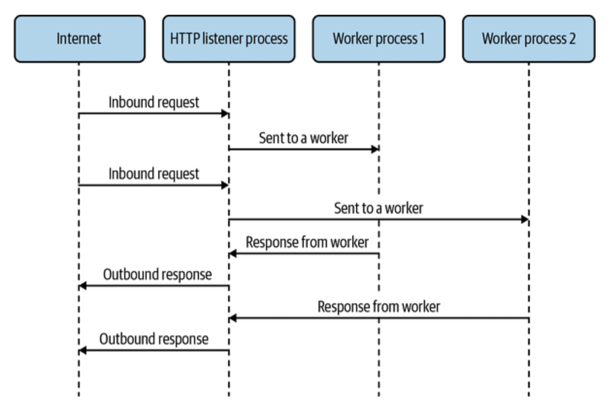

### Content

- [Chapter 3: Node.js](#chapter3)
  - [Before We Had Threads](#BeforeWeHadThreads)
  - [The worker_threads Module](#Theworker_threadsModule)
    - [workerData](#workerData)
    - [MessagePort](#MessagePort)
  - [Happycoin: Revisited](#HappycoinRevisited)
    - [With Only the Main Thread](#WithOnlytheMainThread)
    - [With Four Worker Threads](#WithFourWorkerThreads)
  - [Worker Pools with Piscina](#WorkerPoolswithPiscina)
  - [A Pool Full of Happycoins](#APoolFullofHappycoins)

## <div id='chapter3'/> Chapter 3. Node.js

Outside browsers, there’s only one JavaScript runtime of note, and that’s Node.js.

Today, we have _worker_threads_ for parallelizing our code. This wasn’t always the case, but that didn’t mean we were limited to single-threaded concurrency.

### <div id='BeforeWeHadThreads'/> Before We Had Threads

Prior to threads being available in Node.js, if you wanted to take advantage of CPU cores, you needed to use processes. We don’t get some of the benefits we’d get from threads if we use processes. That being said, if shared memory isn’t important (and in many cases it isn’t!) then processes are perfectly able to solve these kinds of problems for you.

In a scenario, we have threads responding to HTTP requests sent to them from a main thread, which is listening on a port. While this concept is great for handling traffic from several CPU cores, we can also use processes to achieve a similar effect. It might look something like figure below.

<p align="center">

</p>

We could do something like this using the _child_process_ API in Node.js, we’re better off using _cluster_, which was purpose-built for this use case. This module’s purpose is to spread network traffic across several worker processes. Let’s go ahead and use it in a simple “Hello, World” example.

The next code is a standard HTTP server in Node.js. It simply responds to any request, regardless of path or method, with “Hello, World!” followed by a new line character.

```js
const http = require("http");

http
  .createServer((req, res) => {
    res.end("Hello, World!\n");
  })
  .listen(3000);
```

Now, let’s add four processes with _cluster_. With the _cluster_ module, the common approach is to use an _if_ block to detect whether we’re in the main listening process or one of the worker processes. If we’re in the main process, then we have to do the work of spawning the worker processes. Otherwise, we just set up an ordinary web server as before in each of the workers.

```js
const http = require("http");
const cluster = require("cluster"); // 1

if (cluster.isPrimary) {
  // 2
  cluster.fork(); // 3
  cluster.fork();
  cluster.fork();
  cluster.fork();
} else {
  http
    .createServer((req, res) => {
      res.end("Hello, World!\n");
    })
    .listen(3000); // 4
}
```

1. Require the cluster module.
2. Change code paths depending on whether we’re in the primary process.
3. In the primary process, create four worker processes.
4. In the worker processes, create a web server and listen.

We’re not actually listening on the same port four times. It turns out Node.js does some magic for us in _cluster_.

When worker processes are set up in a cluster, any call to _listen()_ will actually cause Node.js to listen on the primary process rather than on the worker. Then, once a connection is received in the primary process, it’s handed off to a worker process via IPC.

Processes incur some extra overhead that threads don’t, and we also don’t get shared memory, which helps with faster transfer of data. For that, we need the _worker_threads_ module.

### <div id='Theworker_threadsModule'/> The worker_threads Module

Node.js’s support for threads is in a built-in module called _worker_threads_. It provides an interface to threads that mimics a lot of what you’d find in web browsers for web workers. Since Node.js is not a web browser, not all the APIs are the same, and the environment inside these worker threads isn’t the same as what you’d find inside web workers.

You can create a new worker thread by using the Worker constructor, like in the next example

```js
const { Worker } = require("worker_threads");
const worker = new Worker("/path/to/worker-file-name.js"); // 1
```

1. The filename here is the entrypoint file that we want to run inside the worker thread. This is similar to the entrypoint in the main file that we’d specify as an argument to node on the command line.

#### <div id='workerData'/> workerData

It’s not sufficient to just be able to create a worker thread. We need to interact with it! The _Worker_ constructor takes a second argument, an options object, that among other things allows us to specify a set of data to be passed immediately to the worker thread. The _options_ object property is called _workerData_, and its contents will be copied into the worker thread. Inside the thread, we can access the cloned data via the _workerData_ property of the _worker_threads_ module. You can see how this works in the next example.

```js
const { Worker, isMainThread, workerData } = require("worker_threads");

const assert = require("assert");

if (isMainThread) {
  // 1
  const worker = new Worker(__filename, { workerData: { num: 42 } });
} else {
  assert.strictEqual(workerData.num, 42);
}
```

1. Rather than using a separate file for the worker thread, we can use the current file with _\_\_filename_ and switch the behavior based on _isMainThread_.

It’s important to note that the properties of the _workerData_ object are cloned rather than shared between threads.

#### <div id='MessagePort'/> MessagePort

A _MessagePort_ is one end of a two-way data stream. By default, one is provided to every worker thread to provide a communication channel to and from the main thread. It’s available in the worker thread as the _parentPort_ property of the _worker_threads_ module.

To send a message via the port, the _postMesage()_ method is called on it. The first argument is any object that can be passed, which will end up being the message data being passed to the other end of the port. When a message is received on the port, the message event is fired, with the message data being the first argument to the event handler function. In the main thread, the event and the _postMessage()_ method are on the worker instance itself, rather than having to get them from a _MessagePort_ instance. The next example shows a simple example where messages sent to the main thread are echoed back to a worker thread.

```js
const { Worker, isMainThread, parentPort } = require("worker_threads");

if (isMainThread) {
  const worker = new Worker(__filename);
  worker.on("message", (msg) => {
    worker.postMessage(msg);
  });
} else {
  parentPort.on("message", (msg) => {
    console.log("We got a message from the main thread:", msg);
  });
  parentPort.postMessage("Hello, World!");
}
```

You can also create a pair of _MessagePort_ instances connected to each other via the _MessageChannel_ constructor. You can then pass one of the ports via an existing message port (like the default one) or via _workerData_. You might want to do this in situations where neither of two threads that need to communicate are the main thread, or even just for organizational purposes.

```js
// Bidirectional communication via MessagePort created with MessageChannel
const {
  Worker,
  isMainThread,
  MessageChannel,
  workerData,
} = require("worker_threads");

if (isMainThread) {
  const { port1, port2 } = new MessageChannel();
  const worker = new Worker(__filename, {
    workerData: {
      port: port2,
    },
    transferList: [port2],
  });

  port1.on("message", (msg) => {
    port1.postMessage(msg);
  });
} else {
  const { port } = workerData;
  port.on("message", (msg) => {
    console.log("We got a message from the main thread:", msg);
  });
  port.postMessage("Hello, World!");
}
```

We used the _transferList_ option when instantiating the Worker. This is a way of transferring ownership of objects from one thread to another.

This is required when sending any _MessagePort_, _ArrayBuffer_, or _FileHandle_ objects via _workerData_ or _postMessage_. Once these objects are transferred, they can no longer be used on the sending side.

### <div id='HappycoinRevisited'/> Happycoin: Revisited

Recall that Happycoin is our imaginary cryptocurrency, with a completely ridiculous proof-of-work algorithm that goes as follows:

1. Generate a random unsigned 64-bit integer.
2. Determine whether or not the integer is happy.
3. If it’s not happy, it’s not a Happycoin.
4. If it’s not divisible by 10,000, it’s not a Happycoin.
5. Otherwise, it’s a Happycoin.

Much like we did in C, we’ll make a single-threaded version first, and then adapt the code to run on multiple threads.

### <div id='WithOnlytheMainThread'/> With Only the Main Thread

Let’s start with generating random numbers. First, let’s create a file called _happycoin.js_, in a directory called _ch3- happycoin/_.

```js
const crypto = require("crypto");

const big64arr = new BigUint64Array(1);
function random64() {
  crypto.randomFillSync(big64arr);
  return big64arr[0];
}
```

They crypto module in Node.js gives us some handy functions for getting cryptographically secure random numbers. We’ll definitely want this since we’re building a cryptocurrency after all!

The _randomFillSync_ function fills a given _TypedArray_ with random data. Since we’re looking for only a single 64-bit unsigned integer, we can use a _BigUint64Array_. This particular _TypedArray_, along with its cousin _BigInt64Array_, are recent additions to JavaScript that were made possible by the new _bigint_ type, which stores arbitrarily large integers. Returning the first (and only) element of this array after we’ve filled it with random data gives us the random 64-bit unsigned integer that we’re looking for.

Now let’s add our happy number calculation.

```js
function sumDigitsSquared(num) {
  let total = 0n;
  while (num > 0) {
    const numModBase = num % 10n;
    total += numModBase ** 2n;
    num = num / 10n;
  }
  return total;
}

function isHappy(num) {
  while (num != 1n && num != 4n) {
    num = sumDigitsSquared(num);
  }
  return num === 1n;
}

function isHappycoin(num) {
  return isHappy(num) && num % 10000n === 0n;
}
```

One thing you might notice if you’re not familiar with _bigint_ is the n suffix on all the number literals in this code. This suffix tells JavaScript that these numbers are to be treated as _bigint_ values, rather than values of type number. This is important because, while both types support mathematical operators like +, -, \*\*, and so on, they cannot interoperate without doing an explicit conversion.

Let’s finish off the file by implementing our Happycoin mining loop and outputting the count of found Happycoins.

```js
let count = 0;

for (let i = 1; i < 10_000_000; i++) {
  const randomNum = random64();
  if (isHappycoin(randomNum)) {
    process.stdout.write(randomNum.toString() + " ");
    count++;
  }
}
process.stdout.write("\ncount " + count + "\n");
```

The code here is very similar to what we did in C. We loop 10,000,000 times, getting a random number and checking if it’s a Happycoin. If it is, we print it out. Note that we’re not using console.log() here because we don’t want to insert a newline character after each number found. Instead we want spaces, so we’re writing to the output stream directly. When we output the count after the loop, we need an additional newline character at the beginning of the output to separate it from the numbers above.

Now, run the program and our output should be exactly the same as it was in C. That is, it should look something like this:

```
5503819098300300000 ... [ 125 more entries ] ...
5273033273820010000
count 127
```

This takes quite a bit longer than the C example. There are a variety of reasons why this takes so much longer. When building applications and optimizing for performance, it’s important to figure out what the sources of performance overhead are. Yes, in general, JavaScript is often “slower than C,” but this enormous difference can’t be explained by that alone.

Let’s see what this looks like when we use worker_threads to split out the load.

### <div id='WithFourWorkerThreads'/>With Four Worker Threads

To add worker threads, we will start from the code we had. Copy the contents of happycoin.js to happycoin-threads.js. Then insert the next content at the very beginning of the file, before the existing content.

```js
const { Worker, isMainThread, parentPort } = require("worker_threads");
```

We’ll need these parts of the _worker_threads_ module, so we require them at the beginning. Now, replace everything from _let count = 0_; to the end of the file with the next code:

```js
const THREAD_COUNT = 4;

if (isMainThread) {
  let inFlight = THREAD_COUNT;
  let count = 0;
  for (let i = 0; i < THREAD_COUNT; i++) {
    const worker = new Worker(__filename);
    worker.on("message", (msg) => {
      if (msg === "done") {
        if (--inFlight === 0) {
          process.stdout.write("\ncount " + count + "\n");
        }
      } else if (typeof msg === "bigint") {
        process.stdout.write(msg.toString() + " ");
        count++;
      }
    });
  }
} else {
  for (let i = 1; i < 10_000_000 / THREAD_COUNT; i++) {
    const randomNum = random64();
    if (isHappycoin(randomNum)) {
      parentPort.postMessage(randomNum);
    }
  }
  parentPort.postMessage("done");
}
```

We’re splitting behavior here with an if block. If we’re on the main thread, we start four worker threads using the current file. Remember, \_\_filename is a string containing the path and name of the current file. We then add a message handler for that worker. In the message handler, if the message is simply done, then the worker has completed its work, and if all other workers are done, we’ll output the count. If the message is a number, or more correctly, a bigint, then we assume it’s a Happycoin, and we’ll print it out and add it to the count like we did in the single- threaded example.

On the else side of the if block, we’re running in one of the worker threads. Also, rather than writing directly to the output stream, we’re sending found Happycoins back to the main thread via the _MessagePort_ given to us, called _parentPort_. We’ve already set up the handler on the main thread for this. When the loop exits, we send a done on the _parentPort_ to indicate to the main thread that we won’t be finding any more Happycoins on this thread.

Now that we’re done adding threads to this example, run it. You should see output that looks something like this:

```
17241719184686550000 ... [ 137 more entries ] ...
17618203841507830000
count 139
```

This code runs quite a bit faster. This is a huge improvement over the single-threaded example, so another big win for threads!

|                                                                                                             NOTE                                                                                                             |
| :--------------------------------------------------------------------------------------------------------------------------------------------------------------------------------------------------------------------------: |
| This is not the only way to split this kind of problem up for thread-based computation. For example, other synchronization techniques could be used to avoid passing data between threads, or the messages could be batched. |

### <div id='WorkerPoolswithPiscina'/> Worker Pools with Piscina

Many types of workloads will naturally lend themselves to using threads. A threaded web server often works, it makes sense to maintain a pool of workers that can be sent various tasks from the main thread.

| NOTE                                                                                                                                                                                                                                                                                                                                                                                                                                                                                                      |
| --------------------------------------------------------------------------------------------------------------------------------------------------------------------------------------------------------------------------------------------------------------------------------------------------------------------------------------------------------------------------------------------------------------------------------------------------------------------------------------------------------- |
| The concept of pooled resources isn’t unique to threads. For example, web browsers typically create pools of socket connections to web servers so that they can multiplex all the various HTTP requests required to render a web page across those connections. Database client libraries often do a similar thing with sockets connected to the database server. There’s a handy module available for Node.js called generic-pool, which is a helper module for dealing with arbitrary pooled resources. |

For the use case of discrete tasks sent to a pool of worker threads, we have the piscina module at our disposal. This module encapsulates the work of setting up a bunch of worker threads and allocating tasks to them.

The basic usage is straightforward. You create an instance of the _Piscina_ class, passing in a _filename_, which will be used in the worker thread. Behind the scenes, a pool of worker threads is created, and a queue is set up to handle incoming tasks. You can enqueue a task by calling _.run()_, passing in a value containing all the data necessary to complete this task, and noting that the values will be cloned as they would be with _postMessage()_. This returns a promise that resolves once the tasks have been completed by a worker, giving a result value. In the file to be run in the worker, a function must be exported that takes in whatever is passed to _.run()_ and returns the result value. This function can also be an _async_ function, so that you can do asynchronous tasks in a worker thread if you need to. There is a basic example calculating square roots in worker threads.

```js
const Piscina = require("piscina");

if (!Piscina.isWorkerThread) {
  // 1
  const piscina = new Piscina({ filename: __filename }); // 2
  piscina.run(9).then((squareRootOfNine) => {
    // 3
    console.log("The square root of nine is", squareRootOfNine);
  });
}

module.exports = (num) => Math.sqrt(num); // 4
```

1. Much like _cluster_ and _worker_threads_, _piscina_ provides a handy boolean for determining whether we’re in the main thread or a worker thread.
2. We’ll use the same technique for using the same file as we did with the Happycoin example.
3. Since _.run()_ returns a promise, we can just call _.then()_ on it.
4. The exported function is used in the worker thread to perform the actual work. In this case, it’s just calculating a square root.

While it’s all fine and good to run one task on the pool, we need to be able to run many tasks on the pool. Let’s say we want to calculate the square roots of every number less than ten million.

```js
const Piscina = require("piscina");
const assert = require("assert");

if (!Piscina.isWorkerThread) {
  const piscina = new Piscina({ filename: __filename });
  for (let i = 0; i < 10_000_000; i++) {
    piscina.run(i).then((squareRootOfI) => {
      assert.ok(typeof squareRootOfI === "number");
    });
  }
}

module.exports = (num) => Math.sqrt(num);
```

This seems like it ought to work. We’re submitting ten million numbers to be processed by the worker pool. However, if you run this code, you’ll get a nonrecoverable JavaScript memory allocation error.

What’s going on here? It turns out the underlying task queue is not infinite. By default, the task queue will keep growing and growing until we run into an allocation error like this one. To avoid having this happen, we need to set a reasonable limit. The piscina module lets you set a limit by using a maxQueue option in its constructor, which can be set to any positive integer. Through experimentation, the maintainers of piscina have found that an ideal maxQueue value is the square of the number of worker threads it’s using. Handily, you can use this number without even knowing it by setting maxQueue to auto.

Once we’ve established a bound for the queue size, we need to be able to handle it when the queue is full. There are two ways to detect that the queue is full:

1. Compare the values of _piscina.queueSize_ and _piscina.options.maxQueue_. If they’re equal, then the queue is full. This can be done prior to calling _piscina.run()_ to avoid attempting to enqueue when it’s full. This is the recommended way to check.
2. If _piscina.run()_ is called when the queue is full, the returned promise will reject with an error indicating that the queue is full. This isn’t ideal because by this point we’re already in a further tick of the event loop and many other attempts to enqueue may already have happened.

When we know that the queue is full, we need a way of knowing when it’ll be ready for new tasks again. Fortunately, piscina pools emit a drain event once the queue is empty, which is certainly an ideal time to start adding new tasks. In the next example we put this all together with an async function around the loop that submits the tasks.

```js
const Piscina = require("piscina");
const assert = require("assert");
const { once } = require("events");

if (!Piscina.isWorkerThread) {
  const piscina = new Piscina({
    filename: __filename,
    maxQueue: "auto", // 1
  });
  (async () => {
    // 2
    for (let i = 0; i < 10_000_000; i++) {
      if (piscina.queueSize === piscina.options.maxQueue) {
        // 3
        await once(piscina, "drain"); // 4
      }
      piscina.run(i).then((squareRootOfI) => {
        assert.ok(typeof squareRootOfI === "number");
      });
    }
  })();
}

module.exports = (num) => Math.sqrt(num);
```

1. The maxQueue option is set to auto, which limits the queue size to the square of the number of threads that piscina is using.
2. The for loop is wrapped in an async immediately invoked function expression (IIFE) in order to use an await within it.
3. When this check is true, the queue is full.
4. We then wait for the drain event before submitting any new tasks to the queue.

On that note, let’s see what happens when we try to use piscina to mine Happycoins.

### <div id='APoolFullofHappycoins'/> A Pool Full of Happycoins

To use piscina to produce Happycoins, we’ll use a slightly different approach from what we did in the original _worker_threads_ implementation. Instead of getting a message back every time we have a Happycoin, we’ll batch them together and send them all at once when we’re done. This trade-off saves us the effort of setting up a _MessageChannel_ to send data back to the main thread with; the side effect is that we’ll only get our results in batches, rather than as soon as they’re ready. The main thread will still do the job of spawning the appropriate threads and retrieving all the results.

|                                                                                                                                                        TRADE-OFFS                                                                                                                                                        |
| :----------------------------------------------------------------------------------------------------------------------------------------------------------------------------------------------------------------------------------------------------------------------------------------------------------------------: |
| All programming is about trade-offs. Multithreaded programming is no exception. In fact, you’ll find trade-offs at every turn. Sacrificing convenience in one place will often give you performance gains elsewhere, or vice versa. Sometimes if one operation is slightly slower, another will be significantly faster. |

To start off, copy your _happycoin-threads.js_ file to a new one called _happycoin-piscina.js_. We’ll build off our old _worker_threads_ example here. Now replace everything before the _require('crypto')_ line with the next code.

```js
const Piscina = require("piscina");
```

Yep, that’s it! Now we’ll get to the more substantial stuff. Replace everything after the _isHappycoin()_ function declaration with the content below.

```js
const THREAD_COUNT = 4;

if (!Piscina.isWorkerThread) {
  // 1
  const piscina = new Piscina({
    filename: __filename, // 2
    minThreads: THREAD_COUNT, // 3
    maxThreads: THREAD_COUNT,
  });

  let done = 0;
  let count = 0;

  for (let i = 0; i < THREAD_COUNT; i++) {
    // 4
    (async () => {
      const { total, happycoins } = await piscina.run(); // 5
      process.stdout.write(happycoins);
      count += total;
      if (++done === THREAD_COUNT) {
        console.log("\ncount", count);
      }
    })();
  }
}
```

1. We’ll use the isWorkerThread property to check that we’re in the main thread.
2. We’re using the same technique as earlier to create worker threads using this same file.
3. We want to restrict the number of threads to be exactly four, to match our previous examples. We’ll want to time this and see what happens, so sticking with four threads reduces the number of variables here.
4. We know we have four threads, so we’ll enqueue our task four times. Each one will complete once it has checked its chunk of random numbers for Happycoins.
5. We submit the task to the queue in this async IIFE, so that they all get queued in the same event loop iteration. Don’t worry, we won’t get out-of-memory errors like we did before because we know we have exactly four threads and we’re only enqueueing four tasks.
6. Much like we’ve done in previous Happycoin implementations, we’ll check that all threads have completed their tasks before outputting the grand total count of Happycoins that we’ve found.

Next we’ll add the code below which adds the exported function that’s used in piscina’s worker threads.

```js
module.exports = () => {
  let happycoins = "";
  let total = 0;

  for (let i = 0; i < 10_000_000 / THREAD_COUNT; i++) {
    // 1
    const randomNum = random64();
    if (isHappycoin(randomNum)) {
      happycoins += randomNum.toString() + " ";
      total++;
    }
  }
  return { total, happycoins }; // 2
};
```

1. We’re doing our typical Happycoin-hunting loop here, but as in other parallelism examples, we’re dividing our total search space by the number of threads.
2. We’re passing the string of found Happycoins and the total count of them back to the main thread by returning a value from this function.

To run this, you’ll have to install piscina if you haven’t done so yet for the earlier examples. You can use the following two commands in your ch3-happycoin directory to set up a Node.js project and add the piscina dependency. The third line can then be used to run the code:

```
$ npm init -y
$ npm install piscina
$ node happycoin-piscina.js
```

Rather than seeing each Happycoin come in one by one, you’ll see them either roughly all at once, or in four large groupings of them. This is the trade-off we made by returning the whole strings rather than the Happycoins one by one.

You can see that we’re not using piscina in the typical manner. We’re not passing it a multitude of discrete tasks that end up requiring careful queueing. The primary reason for this is performance.

If, for example, we had a loop iterating ten million times in the main thread, each time adding another task to the queue and await-ing its response, it would end up being just as slow as running all the code synchronously on the main thread.

When dealing with raw data, like numbers or byte streams, there are usually faster ways of transferring data between threads using _SharedArrayBuffers_.
