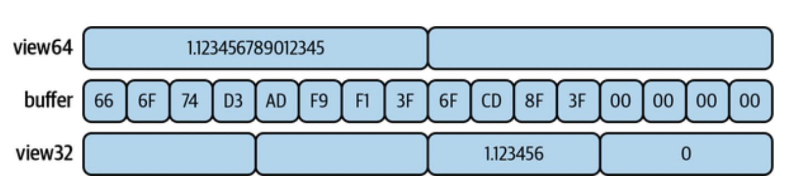
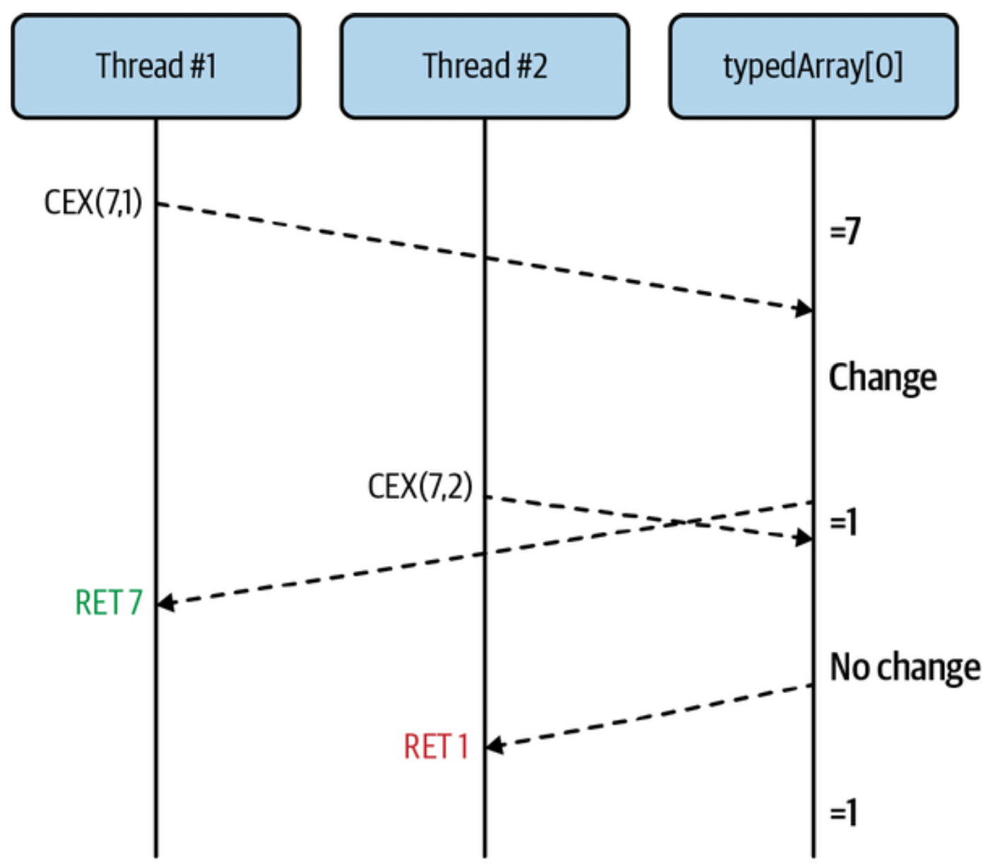
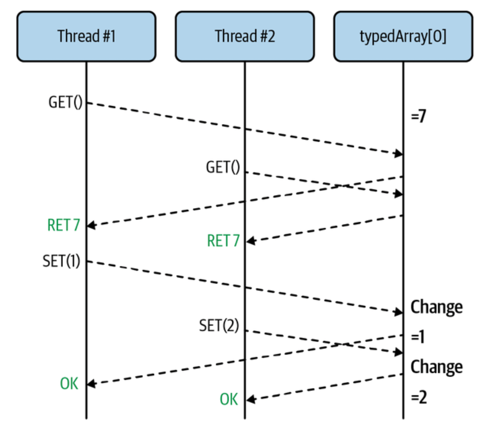

### Content

- [Chapter 4. Shared Memory](#chapter4)
  - [Intro to SharedMemory](#IntrotoSharedMemory)
    - [Shared Memory in the Browser](#SharedMemoryintheBrowser)
    - [Shared Memory in Node.js](#SharedMemoryinNode)
  - [SharedArrayBuffer and TypedArrays](#SharedArrayBufferandTypedArrays)
  - [Atomic Methods for Data Manipulation](#AtomicMethodsforDataManipulationThreads)
    - [Atomics.add()](#AtomicsAdd)
    - [Atomics.and()](#AtomicsAnd)
    - [Atomics.compareExchange()](#AtomicsCompareExchange)
    - [Atomics.exchange()](#AtomicsExchange)
    - [Atomics.isLockFree()](#AtomicsisLockFree)
    - [Atomics.load()](#Atomicsload)
    - [Atomics.or()](#Atomicsor)
    - [Atomics.store()](#Atomicsstore)
    - [Atomics.sub()](#Atomicssub)
    - [Atomics.xor()](#Atomicsxor)
  - [Atomicity Concerns](#AtomicityConcerns)
    - [Data Serialization](#DataSerialization)
      - [Booleans](#Booleans)
      - [Strings](#Strings)
      - [Objects](#Objects)

## <div id='chapter4'/> Chapter 4. Shared Memory

So far you’ve been exposed to the web workers API for browsers, covered in [Chapter 2](../chapter2/), and the worker threads module for Node.js, covered in “The worker_threads Module”. These are two powerful tools for working with concurrency in JavaScript, allowing developers to run code in parallel in a way that wasn’t previously available to JavaScript.

While it’s true they allow you to run code in parallel, you’ve only done so using message-passing APIs. This is a much less performant system than the threading code you worked with in “Threads in C: Get Rich with Happycoin” where these disparate threads are able to access the same shared memory.

This chapter covers two powerful tools available to your JavaScript applications: the _Atomics_ object and the _SharedArrayBuffer_ class.

These allow you to share memory between two threads without depending on message passing.

### <div id='IntrotoSharedMemory'/> Intro to Shared Memory

For this example you will build a very basic application that is able to communicate between two web workers.

This shared memory example will work in a browser as well as in Node.js, though the setup work required is a little different for the two of them. For now, lets build out an example that works in the browser.

#### <div id='SharedMemoryintheBrowser'/>Shared Memory in the Browser

To get started, create another directory to house this project in named ch4-web-workers/. Then, create an HTML file named index.html,

```html
<html>
  <head>
    <title>Shared Memory Hello World</title>
    <script src="main.js"></script>
  </head>
</html>
```

Once you’re done with that file you’re ready for the more complicated part of the application. Create a file named _main.js_.

```js
if (!crossOriginIsolated) {
  // 1
  throw new Error("Cannot use SharedArrayBuffer");
}

const worker = new Worker("worker.js");

const buffer = new SharedArrayBuffer(1024); // 2
const view = new Uint8Array(buffer); // 3

console.log("now", view[0]);

worker.postMessage(buffer);

setTimeout(() => {
  console.log("later", view[0]);
  console.log("prop", buffer.foo); // 4
}, 500);
```

1. When _crossOriginIsolated_ is true, then _SharedArrayBuffer_ can be used.
2. Instantiates a 1 KB buffer.
3. A view into the buffer is created.
4. A modified property is read.

This file is similar to one that you created before. In fact, it’s still making use of a dedicated worker. But a few complexities have been added. The first new thing is the check for the _crossOriginIsolated_ value, which is a global variable available in modern browsers. This value tells you if the JavaScript code currently being run is capable of, among other things, instantiating a _SharedArrayBuffer_ instance.

For security reasons the _SharedArrayBuffer_ object isn’t always available for instantiation. both Chrome and Firefox support the object and require additional HTTP headers to be set when the document is served before it will allow a SharedArrayBuffer to be instantiated. Node.js doesn’t have the same restrictions. Here are the required headers:

```
Cross-Origin-Opener-Policy: same-origin
Cross-Origin-Embedder-Policy: require-corp
```

The test server that you’ll run automatically sets these headers. Any time you build a production-ready application that uses SharedArrayBuffer instances you’ll need to remember to set these headers.

After a dedicated worker is instantiated, an instance of a _SharedArrayBuffer_ is also instantiated. The argument that follows, 1,024 in this case, is the number of bytes allocated to the buffer. Unlike other arrays or buffer objects you might be familiar with, these buffers cannot shrink or grow in size after they’ve been created.

A view to work with the buffer named view has also been created. Think of them as a way to read from and write to a buffer.

This view into the buffer allows us to read from it. In this case, we’re able to inspect the 0th byte in the buffer by logging a call to _view[0]_. After that, the buffer instance is passed into the worker using the _worker.postMessage()_ method.

Once the script is finished with the setup work, it schedules a function to run in 500 ms. This script prints the 0th byte of the buffer again and also attempts to print a property attached to the buffer named _.foo_. Note that this file otherwise does not have a _worker.onmessage_ handler defined.

Now that you’re finished with the main JavaScript file you’re ready to create the worker.

```js
self.onmessage = ({ data: buffer }) => {
  buffer.foo = 42; // 1
  const view = new Uint8Array(buffer);
  view[0] = 2; // 2
  console.log("updated in worker");
};
```

1. A property on the buffer object is written.
2. The 0th index is set to the number 2.

Now that your files are complete, you’re ready to run your new application. Open up a terminal window and run the following command. It’s a little different than the serve commands you ran before because it needs to provide the security headers:

```
$ npx MultithreadedJSBook/serve
```

As before, open the link displayed in your terminal. Next, open the web inspector and visit the Console tab. You might not see any output; if so, refresh the page to execute the code again. You should see logs printed from the application. An example of the output has been reproduced in the table below.

| Log               | Location       |
| ----------------- | -------------- |
| now 0             | main.js:10:9   |
| updated in worker | worker.js:5:11 |
| later 2           | main.js:15:11  |
| prop undefined    | main.js:16:11  |

The first printed line is the initial value of the buffer as seen in _main.js_. In this case the value is 0. Next, the code in _worker.js_ is run, though the timing of this is mostly indeterminate. About half a second later, the value as perceived in _main.js_ is printed again, and the value is now set to 2. Again, notice that other than the initial setup work, no message passing happened between the thread running the _main.js_ file and the thread running the _worker.js_ file.

|                                                                                                                                                                             NOTE                                                                                                                                                                              |
| :-----------------------------------------------------------------------------------------------------------------------------------------------------------------------------------------------------------------------------------------------------------------------------------------------------------------------------------------------------------: |
| This is a very simple example that, while it works, is not how you would normally write multithreaded code. There is no guarantee that the value updated in _worker.js_ would be visible in _main.js_. For example, a clever JavaScript engine could treat the value as a constant, though you’d be hard-pressed to find a browser where this doesn’t happen. |

After the buffer value is printed, the _.foo_ property is also printed and a value of _undefined_ is displayed. Why might this be? Well, while it’s true that a reference to the memory location that stores the binary data contained in the buffer has been shared between the two JavaScript environments, the actual object itself has not been shared. If it had been, this would violate the constraint of the structured clone algorithm wherein object references cannot be shared between threads.

### <div id='SharedMemoryinNode'/> Shared Memory in Node.js

The Node.js equivalent of this application is mostly similar; however, the _Worker_ global provided by browsers isn’t available, and the _worker thread_ won’t make use of _self.onmessage_. Instead, the _worker threads_ module must be required to gain access to this functionality. Since Node.js isn’t a browser the _index.html_ file isn’t applicable.

To create a Node.js equivalent, you’ll only need two files, which can be put in the same _ch4-web-workers/_ folder you’ve been using. First, create a _main-node.js_ script

```js
#!/usr/bin/env node
const { Worker } = require("worker_threads");
const worker = new Worker(__dirname + "/worker-node.js");

const buffer = new SharedArrayBuffer(1024);
const view = new Uint8Array(buffer);

console.log("now", view[0]);

worker.postMessage(buffer);

setTimeout(() => {
  console.log("later", view[0]);
  console.log("prop", buffer.foo);
  worker.unref();
}, 500);
```

The code is a little different, but it should feel mostly familiar. Because the _Worker_ global isn’t available, it is instead accessed by pulling the _.Worker_ property from the required _worker_threads_ module. When instantiating the worker a more explicit path to the worker must be provided than what is accepted by browsers. In this case the path _./worker-node.js_ was required, even though browsers are fine with just _worker.js_. Other than that, the main JavaScript file for this Node.js example is mostly unchanged when compared to the browser equivalent. The final _worker.unref()_ call was added to prevent the worker from keeping the process running forever.

Next, create a file named _worker-node.js_, which will contain the Node.js equivalent of the browser worker.

```js
const { parentPort } = require("worker_threads");

parentPort.on("message", (buffer) => {
  buffer.foo = 42;
  const view = new Uint8Array(buffer);
  view[0] = 2;
  console.log("updated in worker");
});
```

In this case the _self.onmessage_ value isn’t available to the worker. Instead, the _worker_threads_ module is required again, and the _.parentPort_ property from the module is used. This is used to represent a connection to the port from the calling JavaScript environment.

The _.onmessage_ handler can be assigned to the _parentPort_ object, and the method _.on('message', cb)_ can be called. If using both, they’ll be called in the order that they were used.

Other than that the code is exactly the same between Node.js and the browser, the same applicable globals like _SharedArrayBuffer_ are still available, and they still work the same for the sake of this example.

Now that these files are complete, you can run them using this command:

```
$ node main-node.js
```

The output from this command should be equivalent to the output displayed in the browser.

Again, the same structured clone algorithm allows instances of SharedArrayBuffer to be passed along, but only the underlying binary buffer data, not a direct reference to the object itself

### <div id='SharedArrayBufferandTypedArrays'/> SharedArrayBuffer and TypedArrays

Traditionally the JavaScript language didn’t really support interaction with binary data. For many years that was sort of “good enough,” especially before the advent of Node.js and the popularity of running JavaScript outside of a web page context took off.

The Node.js runtime is, among other things, capable of reading and writing to the filesystem, streaming data to and from the network, and so on. Such interactions are not only limited to ASCII-based text files but can also include piping binary data as well. Since there wasn’t a convenient buffer data structure available, the authors created their own. Thus, the Node.js _Buffer_ was born.

As the boundaries of the JavaScript language itself were pushed, so too grew the APIs and the capabilities of the language to interact with the world outside of the browser window. Eventually the _ArrayBuffer_ object and later the _SharedArrayBuffer_ object were created and are now a core part of the language. Most likely, if Node.js were created today, it would not have created its own Buffer implementation.

Instances of ArrayBuffer and SharedArrayBuffer represent a buffer of binary data that is of fixed length and cannot be resized.

Binary data, while ubiquitous and a first-class concept in many traditional programming languages like C, can be easy to misunderstand, especially for developers using high-level languages such as JavaScript.

Just in case you haven’t had experience with it, binary is a system of counting that is 2 based, which at the lowest level is represented as 1s and 0s. Each of these numbers is referred to as a bit. Decimal, the system humans mostly use for counting, is 10 based and is represented with numerals from 0 to 9. A combination of 8 bits is referred to as a byte and is often the smallest addressable value in memory since it’s usually easier to deal with than individual bits. Basically, this means CPUs (and programmers) work with bytes instead of individual bits.

These bytes are often represented as two hexadecimal characters, which is a 16 based system of counting using the numerals 0–9 and the letters A–F. In fact, when you log an instance of an ArrayBuffer using Node.js, the resulting output displays the value of the buffer using hexadecimal.

It’s also important to mention that the contents of an _ArrayBuffer_ (and _SharedArrayBuffer_) can’t be directly modified. Instead, a “view” into the buffer must first be created. Also, unlike other languages which might provide access to abandoned memory, when an _ArrayBuffer_ in JavaScript is instantiated the contents of the buffer are initialized to 0. Considering these buffer objects only store numeric data, they truly are a very elementary tool for data storage, one that more complicated systems are often built upon.

Both _ArrayBuffer_ and _SharedArrayBuffer_ inherit from _Object_ and come with those associated methods. Other than that, they come with two properties. The first is the read- only value _.byteLength_, representing the byte length of the buffer, and the second is the _.slice(begin, end)_ method, which returns a copy of the buffer depending on the range that is provided.

The begin value of _.slice()_ is inclusive, while the end value is exclusive, and is notably different than, say, _String#substr(begin, length)_, where the second parameter is a length. If the begin value is omitted, it defaults to the first element, and if the end value is omitted, it defaults to the last element. Negative numbers represent values from the end of the buffer.

Here’s an example of some basic interaction with an _ArrayBuffer_:

```js
const ab = new ArrayBuffer(8);
const view = new Uint8Array(ab);

for (i = 0; i < 8; i++) view[i] = i;
console.log(view);
// Uint8Array(8) [
// 0, 1, 2, 3,
// 4, 5, 6, 7
// ]

ab.byteLength; // 8
ab.slice(); // 0, 1, 2, 3, 4, 5, 6, 7
ab.slice(4, 6); // 4, 5
ab.slice(-3, -2); // 5
```

Different JavaScript environments display the contents of an _ArrayBuffer_ instance differently. Node.js displays a list of hexadecimal pairs as if the data were going to be viewed as a _Uint8Array_. Chrome v88 displays an expandable object with several different views. Firefox, however, won’t display the data, and will need to first be passed through a view.

The term _view_ has been mentioned in a few places, and now is a good time to define it. Due to the ambiguity of what binary data can mean, we need to use a _view_ to read and write to the underlying buffer. There are several of these views available in JavaScript. Each of these views extends from a base class called _TypedArray_. This class can’t be instantiated directly and isn’t available as a global, but it can be accessed by grabbing the _.prototype property_ from an instantiated child class.

The next table contains a list of the view classes that extend from TypedArray.

| Class             | Bytes | Minimum Value              | Maximum Value              |
| ----------------- | ----- | -------------------------- | -------------------------- |
| Int8Array         | 1     | –128                       | 127                        |
| Unit8Array        | 1     | 0                          | 255                        |
| Uint8ClampedArray | 1     | 0                          | 255                        |
| Int16Array        | 2     | -32,768                    | 32,767                     |
| Uint16Array       | 2     | 0                          | 65,535                     |
| Int32Array        | 4     | –2,147,483,648             | 2,147,483,647              |
| Uint32Array       | 4     | 0                          | 4294967295                 |
| Float32Array      | 4     | 1.4012984643e-45           | 3.4028235e38               |
| Float64Array      | 8     | 5e–324                     | 1.7976931348623157e308     |
| BigInt64Array     | 8     | –9,223,372,036,854,775,808 | 9,223,372,036,854,775,807  |
| BigUint64Array    | 8     | 0                          | 18,446,744,073,709,551,615 |

The Class column is the name of the class that is available for instantiation. These classes are globals and are accessible in any modern JavaScript engine. The Bytes column is the number of bytes that are used to represent each individual element in the view. The Minimum Value and Maximum Value columns display the valid numeric ranges that can be used to represent an element in the buffer.

When creating one of these views, the _ArrayBuffer_ instance is passed into the constructor of the view.

The U prefix to half of these classes refers to unsigned, which means that only positive numbers may be represented. Classes without the U prefix are signed and so negative and positive numbers may be represented, though with only half the maximum value. This is because a signed number uses the first bit to represent the “sign,” conveying if the number is positive or negative.

When a value is written to Float64Array, it can be left mostly as the same. The minimum allowed value is the same as Number.MIN_VALUE, while the maximum is Number.MAX_VALUE. When a value is written to a Float32Array, not only are the minimum and maximum value ranges reduced but the decimal precision will be truncated as well.

As an example of this, consider the following code:

```js
const buffer = new ArrayBuffer(16);

const view64 = new Float64Array(buffer);
view64[0] = 1.1234567890123456789; // bytes 0 - 7
console.log(view64[0]); // 1.1234567890123457

const view32 = new Float32Array(buffer);
view32[2] = 1.1234567890123456789; // bytes 8 - 11
console.log(view32[2]); // 1.1234568357467651
```

In this case, the decimal precision for the float64 number is accurate to the 15th decimal, while the precision for the float32 number is only accurate to the 6th decimal.

This code exemplifies another thing of interest. In this case, there is a single _ArrayBuffer _ instance named _buffer_, and yet there are two different _TypedArray_ instances that point to this buffer data. Can you think of what’s weird with this? The figure below might give you a hint.

<p align="center">

</p>

What do you think will be returned if you were to read either _view64[1]_, _view32[0]_, or _view32[1]_? In this case, a truncated version of the memory used to store data of one type will be combined, or split, to represent data of another type. The values returned are interpreted in the wrong way and are nonsensical, though they should be deterministic and consistent.

When numeric values that are outside of the range of the supported _TypedArray_ for nonfloats are written, they need to go through some sort of conversion process to fit the target data type. First, the number must be converted into an integer, as if it were passed into _Math.trunc()_. If the value falls outside of the acceptable range, then it wraps around and resets at 0 as if using the modulus (%) operator. Here are some examples of this happening with a _Uint8Array_ (which is a _TypedArray_ with a max element value of 255):

```js
const buffer = new ArrayBuffer(8);
const view = new Uint8Array(buffer);

view[0] = 255;
view[1] = 256;
view[2] = 257;
view[3] = -1;
view[4] = 1.1;
view[5] = 1.999;
view[6] = -1.1;
view[7] = -1.9;

console.log(view);
```

The table below contains a list of the values output on the second line, with their correlating values on the first line.

| Input | Output |
| ----- | ------ |
| 255   | 255    |
| 256   | 0      |
| 257   | 1      |
| -1    | 255    |
| 1.1   | 1      |
| 1.999 | 1      |
| -1.9  | 255    |

This behavior is a little different for _Uint8ClampedArray_. When a negative value is written, it is converted into 0. When a value greater than 255 is written, it’s converted into 255. When a noninteger value is provided, it’s instead passed to _Math.round()_. Depending on your use case, it may make more sense to use this view.

Finally, the _BigInt64Array_ and _BigUint64Array_ entries also deserve some special attention. Unlike the other _TypedArray_ views, which work with the Number type, these two variants work with the BigInt type.

This is because the numeric values that can be represented using 64 bytes fall out of the range of the numbers than can be represented using JavaScript’s Number. For that reason, setting a value with these views must be done with a _BigInt_, and the values retrieved will also be of type _BigInt_.

In general, using multiple _TypedArray_ views, especially those of different sizes, to look into the same buffer instance is a dangerous thing and should be avoided when possible. You might find that you accidentally clobber some data when performing different operations. It is possible to pass more than one _SharedArrayBuffer_ between threads, so if you find yourself needing to mix types, then you might benefit from having more than one buffer.

### <div id='AtomicMethodsforDataManipulationThreads'/> Atomic Methods for Data Manipulation Threads

The methods that are available on the Atomics object accept a TypedArray instance as the first argument and the index to act upon as the second argument.

#### <div id='AtomicsAdd'/> Atomics.add()

```js
old = Atomics.add(typedArray, index, value);
```

This method adds the provided value to the existing value in a typedArray that is located at index. The old value is returned. Here’s what the nonatomic version might look like:

```js
const old = typedArray[index];
typedArray[index] = old + value;
return old;
```

#### <div id='AtomicsCompareExchange'/> Atomics.and()

```js
old = Atomics.and(typedArray, index, value);
```

This method performs a bitwise and using value with the existing value in typedArray located at index. The old value is returned. Here’s what the nonatomic version might look like:

```js
const old = typedArray[index];
typedArray[index] = old & value;
return old;
```

#### <div id='AtomicsCompareExchange'/> Atomics.compareExchange()

```js
old = Atomics.compareExchange(typedArray, index, oldExpectedValue, value);
```

This method checks typedArray to see if the value oldExpectedValue is located at index. If it is, then the value is replaced with value. If not, then nothing happens. The old value is always returned, so you can tell if the exchange succeeded if oldExpectedValue === old. Here’s what the nonatomic version might look like:

```js
const old = typedArray[index];
if (old === oldExpectedValue) {
  typedArray[index] = value;
}

return old;
```

#### <div id='AtomicsExchange'/> Atomics.exchange()

```js
old = Atomics.exchange(typedArray, index, value);
```

This method sets the value in typedArray located at index to value. The old value is returned. Here’s what the nonatomic version might look like:

```js
const old = typedArray[index];
typedArray[index] = value;
return old;
```

#### <div id='AtomicsisLockFree'/> Atomics.isLockFree()

```js
free = Atomics.isLockFree(size);
```

This method returns a true if size is a value that appears as the BYTES_PER_ELEMENT for any of the TypedArray subclasses (usually 1, 2, 4, 8), and a false if otherwise. If true, then using the Atomics methods will be quite fast using the current system’s hardware. If false, then the application might want to use a manual locking mechanism,

#### <div id='Atomicsload'/> Atomics.load()

```js
value = Atomics.load(typedArray, index);
```

This method returns the value in typedArray located at index. Here’s what the nonatomic version might look like:

```js
const old = typedArray[index];
return old;
```

#### <div id='Atomicsor'/> Atomics.or()

```js
old = Atomics.or(typedArray, index, value);
```

This method performs a bitwise or using value with the existing value in typedArray located at index. The old value is returned. Here’s what the nonatomic version might look like:

```js
const old = typedArray[index];
typedArray[index] = old | value;
return old;
```

#### <div id='Atomicsstore'/> Atomics.store()

```js
value = Atomics.store(typedArray, index, value);
```

This method stores the provided value in typedArray located at index. The value that was passed in is then returned. Here’s what the nonatomic version might look like:

```js
typedArray[index] = value;
return value;
```

#### <div id='Atomicssub'/> Atomics.sub()

```js
old = Atomics.sub(typedArray, index, value);
```

This method subtracts the provided value from the existing value in typedArray that is located at index. The old value is returned. Here’s what the nonatomic version might look like:

```js
const old = typedArray[index];
typedArray[index] = old - value;
return old;
```

#### <div id='Atomicsxor'/> Atomics.xor()

```js
old = Atomics.xor(typedArray, index, value);
```

This method performs a bitwise xor using value with the existing value in typedArray located at index. The old value is returned. Here’s what the nonatomic version might look like:

```js
const old = typedArray[index];
typedArray[index] = old ^ value;
return old;
```

### <div id='AtomicityConcerns'/> Atomicity Concerns

The methods covered in “Atomic Methods for Data Manipulation” are each guaranteed to execute atomically. For example, consider the _Atomics.compareExchange()_ method. This method takes an _oldExpectedValue_ and a new value, replacing the existing value only if it equals _oldExpectedValue_ with the new _value._ While this operation would take several individual statements to represent with JavaScript, it’s guaranteed that the overall operation will always execute entirely.

To illustrate this, imagine you have a _Uint8Array_ named _typedArray_, and the 0th element is set to 7. Then, imagine that multiple threads have access to that same _typedArray_, and each of them executes some variant of the following line of code:

```js
let old1 = Atomics.compareExchange(typedArray, 0, 7, 1); // Thread #1
let old2 = Atomics.compareExchange(typedArray, 0, 7, 2); // Thread #2
```

It’s entirely nondeterministic the order that these three methods are called in, or even the timing of their calls. In fact, they could be called simultaneously! However, with the atomicity guarantee of the Atomics object, it’s guaranteed that exactly one of the threads will have the initial 7 value returned, while the other thread will get the updated value of 1 or 2 returned.

<p align="center">

</p>

On the other hand, if you’re using the nonatomic equivalent of compareExchange(), such as reading and writing to typedArray[0] directly, it is entirely possible that the program will accidentally clobber a value. In this case both threads read the existing value at about the same time, then they both see that the original value is present, then they both write at about the same time. Here is an annotated version of the nonatomic compareExchange() code again:

```js
const old = typedArray[0]; // GET()
if (old === oldExpectedValue) {
  typedArray[0] = value; // SET(value)
}
```

This code performs multiple interactions with shared data, notably the line where the data is retrieved (labeled as _GET()_) and later where the data is later set (labeled as _SET(value)_). For this code to function properly it would need a guarantee that other threads aren’t able to read or write to the value while the code is running. This guarantees that only one thread gets exclusive access to shared resources is called a critical section.

<p align="center">

</p>

In this case both threads think they have successfully set the value, but the desired outcome only persists for the second thread. This class of bug is referred to as a race condition, where two or more threads are racing against each other to perform some action

To benefit from the atomic properties of the _Atomics_ object when interacting with an array buffer, you’ll need to take care when mixing _Atomics_ calls with direct array buffer access. If one thread of your application is using the _compareExchange()_ method, and another thread is directly reading and writing to the same buffer location, then the safety mechanisms will have been defeated and your application will have nondeterministic behavior. Essentially, when using _Atomics_ calls, there’s an implicit lock in place to make interactions convenient.

Sadly, not all of the operations you’ll need to perform with shared memory can be represented using the _Atomics_ methods. When that happens you’ll need to come up with a more manual locking mechanism, allowing you to read and write freely and preventing other threads from doing so.

#### <div id='DataSerialization'/> Data Serialization

Buffers are extremely powerful tools. Sometimes you’ll need to store things that represent nonnumeric data using a buffer. When this happens you’ll need to serialize that data in some manner before writing it to the buffer, and you’ll later need to deserialize it when reading from the buffer.

##### <div id='Booleans'/> Booleans

Booleans are easy to represent because they take a single bit to store the data, and a bit is less than a byte. So you can then create one of the smallest views, such as a Uint8Array, then point it at an ArrayBuffer with a byte length of 1, and be set.

<p align="center">

</p>

The following is an example of how to store and retrieve these boolean values so that they’re backed in an ArrayBuffer:

```js
const buffer = new ArrayBuffer(1);
const view = new Uint8Array(buffer);
function setBool(slot, value) {
  view[0] = (view[0] & ~(1 << slot)) | ((value | 0) << slot);
}

function getBool(slot) {
  return !((view[0] & (1 << slot)) === 0);
}
```

This code creates a one-byte buffer (0b00000000 in binary) then creates a view into the buffer. To set the value in the least significant digit in the ArrayBuffer to true, you would use the call setBool(0, true). To set the second least significant digit to false, you would call setBool(1, false). To retrieve the values stored at the third least significant digit, you would then call getBool(2).

The _setBool()_ function works by taking the boolean value and converting it into an integer (value|0 converts false to 0 and true to 1). Then it “shifts the value left” by adding zeros to the right based on which slot to store it in (0b1<<0 stays 0b1, 0b1<<1 becomes 0b10, etc.). It also takes the number 1 and shifts it based on the slot (so 0b1000 if the slot is 3), then inverts the bits (using ~), and gets a new value by AND-ing (&) the existing value with this new value (view[0] & ~(1 << slot)). Finally, the modified old value and the new shifted values are OR-ed together (|) and assigned to view[0]. Basically, it reads the existing bits, replaces the appropriate bit, and writes the bits back.

The _getBool()_ function works by taking the number 1, shifting it based on the slot, then using & to compare it to the existing value. The shifted value (on the right of &) only contains a single 1 and seven 0s. The AND-ing between this modified value and the existing value returns either a number representing the value of the shifted slot, assuming the value at the slot position located at view[0] was truthy; otherwise, it returns 0. This value is then checked to see if it is exactly equal to 0 (===0), and the result of that is negated (!). Basically, it returns the value of the bit at slot.

This code has some shortcomings and shouldn’t necessarily be used in production. For example, it isn’t meant for working with buffers that are larger than a single byte, and you’ll encounter undefined behavior when reading or writing to entries past 7. A production-ready version would consider the size of storage and do bounds checking, but that’s an exercise left to the reader.

##### <div id='Strings'/> Strings

Strings aren’t as easy to encode. It’s easy to assume that each character in a string can be represented using a single byte, and that the .length property of a string is sufficient to choose the size of a buffer to store it in. While this may seem to work sometimes, particularly with simple strings, you’ll soon encounter errors when dealing with more complex data.

The reason this will work with simple strings is that data represented using ASCII does allow a single character to fit into a single byte. With ASCII the entire range of characters can be represented with a byte, but in a world of many cultures, languages, and emojis, it’s absolutely impossible to represent all these characters in such a manner.

We use encoding systems where a variable number of bytes can be used to represent a single character. Internally, JavaScript engines use a variety of encoding formats to represent strings depending on the situation, and the complexity of this is hidden from our applications. One possible internal format is UTF-16, which uses 2 or 4 bytes to represent a character, or even up to 14 bytes to represent certain emojis. A more universal standard is UTF-8, which uses 1 to 4 bytes of storage per character and is backwards compatible with ASCII.

The following is an example of what happens when a string is iterated using its _.length_ property and the resulting values are mapped to a _Uint8Array_ instance:

```js
// Warning: Antipattern!
function stringToArrayBuffer(str) {
  const buffer = new ArrayBuffer(str.length);
  const view = new Uint8Array(buffer);
  for (let i = 0; i < str.length; i++) {
    view[i] = str.charCodeAt(i);
  }
  return view;
}

stringToArrayBuffer("foo"); // Uint8Array(3) [ 102, 111, 111 ]
stringToArrayBuffer("€"); // Uint8Array(1) [ 172 ]
```

In this case storing the basic string foo is fine. However, the € character, which is really represented by the value 8,364, is greater than the maximum 255 value supported by Uint8Array and has accordingly been truncated to 172. Converting that number back into a character gives the wrong value.

An API is available to modern JavaScript for encoding and decoding strings directly to _ArrayBuffer_ instances. This API is provided by the globals _TextEncoder_ and _TextDecoder_, both of which are constructors and are globally available in modern JavaScript environments including browsers and Node.js. These APIs encode and decode using the UTF-8 encoding due to its ubiquity.

Here’s an example of how to safely encode strings into the UTF-8 encoding using this API:

```js
const enc = new TextEncoder();
enc.encode("foo"); // Uint8Array(3) [ 102, 111, 111 ]
enc.encode("€"); // Uint8Array(3) [ 226, 130, 172 ]
```

And here’s how to decode such values:

```js
const ab = new ArrayBuffer(3);
const view = new Uint8Array(ab);
view[0] = 226;
view[1] = 130;
view[2] = 172;
const dec = new TextDecoder();
dec.decode(view); // '€'
dec.decode(ab); // '€'
```

Notice that _TextDecoder#decode()_ works with either the _Uint8Array_ view, or with the underlying _ArrayBuffer_ instance. This makes it convenient to decode data that you might get from a network call without the need to first wrap it in a view.

##### <div id='Objects'/> Objects

Considering that objects can already be represented as strings using JSON, you do have the option of taking an object that you’d like to make use of across two threads, serializing it into a JSON string, and writing that string to an array buffer using the same _TextEncoder_ API that you worked with in the previous section. This can essentially be performed by running the following code:

```js
const enc = new TextEncoder();
return enc.encode(JSON.stringify(obj));
```

JSON takes a JavaScript object and converts it into a string representation. If you wanted to reduce the size of a payload even more, you could make use of a format like MessagePack, which is able to reduce the size of a serialized object even more by representing object metadata using binary data. The msgpack5 npm package is a browser and Node.js compatible package for doing just that.

That said, the performance trade-offs when communicating between threads is not usually due to the size of the payload being transferred, but is more than likely due to the cost of serializing and deserializing payloads. For that reason it’s usually better to pass simpler data representations between threads.

If you do find yourself building an application that serializes and deserializes objects and writes them to a _SharedArrayBuffer_, you might want to reconsider some of the architecture of the application. You’re almost always better off finding a way to take objects that you’re passing around, serializing them using lower-level types, and passing those along instead.
