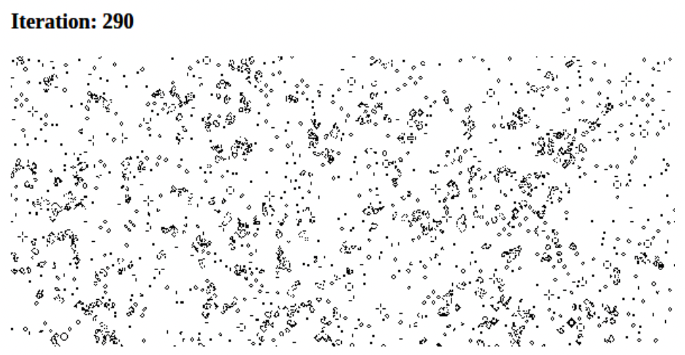

### Content

- [Chapter 5. Advanced Shared Memory](#chapter5)
  - [Atomic Methods for Coordination](#AtomicMethodsforCoordination)
    - [Atomics.wait()](#Atomicswait)
    - [Atomics.notify()](#Atomicsnotify)
    - [Atomics.waitAsync()](#AtomicswaitAsync)
  - [Timing and Nondeterminism](#TimingandNondeterminism)
    - [Example of Nondeterminism](#ExampleofNondeterminism)
    - [Detecting Thread Preparedness](#DetectingThreadPreparedness)
  - [Example Application: Conway's Game of Life](#ConwaysGameofLife)
    - [Single-Threaded Game of Life](#SingleThreadedGameofLife)
    - [Multithreaded Game of Life](#MultithreadedGameofLife)
  - [Atomics and Events](#AtomicsandEvents)

## <div id='chapter5'/> Chapter 5. Advanced Shared Memory

Chapter 4 looked at using the SharedArrayBuffer object to read and write directly to a collection of shared data from across separate threads. But doing so is risky business.

### <div id='AtomicMethodsforCoordination'/> Atomic Methods for Coordination

These methods are a little different than the ones that were already covered in “Atomic Methods for Data Manipulation”. Specifically, the methods previously covered each work with a _TypedArray_ of any kind and may operate on both _SharedArrayBuffer_ and _ArrayBuffer_ instances. However, the methods listed here will only work with _Int32Array_ and _BigInt64Array_ instances, and they only make sense when used with _SharedArrayBuffer_ instances.

If you try to use these methods with the wrong type of _TypedArray_, you’ll get one of these errors:

```
# Firefox v88
Uncaught TypeError: invalid array type for the operation

# Chrome v90 / Node.js v16
Uncaught TypeError: [object Int8Array] is not an int32 or
BigInt64 typed array.
```

As far as prior art goes, these methods are modeled after a feature available in the Linux kernel called the futex, which is short for fast _userspace mutex_. _Mutex_ itself is short for _mutual exclusion_, which is when a single thread of execution gets exclusive access to a particular piece of data. A _mutex_ can also be referred to as a _lock_, where one thread locks access to the data, does its thing, and then unlocks access, allowing another thread to then touch the data. A _futex_ is built on two basic operations, one being “wait” and the other being “wake.”

#### <div id='Atomicswait'/> Atomics.wait()

```js
status = Atomics.wait(typedArray, index, value, (timeout = Infinity));
```

This method first checks _typedArray_ to see if the value at _index_ is equal to _value_. If it is not, the function returns the value _not-equal_. If the value is equal, it will then freeze the thread for up to _timeout_ milliseconds. If nothing happens during that time, the function returns the value _timed-out_. On the other hand, if another thread calls _Atomics.notify()_ for that same _index_ within the time period, the function then returns with a value of ok.

The next table shows a list of return values

| Value     | Meaning                                                                    |
| --------- | -------------------------------------------------------------------------- |
| not-equal | The provided value didn’t equal the value present in the buffer.           |
| timed-out | Another thread didn’t call _Atomics.notify()_ within the allotted timeout. |
| ok        | Another thread did call _Atomics.notify()_ in time.                        |

This blocking behavior might be a little shocking at first. Locking an entire thread sounds a bit intense, and in many cases it is. Another example of what can cause an entire JavaScript thread to lock is the _alert()_ function in a browser. The _Atomics.wait()_ method similarly freezes the thread.

This behavior is so extreme, in fact, that the “main” thread is not allowed to call this method, at least in a browser. The reason is that locking the main thread would be such a poor user experience that the API authors didn’t even want to allow it. If you do try to call this method in the main thread of a browser, you will get one of the following errors:

```
#Firefox
Uncaught TypeError: waiting is not allowed on this thread

#Chrome v90
Uncaught TypeError: Atomics.wait cannot be called in this context
```

Node.js, on the other hand, does allow _Atomics.wait()_ to be called in the main thread. Since Node.js doesn’t have a UI, this isn’t necessarily a bad thing. Indeed, it can be useful when writing scripts where calling _fs.readFileSync()_ is acceptable.

#### <div id='Atomicsnotify'/> Atomics.notify()

```js
awaken = Atomics.notify(typedArray, index, (count = Infinity));
```

The _Atomics.notify()_ method attempts to awaken other threads that have called _Atomics.wait()_ on the same _typedArray_ and at the same _index_. If any other threads are currently frozen, then they will wake up. Multiple threads can be frozen at the same time, each waiting to be notified. The _count_ value then determines how many of them to awaken. The _count_ value defaults to _Infinity_, meaning that every thread will be awakened. However, if you have four threads waiting and set the value to three, then all but one of them will be woken up.

The return value is the number of threads that have been awoken once the method is complete. If you were to pass in a _TypedArray_ instance that points to a nonshared _ArrayBuffer_ instance, this will always return a 0. If no threads happen to be listening at the time it will also return a 0. Because this method doesn’t block the thread, it can always be called from a main JavaScript thread.

#### <div id='AtomicswaitAsync'/> Atomics.waitAsync()

```js
promise = Atomics.waitAsync(typedArray, index, value, (timeout = Infinity));
```

This is essentially a promise-based version of _Atomics.wait()_.

This method is essentially a less-performant, nonblocking version of _Atomics.wait()_ that returns a promise which resolves the status of the wait operation. On the other hand, it can be useful in situations where a lock change is more convenient to signal another thread than to perform message-passing operations via _postMessage()_. Because this method doesn’t block the thread, it can be used in the main thread of an application.

### <div id='TimingandNondeterminism'/> Timing and Nondeterminism

In order for an application to be correct it usually needs to behave in a deterministic fashion. The _Atomics.notify()_ function accepts an argument _count_ that contains the number of threads to wake up. The glaring question in this situation is which threads get woken up and in which order?

#### <div id='ExampleofNondeterminism'/> Example of Nondeterminism

Threads are woken up in _FIFO_ (first in, first out) order, meaning the first thread that called _Atomics.wait()_ is the first to be woken up, the second to call is the second to be woken up, and so on.

To test this for yourself, you can create a new application. First, create a new directory named _ch5-notify-order/_. In it, start off by creating another basic _index.html_

```html
<html>
  <head>
    <title>Shared Memory for Coordination</title>
    <script src="main.js"></script>
  </head>
</html>
```

Next, create another main.js file.

```js
if (!crossOriginIsolated) throw new Error("Cannot use SharedArrayBuffer");

const buffer = new SharedArrayBuffer(4);
const view = new Int32Array(buffer);

for (let i = 0; i < 4; i++) {
  // 1
  const worker = new Worker("worker.js");
  worker.postMessage({ buffer, name: i });
}

setTimeout(() => {
  Atomics.notify(view, 0, 3); // 2
}, 500); // 3
```

1. Four dedicated workers are instantiated.
2. The shared buffer is notified at index 0.
3. The notification is sent at half a second.

What would happen if the _setTimeout_ value were too low, say 10 ms? Or even if it were called in the same stack outside of _setTimeout_? In that case the threads wouldn’t yet be initialized, the worker wouldn’t have had time to call _Atomics.wait()_, and the call would immediately return with a 0. What would happen if the time value is too high? Well, the application might be painfully slow, or any timeout value used by _Atomics.wait()_ might have been exceeded.

It is difficult to know an exact amount of time before a thread is ready. Often this is an issue when first starting an application, not one that is present throughout the life cycle of the application.

To finish off the application, create a file named _worker.js_

```js
self.onmessage = ({ data: { buffer, name } }) => {
  const view = new Int32Array(buffer);
  console.log(`Worker ${name} started`);
  const result = Atomics.wait(view, 0, 0, 1000); // 1
  console.log(`Worker ${name} awoken with ${result}`);
};
```

1. Wait on 0th entry in buffer, assuming initial value of 0, for up to 1 second.

Once the method call is complete, the value is printed in the terminal. And once you’ve finished creating these files, switch to a terminal and run another web server to view the content. Again, you can do so by running the following command:

```
$ npx MultithreadedJSBook/serve
```

The next table contains the output from a test run.

| Log                            | Location       |
| ------------------------------ | -------------- |
| Worker 1 started               | worker.js:4:11 |
| Worker 0 started               | worker.js:4:11 |
| Worker 3 started               | worker.js:4:11 |
| Worker 2 started               | worker.js:4:11 |
| Worker 0 awoken with ok        | worker.js:7:11 |
| Worker 3 awoken with ok        | worker.js:7:11 |
| Worker 1 awoken with ok        | worker.js:7:11 |
| Worker 2 awoken with timed-out | worker.js:7:11 |

Ideally, though, the final worker name that is printed with the “started” messages will also be the worker that fails with the “timed-out” message.

Earlier we stated that the order seems to be FIFO ordered, but the numbers here aren’t from 0 to 3. The reason is that the order doesn’t depend on the order that the threads were created (0, 1, 2, 3), but the order in which the threads executed the _Atomics.wait()_ call (1, 0, 3, 2 in this case).

Once printed, the messages don’t get displayed directly to the screen. If that could happen, then the messages could overwrite each other, and you’d end up with visual tearing of pixels. Instead, the engine queues up the messages to be printed, and some other mechanism internal to the browser, but hidden away from us developers, determines the order in which they’re taken from the queue and printed to the screen.

Indeed, in this case the “timed-out” message is always from the last worker that was started.

#### <div id='DetectingThreadPreparedness'/> Detecting Thread Preparedness

This experiment begs the question: how can an application deterministically know when a thread has finished going through initial setup and is thus prepared to take on work?

A simple way to do so is to call _postMessage()_ from within the worker threads to post back to the parent thread at some point during the _onmessage()_ handler. This works because once the _onmessage()_ handler has been called the worker thread has finished its initial setup and is now running JavaScript code.

Here’s an example of the quickest way to pull this off. First, copy the _ch5-notify-order/_ directory you created and paste it as a new _ch5-notify-when-ready/_ directory. Inside this directory the _index.html_ file will remain the same, though the two JavaScript files will be updated. First, update _main.js_ to contain the next content.

```js
if (!crossOriginIsolated) throw new Error("Cannot use SharedArrayBuffer");

const buffer = new SharedArrayBuffer(4);
const view = new Int32Array(buffer);
const now = Date.now();
let count = 4;

for (let i = 0; i < 4; i++) {
  // 1
  const worker = new Worker("worker.js");
  worker.postMessage({ buffer, name: i }); // 2
  worker.onmessage = () => {
    console.log(`Ready; id=${i}, count=${--count}, time=${Date.now() - now}ms`);
    if (count === 0) {
      // 3
      Atomics.notify(view, 0);
    }
  };
}
```

1. Instantiate four workers.
2. Immediately post a message to the workers.
3. Notify on the 0th entry once all four workers reply.

The script has been modified so that _Atomics.notify()_ will be called after each of the four workers has posted a message back to the main thread. Once the fourth and final worker has posted a message, the notification is then sent. This allows the application to post a message as soon as it’s ready, likely saving hundreds of milliseconds in the best case, and preventing a failure in the worst case.

The _Atomics.notify()_ call has also been updated to simply wake up all threads instead of just three, and the timeout has been set back to the default of _Infinity_. This was done to show that every thread will receive the message on time.

Next, update worker.js to contain the next content:

```js
self.onmessage = ({ data: { buffer, name } }) => {
  postMessage("ready"); // 1
  const view = new Int32Array(buffer);
  console.log(`Worker ${name} started`);
  const result = Atomics.wait(view, 0, 0); // 2
  console.log(`Worker ${name} awoken with ${result}`);
};
```

1. Post message back to parent thread to signal readiness.
2. Wait for notification on the 0th entry.

This time the _onmessage_ handler immediately calls _postMessage()_ to send a message back to the parent. Then, the wait call happens shortly afterward. Technically, if the parent thread were to somehow receive the message before the _Atomics.wait()_ call were made, then the application could conceivably break. But the code is relying on the fact that message passing is far slower than iterating over lines of code within a synchronous JavaScript function.

One thing to keep in mind is that calling _Atomics.wait()_ will pause the thread. This means _postMessage()_ can’t be called afterward.

When you run this code, the new _logs_ print out three pieces of information: the name of the thread, the countdown (always in the order of 3, 2, 1, 0), and finally the amount of time it took for the thread to be ready since the start of the script.

The next table contains the log output from some sample runs.

| Firefox v88 | Chrome v90 |
| ----------- | ---------- |
| T1, 86ms    | T0, 21ms   |
| T0, 99ms    | T1, 24ms   |
| T2, 101ms   | T2, 26ms   |
| T3, 108ms   | T3, 29ms   |

In this case, with a 16-core laptop, Firefox seems to take around four times as long to initialize the worker threads as Chrome does. Also, Firefox gives a more random thread order than Chrome. Each time the page is refreshed the order of threads for Firefox changes but the order in Chrome does not. This then suggests that the V8 engine used by Chrome is more optimized for starting new JavaScript environments or instantiating browser APIs than the SpiderMonkey engine used by Firefox.

### <div id='ConwaysGameofLife'/>Example Application: Conway’s Game of Life

Now that we’ve had a look at _Atomics.wait()_ and _Atomics.notify()_, it’s time to look at a concrete example.

We’ll use Conway’s Game of Life, a well-established concept that naturally lends itself to parallel programming. The “game” is actually a simulation of population growth and decay. The “world” this simulation exists in is a grid of cells that are in one of two states: alive or dead. The simulation works iteratively, and on each iteration, the following algorithm is performed for each cell.

1. If the cell is alive:

   - If there are 2 or 3 neighbors alive, the cell remains alive.
   - If there are 0 or 1 neighbors alive, the cell dies (this simulates underpopulation as a cause of death).
   - If there are 4 or more neighbors alive, the cell dies (this simulates overpopulation as a cause of death).

2. If the cell is dead:
   - If there are exactly 3 neighbors alive, the cell becomes alive (this simulates reproduction).
   - In any other case, the cell remains dead.

When talking about “neighbors alive,” we’re referring to any cell that’s at most one unit away from the current cell, including diagonals, and we’re referring to the state prior to the current iteration. We can simplify these rules to the following.

1. If there are exactly 3 neighbors alive, the new cell state is alive (regardless of how it started).
2. If the cell is alive and exactly 2 neighbors are alive, the cell remains alive.
3. In all other cases, the new cell state is dead.

For our implementation, we’ll make the following assumptions:

- The grid is a square. This is a slight simplification so that there’s one less dimension to worry about.
- The grid wraps around itself like a torus. This means that when we’re at an edge, and we need to evaluate a neighboring cell outside the bounds, we’ll look at the cell at the other end.

We’ll write our code for web browsers, since they give us a handy canvas element with which to plot the state of the Game of Life world.

### <div id='SingleThreadedGameofLife'/> Single-Threaded Game of Life

To start off, we’ll build up a Grid class, which holds our Game of Life world as an array and handles each iteration.

To properly simulate the Game of Life, we’ll need a multidimensional array to represent our grid of cells. We could use arrays of arrays, but to make things easier later on, we’ll store it in a one-dimensional array (in fact, a _Uint8Array_), and then for any cell with coordinates _x_ and _y_, we’ll store it in the array at _cells[size _ x + y]*. We’ll also need two of these, since one will be for the current state, and one for the previous state. In another attempt to simplify things for later on, we’ll store both of them sequentially in the same *ArrayBuffer\*.

Make a directory called _ch5-game-of-life/_ and add the next content to _gol.js_ in that directory.

```js
// part 1
class  Grid {
	constructor(size, buffer, paint  = () => {}) {
		const sizeSquared = size * size;
		this.buffer = buffer;
		this.size = size;
		this.cells = new Uint8Array(this.buffer, 0, sizeSquared);
		this.nextCells = new Uint8Array(this.buffer, sizeSquared, sizeSquared);
		this.paint = paint;
	}
```

Here we’ve started off the _Grid_ class with a constructor. It takes in a _size_, which is the width of our square, an _ArrayBuffer_ called _buffer_, and a _paint_ function which we’ll use later on. We then establish our _cells_ and _nextCells_ as instances of _Uint8Array_ stored side-by-side in the _buffer_.

Next, we can add the cell retrieval method we’ll need later on when performing iterations.

```js
// gol.js part 2
getCell(x, y) {
	const size =  this.size;
	const sizeM1 = size -  1;
	x = x <  0  ? sizeM1 : x > sizeM1 ?  0  : x;
	y = y <  0  ? sizeM1 : y > sizeM1 ?  0  : y;
	return  this.cells[size * x + y];
}
```

To retrieve a cell with a given set of coordinates, we need to normalize the indices. Recall that we’re saying the grid wraps around. The normalization we’ve done here makes sure that if we’re one unit above or below the range, we instead retrieve the cell at the other end of the range.

Now, we’ll add the actual algorithm that runs on every iteration.

```js
// gol.js part 3
	static NEIGHBORS = [ // 1
	[-1, -1], [-1, 0], [-1, 1], [0, -1], [0, 1], [1, -1], [1, 0],[1, 1]];

	iterate(minX, minY, maxX, maxY) { // 2
		const size =  this.size;
		for (let x = minX; x < maxX; x++) {
			for (let y = minY; y < maxY; y++) {
				const cell =  this.cells[size * x + y];
				let alive =  0;
				for (const [i, j] of Grid.NEIGHBORS) {
					alive +=  this.getCell(x + i, y + j);
				}
				const newCell = alive ===  3  || (cell && alive ===  2) ?  1  :0;
				this.nextCells[size * x + y] = newCell;
				this.paint(newCell, x, y);
			}
		}
		const cells =  this.nextCells;
		this.nextCells =  this.cells;
		this.cells = cells;
	}
}
```

1. The set of neighbors coordinates are used in the algorithm to look at neighboring cells in eight directions. We’ll keep this array handy because we’ll need to use it for every cell.
2. The _iterate()_ method takes in a range to operate on in the form of minimum X and Y values (inclusive) and maximum X and Y values (exclusive). For our single-threaded example, it will always be (0, 0, size, size), but putting a range here will make it easier to split up when we move to a multithreaded implementation, where we’ll use these X and Y boundaries to divide the whole grid into sections for each thread to work on.

We loop over every cell in the grid, and for each one get the number of neighbors that are alive. We’re using the number 1 to represent living cells and 0 to represent dead cells, so we can count the number of neighboring living cells by adding them all up. Once we have that, we can apply the simplified Game of Life algorithm. We store the new cell state in the nextCells array, and then provide the new cell state and coordinates to the paint callback for visualization. Then we swap the cells and nextCells arrays for the subsequent iteration to use. That way, inside each iteration, cells always represents the previous iteration’s result, and newCells always represents the current iteration’s result.

All the code up until this point will be shared with our multithreaded implementation. With the _Grid_ class complete, we can now move on to creating and initializing a _Grid_ instance and tying it to our UI.

```js
// gol.js part 4
const BLACK = 0xff000000; // 1
const WHITE = 0xffffffff;
const SIZE = 1000;

const iterationCounter = document.getElementById("iteration"); // 2
const gridCanvas = document.getElementById("gridcanvas");
gridCanvas.height = SIZE;
gridCanvas.width = SIZE;
const ctx = gridCanvas.getContext("2d");
const data = ctx.createImageData(SIZE, SIZE); // 3
const buf = new Uint32Array(data.data.buffer);

function paint(cell, x, y) {
  // 4
  buf[SIZE * x + y] = cell ? BLACK : WHITE;
}
const grid = new Grid(SIZE, new ArrayBuffer(2 * SIZE * SIZE), paint); // 5
for (let x = 0; x < SIZE; x++) {
  // 6
  for (let y = 0; y < SIZE; y++) {
    const cell = Math.random() < 0.5 ? 0 : 1;
    grid.cells[SIZE * x + y] = cell;
    paint(cell, x, y);
  }
}
ctx.putImageData(data, 0, 0); // 7
```

1. We assign some constants for the black-and-white pixels we’ll draw to the screen and set the size (actually, the width) of the grid we’re using. Feel free to play around with the size to see the Game of Life play out in different magnitudes.
2. We grab an iteration counter and canvas element from the HTML (which we’ll write later on). We’ll set our canvas width and height to SIZE, and get a 2D context from it to work with.
3. We’ll use an _ImageData_ instance to modify the pixels on the canvas directly, via a _Uint32Array_.
4. This _paint()_ function will be used both in initialization of the grid and on each iteration to modify the buffer backing the _ImageData_ instance. If a cell is alive, it’ll paint it black. Otherwise, it’ll paint it white.
5. Now we create the grid instance, passing in the size, an _ArrayBuffer_ big enough to hold both cells and _nextCells_, and our _paint()_ function.
6. To initialize the grid, we’ll loop over all the cells and assign each one a random dead or alive state. At the same time, we’ll pass the result to our _paint()_ function to ensure that the image is updated.
7. Whenever an _ImageData_ is modified, we need to add it back to the canvas, so we’re doing it here now that we’re done initializing.

Finally, we’re ready to start running iterations.

```js
// gol.js part 5
let iteration = 0;
function iterate(...args) {
  grid.iterate(...args);
  ctx.putImageData(data, 0, 0);
  iterationCounter.innerHTML = ++iteration;
  window.requestAnimationFrame(() => iterate(...args));
}

iterate(0, 0, SIZE, SIZE);
```

We’re done with the JavaScript, but now we need the supporting HTML. Fortunately, this is very short. Add the next content to a file called gol.html in the same directory, and then open that file up in your browser.

```html
<h3>Iteration: <span id="iteration">0</span></h3>
<canvas id="gridcanvas"></canvas>
<script src="gol.js"></script>
```

You should now see a 1,000 by 1,000 image displaying Conway’s Game of Life, going through the iterations as fast as it can. It should look something like this.

<p align="center">

</p>

#### <div id='MultithreadedGameofLife'/> Multithreaded Game of Life

For the multithreaded version of our Game of Life implementation, we can reuse a lot of the code. In particular, the HTML doesn’t change and neither does our _Grid_ class. We’ll set up some worker threads and an additional one to coordinate and modify image data. We need that additional thread because we can’t use _Atomics.wait()_ on the main browser thread. We’ll make use of _SharedArrayBuffer_, rather than the regular _ArrayBuffer_ used in the single-threaded example. To coordinate the threads, we’ll need 8 bytes for coordination, specifically 4 to synchronize in each direction, since _Atomics.wait()_ requires at least an _Int32Array_. Since our coordination thread will also be generating the image data, we’ll also need enough shared memory to hold that as well. For a grid of side length _SIZE_, this means a _SharedArrayBuffer_ with memory laid out as in next table.

| Purpose                  | # of Bytes      |
| ------------------------ | --------------- |
| Cells (or next cells)    | SIZE \* SIZE    |
| Cells (or next cells)    | SIZE \* SIZE    |
| Image data               | 4 _ SIZE _ SIZE |
| Worker thread wait       | 4               |
| Coordination thread wait | 4               |

To get started here, copy the _.html_ and _.js_ files from the previous example to new files named _thread-gol.html_ and _hread-gol.js_, respectively. Edit _thread-gol.html_ to make reference to this new JavaScript file.

Delete everything after the _Grid_ class definition. The next thing we’ll do is set up some constants. Add the next code:

```js
// thread-gol.js part 1
const BLACK = 0xff000000;
const WHITE = 0xffffffff;
const SIZE = 1000;
const THREADS = 5; // must be a divisor of SIZE

const imageOffset = 2 * SIZE * SIZE;
const syncOffset = imageOffset + 4 * SIZE * SIZE;

const isMainThread = !!self.window;
```

The BLACK, WHITE, and SIZE constants have the same purpose as in the single-threaded example. We’ll set this THREADS constant to any number that’s a divisor of SIZE, and it will represent the number of worker threads we’ll spawn for doing the Game of Life calculation. We’ll be dividing the grid into chunks that can be handled by each thread.

Next, we’ll start writing the code for the main thread. Add the next content.

```js
if (isMainThread) {
	const gridCanvas = document.getElementById('gridcanvas');
	gridCanvas.height = SIZE;
	gridCanvas.width = SIZE;
	const ctx = gridCanvas.getContext('2d');
	const iterationCounter = document.getElementById('iteration');
	const sharedMemory =  new  SharedArrayBuffer( // 1
	syncOffset +  // data + imageData
	THREADS *  4  // synchronization
);

const imageData = new ImageData(SIZE, SIZE);
const cells = new Uint8Array(sharedMemory, 0, imageOffset);
const sharedImageBuf = new Uint32Array(sharedMemory, imageOffset);
const sharedImageBuf8 = new Uint8ClampedArray(sharedMemory, imageOffset, 4  * SIZE * SIZE);

for (let x =  0; x < SIZE; x++) {
	for (let y =  0; y < SIZE; y++) {
		// 50% chance of cell being alive
		const cell =  Math.random() <  0.5  ?  0  :  1;
		cells[SIZE * x + y] = cell;
		sharedImageBuf[SIZE * x + y] = cell ? BLACK : WHITE;
	}
}

imageData.data.set(sharedImageBuf8);
ctx.putImageData(imageData, 0, 0);
```

1. The SharedArrayBuffer ends 16 bytes later than the _syncOffset_, since we need 4 bytes for synchronization for each of our four threads.

The first part of this is roughly the same as in the single-threaded example. We’re just grabbing the DOM elements and setting the grid size. Next, we set up the _SharedArrayBuffer_, which we’re calling _sharedMemory_, and put views on it for the cells (which we’ll assign values to soon) and got the image data. We’ll use both a _Uint32Array_ and a _Uint8ClampedArray_ for the image data, for modification and assignment to the *ImageData *instance, respectively.

Then we’ll initialize the grid randomly, and at the same time modify the image data accordingly and populate that image data to the canvas context. This sets up our initial state for the grid. At this point, we can start spawning worker threads.

```js
const chunkSize = SIZE / THREADS;
for (let i = 0; i < THREADS; i++) {
  const worker = new Worker("thread-gol.js", { name: `gol- worker-${i}` });
  worker.postMessage({
    range: [0, chunkSize * i, SIZE, chunkSize * (i + 1)],
    sharedMemory,
    i,
  });
}

const coordWorker = new Worker("thread-gol.js", { name: "gol- coordination" });
coordWorker.postMessage({ coord: true, sharedMemory });

let iteration = 0;
coordWorker.addEventListener("message", () => {
  imageData.data.set(sharedImageBuf8);
  ctx.putImageData(imageData, 0, 0);
  iterationCounter.innerHTML = ++iteration;
  window.requestAnimationFrame(() => coordWorker.postMessage({}));
});
```

We set up some worker threads in a loop. For each one, we give it a unique name for debugging purposes, post it a message telling it what range (i.e., the boundaries minX, minY, maxX, and maxY) of the grid we want it to operate in, and send it the sharedMemory. Then we add a coordination worker, pass it the sharedMemory, and let it know that it’s the coordination worker via a message.

From the main browser thread, we’re only going to talk to this coordination worker. We’ll set it up so that it loops by posting a message every time it receives one, but only after grabbing the image data from SharedMemory, making the appropriate UI updates, and requesting an animation frame.

The rest of the code runs in the other threads:

```js
} else {
	let sharedMemory;
	let sync;
	let sharedImageBuf;
	let cells;
	let nextCells;

	self.addEventListener('message', initListener);

	function  initListener(msg) {
		const opts = msg.data;
		sharedMemory = opts.sharedMemory;
		sync =  new  Int32Array(sharedMemory, syncOffset);
		self.removeEventListener('message', initListener);
		if (opts.coord) {
			self.addEventListener('message', runCoord);
			cells =  new  Uint8Array(sharedMemory);
			nextCells =  new  Uint8Array(sharedMemory, SIZE * SIZE);
			sharedImageBuf =  new  Uint32Array(sharedMemory, imageOffset);
			runCoord();
		} else {
			runWorker(opts);
		}
	}
```

We’re on the other side of that isMainThread condition now, so we know we’re in a worker thread or the coordination thread.

Here, we declare some variables, and then add an initial listener to the message event. Regardless of whether this is a coordination thread or a worker thread, we’ll need the sharedMemory and sync variables populated, so we assign those in the listener. Then we remove the initialization listener, since we won’t need it anymore. The worker threads won’t rely on message passing at all, and the coordination thread will have a different listener, as we’ll see in a moment.

If we’ve initialized a coordination thread we’ll add a new message listener; a _runCoord_ function that we’ll define later. Then we’ll get references to _cells_ and _nextCells_ since we’ll need to keep track on the coordination thread separate from what’s going on in the _Grid_ instances in the worker threads. Since we’re generating the image on the coordination thread, we’ll need that too. Then we run the first iteration of _runCoord_. If we’ve initialized a worker thread, we simply go ahead and pass the options (containing the range to operate) to _runWorker()_.

Let’s go ahead and define runWorker() right now.

```js
function runWorker({ range, i }) {
  const grid = new Grid(SIZE, sharedMemory);
  while (true) {
    Atomics.wait(sync, i, 0);
    grid.iterate(...range);
    Atomics.store(sync, i, 0);
    Atomics.notify(sync, i);
  }
}
```

Worker threads are the only ones that need an instance of the _Grid_ class, so first we instantiate it, passing in the _sharedMemory_ as the backing buffer. This works because we decided that the first part of the _sharedMemory_ would be the _cells_ and _nextCells_, as it would be in the single-threaded example.

Then we start an infinite loop. The loop performs the following operations:

1. It performs an _Atomics.wait()_ on the _i_ th element of the sync array. In the coordination thread, we’ll do the appropriate _Atomics.notify()_ to allow this to proceed. We’re waiting for the coordination thread here because otherwise we may start changing data and swapping references to _cells_ and _nextCells_ before other threads are ready and data has made its way to the main browser thread.

Then it performs the iteration on the Grid instance.

2. Once that’s done, it notifies the main thread of having completed this task. This is done by setting the _i_ th element of the sync array to 1 with _Atomics.store()_, and then waking the waiting thread via _Atomics.notify()_. We’re using the transition away from the 0 state as an indicator that we should do some work, and a transition back to the 0 state to notify that we’ve finished the work.

We’re using _Atomics.wait()_ to stop the coordination thread from executing while the worker threads are modifying data, and then stop the worker threads with _Atomics.wait()_ while the coordination thread does its work. On either side, we use _Atomics.notify()_ to wake the other thread and immediately go back into a waiting state, waiting for the other thread to notify back. We know that all the data accesses are sequentially consistent. In the interleaving program flow across threads, a deadlock cannot occur, since we’re always flipping execution back and forth from the coordination thread to the worker threads. The worker threads never execute on the same parts of memory as each other, so we don’t have to worry about this concept from the perspective of solely the worker threads.

Worker threads can just run infinitely. We don’t have to be worried about that infinite loop because it will only proceed if _Atomics.wait()_ returns, which requires that another thread calls _Atomics.notify()_ for that same array element.

Let’s wrap up the code here with the _runCoord()_ function, which is triggered via a message from the main browser thread after the initialization message.

```js
	function  runCoord() {
		for (let i =  0; i < THREADS; i++) {
			Atomics.store(sync, i, 1);
			Atomics.notify(sync, i);
		}
		for (let i =  0; i < THREADS; i++) {
			Atomics.wait(sync, i, 1);
		}
		const oldCells = cells;
		cells = nextCells;
		nextCells = oldCells;
		for (let x =  0; x < SIZE; x++) {
			for (let y =  0; y < SIZE; y++) {
				sharedImageBuf[SIZE * x + y] = cells[SIZE * x + y] ? BLACK : WHITE;
			}
		}
		self.postMessage({});
	}
}
```

The first thing that happens here is the coordination thread notifying the worker threads via the *i*th element of the sync array for each worker thread, waking them up to perform an iteration. When they’re done, they’ll notify via the same element of the sync array, so we’ll wait on those. The fact that each of these calls to _Atomics.wait()_ blocks the thread execution is exactly why we need this coordination thread in the first place, rather than just doing it all on the main browser thread.

Next, we swap the _cells_ and _nextCells_ references. The workers have already done this for themselves inside the _iterate()_ method, so we need to follow suit here. Then we’re ready to iterate over all the cells and convert their values to pixels in the image data. Finally, we post a message back to the main browser thread, indicating that the data is ready to be displayed in the UI. The coordination thread has nothing to do until the next time it receives a message, at which point _runCoord_ is run again.

Now we’re done! To view the HTML file, remember that in order to use _SharedArrayBuffer_, we need a server running with particular headers set. To do this, run the following in your _ch5-game-of-life_ directory:

```
$ npx MultithreadedJSBook/serve
```

Because we haven’t changed any UI code, it should look exactly the same as the single-threaded example.

The only difference you should see is in performance. The transitions between iterations likely appear to be much smoother and quicker. You’re not imagining things! We’ve moved the work of calculating cell states and plotting pixels into separate threads, so now the main thread is free to animate more smoothly, and iterations happen faster because we’re using more CPU cores in parallel to do the work.

Most importantly, we’re avoiding most of the overhead of passing messages between threads for coordination by just using _Atomics.notify()_ to let other threads know that they can continue after having paused themselves with _Atomics.wait()_.

### <div id='AtomicsandEvents'/> Atomics and Events

Using _Atomics.wait()_ and shared memory, this pattern now allows applications to halt the execution of JavaScript, thereby causing the event loop to completely stop working. Because of this you can’t simply start throwing calls to make use of multithreading into your application and expect it to work without problem. Instead, certain restrictions must be followed to make the application behave nicely.

One such restriction is hinted at when it comes to browsers: the main thread of the application should not call _Atomics.wait()_. And, while it can be done in a simple Node.js script, you should really avoid doing so in a larger application.

For example, if your main Node.js thread is handling incoming HTTP requests, or has a handler for receiving operating system signals, what’s going to happen when the event loop comes to a halt when a wait operation is started? Here is an example of such a program.

```js
#!/usr/bin/env node

const http = require("http");
const view = new Int32Array(new SharedArrayBuffer(4));

setInterval(() => Atomics.wait(view, 0, 0, 1900), 2000); // 1

const server = http.createServer((req, res) => {
  res.end("Hello World");
});

server.listen(1337, (err, addr) => {
  if (err) throw err;
  console.log("http://localhost:1337/");
});
```

1. Every 2 seconds the app pauses for 1.9 seconds.

Execute the server by running the following command:

```
node main.js
```

Once it’s running, execute the following command in your terminal several times, waiting a random amount of time between each invocation:

```
time curl http://localhost:1337
```

What this application does is first create an HTTP server and listen for requests. Then, every two seconds, a call to _Atomics.wait()_ is made. It’s configured in such a way that the application freezes for 1.9 seconds to exaggerate the effect of long pauses. The _curl_ command you’re running is prefixed with the _time_ command, which displays the amount of time the following command takes to run. Your output will then randomly vary between 0 and 1.9 seconds, which is a huge amount of time for a web request to pause for. Even as you reduce that timeout value closer and closer to 0, you’ll still end up with micro stutters that globally affect all incoming requests. If web browsers allowed _Atomics.wait()_ calls in the main thread, you would definitely be encountering micro stutters from this in websites you visit today.

What sort of restrictions should come into play with each of the additional threads that an application spawns, considering that each thread has their own event loop?

Our recommendation is to designate ahead of time what the main purpose of each spawned thread is. Each thread either becomes a CPU-heavy thread that makes heavy use of _Atomics_ calls or an event-heavy thread that makes minimal _Atomics_ calls. With such an approach, you might have a thread that is a worker in the truest sense, constantly performing complex calculations and writing the results to a shared array buffer. You would also have your main thread, which is then mostly communicating via message passing and doing event loop based work. It then might make sense to have simple intermediary threads that call _Atomics.wait()_ as they wait for another thread to finish doing work, then call _postMessage()_ to send the resulting data back to the main thread to handle the result at a much higher level.

To summarize the concepts in this section:

- Don’t use _Atomics.wait()_ in the main thread.
- Designate which threads are CPU-heavy and use lots of _Atomics_ calls and which threads are evented.
- Consider using simple “bridge” threads to wait and post messages where appropriate.

These are some very high-level guidelines that you can follow when designing your application.
