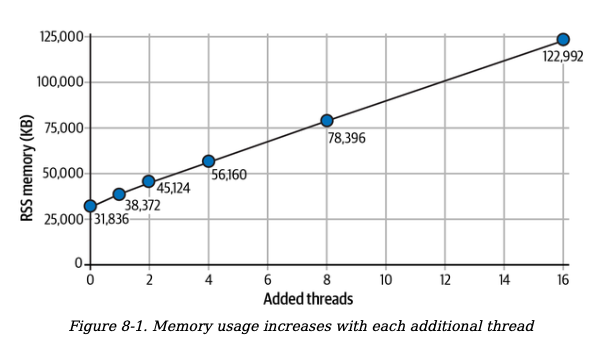
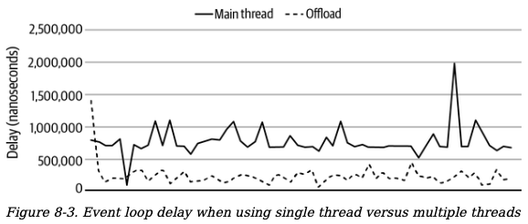

### Content

- [Chapter 8. Analysis](#chapter8)
  - [When Not to Use](#WhenNotToUse)
    - [Low Memory Constraints](#LowMemoryConstraints)
    - [Low Core Count](#LowCoreCount)
    - [Containers Versus Threads](#ContainersVersusThreads)
  - [When to use](#WhentoUse)
  - [Summary of Caveats](#SummaryofCaveats)

## <div id='chapter8'/> Chapter 8. Analysis

While this book provides a lot of use cases and reference material, at no point did it say “you should add multithreading to your application,” and there’s an important reason for this.

By and large the main reason to add workers to an application is to increase performance. But this trade-off comes with a cost of added complexity. The KISS principle, meaning “Keep It Simple, Stupid,” suggests that your applications should be so stupidly simple that anyone can quickly look at the code and get an understanding of it. Being able to read code after it has been written is of paramount importance and simply adding threads to a program without purpose is an absolute violation of KISS.

But how do you identify situations where threads will or will not help without going through all the work of implementing them? And how do you go about measuring performance impact?

### <div id='WhenNotToUse'/> When Not to Use

Threading, when it comes to performance, should often be done as a final effort. Adding threading support may require heavy changes to an application, which means your effort-to-performance gains will likely be higher if you first hunt down other code inefficiencies first.

Once that’s done, and you’ve made your application performant in other areas, you are then left with the question, “Is now a good time to add multithreading?”

#### <div id='LowMemoryConstraints'/> Low Memory Constraints

There is some additional memory overhead incurred when instantiating multiple threads in JavaScript. This is because the browser needs to allocate additional memory for the new JavaScript environment—this includes things like globals and APIs available to your code as well as under-the-hood memory used by the engine itself.

What’s the memory impact of additional threads? It’s a little hard to quantify, and it changes depending on the JavaScript engine and platform.

First, let’s consider a dead simple Node.js program that just kicks off a timer and doesn’t pull in any third-party modules.

This program looks like the following:

```js
#!/usr/bin/env node

const { Worker } = require("worker_threads");
const count = Number(process.argv[2]) || 0;

for (let i = 0; i < count; i++) {
  new Worker(__dirname + "/worker.js");
}

console.log(`PID: ${process.pid}, ADD THREADS: ${count}`);
setTimeout(() => {}, 1 * 60 * 60 * 1000);
```

Running the program and measuring memory usage looks like this:

```
# Terminal 1
$ node leader.js 0
# PID 10000

# Terminal 2
$ pstree 10000 -pa # Linux only
$ ps -p 10000 -o pid,vsz,rss,pmem,comm,args
```

The _pstree_ command displays the threads used by the program. It displays the main V8 JavaScript thread, as well as some of the background threads. Multithreaded JavaScript

Here is an example output from the command:

```
node,10000 ./leader.js
	├─{node},10001
	├─{node},10002
	├─{node},10003
	├─{node},10004
	├─{node},10005
	└─{node},10006
```

The ps command displays information about the process, notably the memory usage of the process. Here’s an example of the output from the command:

```
PID VSZ RSS %MEM COMMAND COMMAND
66766 1409260 48212 0.1 node node ./leader.js
```

There are two important variables here used to measure the memory usage of a program, both of them measured in kilobytes. The first here is VSZ, or virtual memory size, which is the memory the process can access including swapped memory, allocated memory, and even memory used by shared libraries approximately 1.4 GB. The next is RSS, or resident set size, which is the amount of physical memory currently being used by the process, approximately 48 MB.

It’s tricky to estimate how many processes can actually fit in memory. In this case, we’ll mostly be looking at the RSS value.

let’s consider a more complicated version of the program using threads. Again, the same dead simple timer will be used, but in this case there will be a total of four threads created. In this case a new _worker.js_ file is required:

```js
console.log(`WPID: ${process.pid}`);
setTimeout(() => {}, 1 * 60 * 60 * 1000);
```

Running the leader.js program with a numerical argument greater than 0 allows the program to create additional workers. The next table is a listing of the memory usage output from _ps_ for each of the different iterations of additional threads.

| Add Threads | VSZ          | RSS        | SIZE       |
| ----------- | ------------ | ---------- | ---------- |
| 0           | 318,124 KB   | 31,836 KB  | 47,876 KB  |
| 1           | 787,880 KB   | 38,372 KB  | 57,772 KB  |
| 2           | 990,884 KB   | 45,124 KB  | 68,228 KB  |
| 4           | 1,401,500 KB | 56,160 KB  | 87,708 KB  |
| 8           | 2,222,732 KB | 78,396 KB  | 126,672 KB |
| 16          | 3,866,220 KB | 122,992 KB | 205,420 KB |

The next figure displays the correlation between RSS memory and thread count.

<p align="center">

</p>

With this information it appears that the added RSS memory overhead of instantiating each new thread, using Node.js 16.5 on an x86 processor, is approximately 6 MB. Again, this number is a bit hand wavy, and you’ll need to measure it in your particular situation.

#### <div id='LowCoreCount'/> Low Core Count

Your application will run slower in situations where it has fewer cores. Even if you employ a thread pool in your application and scale the pool based on the core count, the application will be slower if it creates a single worker thread.

Another reason your application will slow down is that there is additional overhead when it comes to communicating between threads.

On the Linux operating system it’s straightforward to tell the OS that a program, and all of its threads, should only run on a subset of CPU cores. The use of this command allows developers to test the effects of running a multithreaded application in a low core environment.

There is an obvious performance benefit when the number of threads dedicated to the thread pool is at least two and the number of cores available to the application is at least three. Other than that, there isn’t anything too interesting about the data. When measuring the effects of cores versus threads in a real-world application, you will likely see more interesting performance trade-offs.

#### <div id='ContainersVersusThreads'/> Containers Versus Threads

When it comes to writing server software, like with Node.js, the rule of thumb is that processes should scale horizontally. This is a fancy term meaning you should run multiple redundant versions of the program in an isolated manner— such as within a Docker container. Horizontal scaling benefits performance in a way that allows developers to fine-tune the performance of the whole fleet of applications. Such tuning can’t be performed as easily when the scaling primitive happens within the program, in the form of a thread pool.

Orchestrators, such as Kubernetes, are tools that run containers across multiple servers. They make it easy to scale an application on demand. Orchestrators can also dynamically change the scale depending on other heuristics like CPU usage, traffic throughput, and even the size of a work queue.

How might this dynamic scaling look if it were performed within an application at runtime? Well, certainly the available thread pool would need to be resized. There would also need to be some sort of communication in place, allowing an engineer to send messages to the processes to resize the pool; perhaps an additional server needs to listen on a port for such administrative commands. Such functionality then requires additional complexity to be added to the application code.

While adding additional processes instead of increasing thread count increases overall resource consumption, not to mention the overhead of wrapping processes in a container, larger companies usually prefer the scaling flexibility of this approach.

### <div id='WhentoUse'/>When to Use

Here are some of the most straightforward characteristics of a problem to keep an eye out for:

_Embarrassingly parallel_
: This is a class of problems where a large task can be broken down into smaller tasks and very little or no sharing of state is required.

_Heavy math_
: Another characteristic of problems that are a good fit for threads are those that involve a heavy use of math, aka CPU-intensive work. Sure, one might say that everything a computer does is math, but the inverse of a math-heavy application is one that is I/O heavy, or one that mostly deals with network operations.

_MapReduce-friendly problems_
: This model is often used for large- scale data processing that has been spread across many different machines. MapReduce is broken into two pieces. The first is Map, which accepts a list of values and produces a list of values. The second is Reduce, where the list of values are iterated on again, and a singular value is produced.

_Graphics processing_
: A lot of graphics processing tasks also benefit from multiple threads. Image filtering then becomes a problem of subdividing an image into smaller images, having threads in a thread-pool process with the smaller images in parallel, then updating the interface once the change is complete.

This isn’t a complete list of all the situations in which you should use multithreading; it’s just a list of some of the most obvious use cases.

Create a new directory named _ch8-template-render/_. Inside this directory, copy and paste the existing* ch6-thread-pool/rpc-worker.js* file.

Initialize an npm project and install some basic packages. You can do this by running the following commands:

```
$ npm init -y
$ npm install fastify@3 mustache@4
```

Next, create a file named _server.js_. This represents an HTTP application that performs basic HTML rendering when it receives a request.

Start the file off with the next content

```js
#!/usr/bin/env node

// npm install fastify@3 mustache@4

const Fastify = require("fastify");
const RpcWorkerPool = require("./rpc-worker.js");
const worker = new RpcWorkerPool("./worker.js", 4, "leastbusy");
const template = require("./template.js");
const server = Fastify();
```

The file starts off by instantiating the Fastify web framework, as well as a worker pool with four workers. The application also loads a module named _template.js_ that will be used to render templates used by the web application.

Keep editing the file by adding the content below

```js
server.get("/main", async (request, reply) =>
  template.renderLove({ me: "Thomas", you: "Katelyn" })
);

server.get("/offload", async (request, reply) =>
  worker.exec("renderLove", { me: "Thomas", you: "Katelyn" })
);

server.listen(3000, (err, address) => {
  if (err) throw err;
  console.log(`listening on: ${address}`);
});
```

Two routes have been introduced to the application. The first is GET /main and will perform the rendering of the request in the main thread. This represents a single-threaded application. The second route is GET /offload, where the rendering work will be offloaded to a separate worker thread. Finally, the server is instructed to listen on port 3000.

As an added bonus, it would be nice to be able to quantify the amount of work that the server is busy doing. While it’s true that we can primarily test the efficiency of this application by using an HTTP request benchmark, sometimes it’s nice to look at other numbers as well.

```js
const timer = process.hrtime.bigint;
setInterval(() => {
  const start = timer();
  setImmediate(() => {
    console.log(`delay: ${(timer() - start).toLocaleString()}ns`);
  });
}, 1000);
```

This code uses a setInterval call that runs every second. It wraps a *setImmediate() *call, measuring current time in nanoseconds before and after the call is made. It’s not perfect, but it is one way to approximate how much load the process is currently receiving. As the event loop for the process gets busier, the number that is reported will get higher. Also, the busyness of the event loop affects the delay of asynchronous operations throughout the process. Keeping this number lower therefore correlates to a more performant application.

Next, create a file named _worker.js_. Add the next content

```js
const { parentPort } = require("worker_threads");
const template = require("./template.js");

function asyncOnMessageWrap(fn) {
  return async function (msg) {
    parentPort.postMessage(await fn(msg));
  };
}

const commands = {
  renderLove: (data) => template.renderLove(data),
};

parentPort.on(
  "message",
  asyncOnMessageWrap(async ({ method, params, id }) => ({
    result: await commands[method](...params),
    id,
  }))
);
```

This is a modified version of the worker file that you created before. In this case a single command is used, _renderLove()_, which accepts an object with key value pairs to be used by the template rendering function.

Finally, create a file named _template.js_, and add the content below:

```js
const Mustache = require("mustache");
const love_template = "<em>{{me}} loves {{you}}</em> ".repeat(80);

module.exports.renderLove = (data) => {
  const result = Mustache.render(love_template, data);
  // Mustache.clearCache();
  return result;
};
```

In a real-world application, this file might be used for reading template files from disk and substituting values. For this simple example just a single template renderer is exported and a single hard-coded template is used. This template uses two variables, _me_ and _you_. The string is repeated many times to approach the length of a template that a real application might use. The longer the template, the longer it takes to render.

Now that the files have been created, you’re ready to run the application. Run the following commands to run the server and then to launch a benchmark against it:

```js
// Terminal 1
$ node server.js

// Terminal 2
$ npx autocannon -d 60 http://localhost:3000/main
$ npx autocannon -d 60 http://localhost:3000/offload
```

On a test run on a beefy 16-core laptop, when rendering templates entirely in the main thread, the application had an average throughput of 13,285 requests per second. However, when running the same test while offloading template rendering to a worker thread, the average throughput was 18,981 requests per second. In this particular situation it means the throughput increased by about 43%.

The event loop latency also decreased significantly. The next figure compares these samples over time during the 60-second benchmark.

<p align="center">

</p>

Does this mean you should run out and refactor your applications to offload rendering to another thread? Not necessarily.

### <div id='SummaryofCaveats'/> Summary of Caveats

This is a combined list of the aforementioned caveats when working with threads in JavaScript:

_Complexity_
: Applications tend to be more complex when using shared memory. A lot of this complexity can be hidden from the application through the use of a third-party module. In such a case it can be possible to represent your workers in a clean manner, communicating with them from the main thread, and having all the intercommunication and coordination abstracted away.

_Memory overhead_
: There is additional memory overhead with each thread that is added to a program. One way to help alleviate this issue is to audit the code that is being loaded in separate threads.

_No shared objects_
: The inability to share objects between threads can make it difficult to easily convert a single-threaded application to a multithreaded one. Instead, when it comes to mutating objects, you’ll need to pass messages around that end up mutating an object that lives in a single location.

_No DOM access_
: Only the main thread of a browser-based application has access to the DOM. It’s entirely possible for the main thread to be in charge of DOM mutation while additional threads can do the heavy lifting and return data changes to the main thread to update the UI.

_Modified APIs_
: There are slight changes to APIs available in threads. In the browser this means no calls to _alert()_, and individual worker types have even more rules, like disallowing blocking _XMLHttpRequest#open()_ requests, _localStorage_ restrictions, top-level _await_, etc.

_Structured clone algorithm constraints_
: There are some constraints on the structured clone algorithm that may make it difficult to pass certain class instances between different threads. Currently, even if two threads have access to the same class definition, instances of the class passed between threads become plain _Object_ instances. While it’s possible to rehydrate the data back into a class instance, it does require manual effort.

_Browsers require special headers_
: When working with shared memory in the browser via _SharedArrayBuffer_, the server must supply two additional headers in the request for the HTML document used by the page. If you have complete control of the server, then these headers may be easy to introduce. However, in certain hosting environments, it might be difficult or impossible to supply such headers.

_Thread preparedness detection_
: There is no built-in functionality to know when a spawned thread is ready to work with shared memory. Instead, a solution must first be built that essentially pings the thread and then waits until a response has been received.
