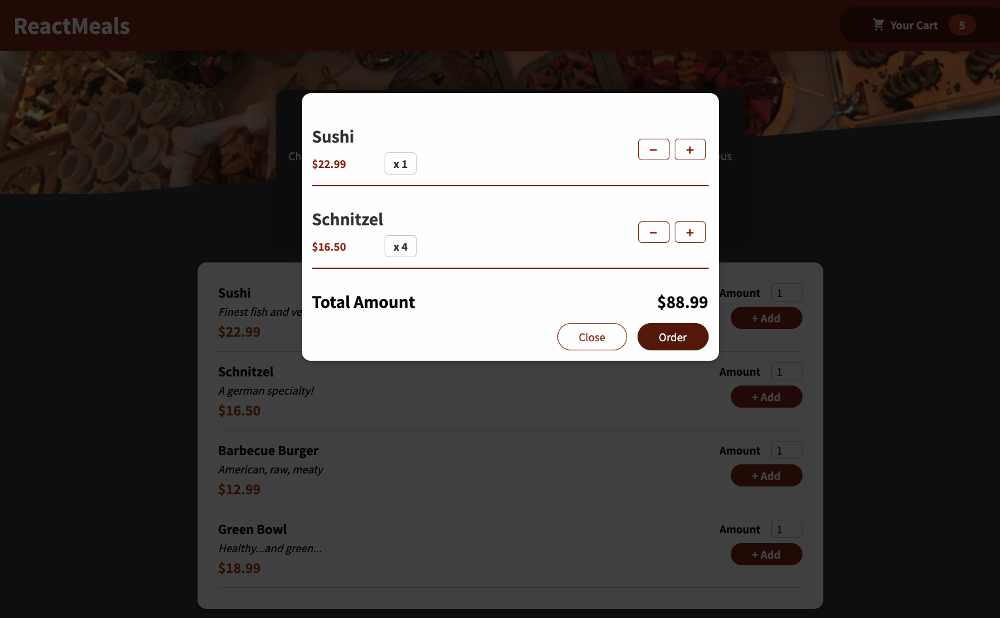
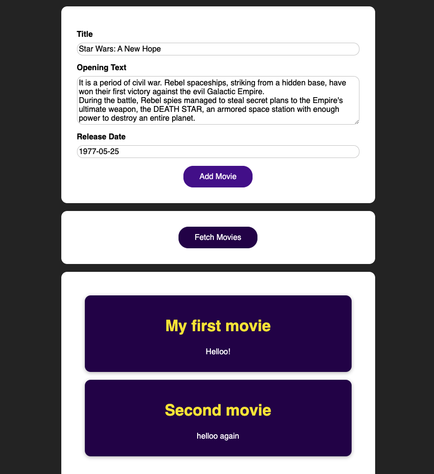
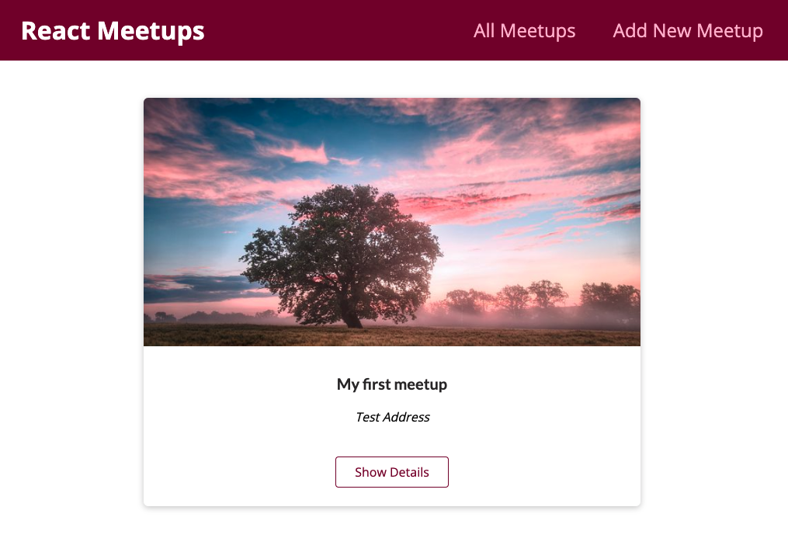
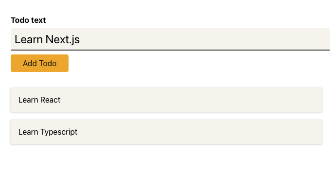

<h1 align="center"> React the complete guide </h1>

 <!-- TODO: React testing library -->

During this course I developed some exercises and projects which have different purposes. The projects are listed below.

## Food Order App

This app simulates a menu for a restaurant. We can add meals to a cart and then order.
The purpose of this app is implement React Hooks.

<a href='https://food-order-app-sandraenciso.vercel.app/ target='_blank'>Live Demo ✨</a> 
<a href='./13-addingHTTP/practice/' target='_blank'>Code 📂</a>

## Movies

This app allows us to create a list of movies and store this list in a database created in Firebase.
The purpose of this app is implement HTTP requests to a Firebase database

<a href='https://movies-sandraenciso.vercel.app/'>Live Demo ✨</a> 
<a href='./10-SendingHTTPRequests/firebase/'>Code 📂</a>

## Meetups

App that allows to register meetups and see its details.
The purpose of this app is implement Next.js and store data in a Mongo Atlas database.

<a href='https://nextjs-course-demo-sandraenciso.vercel.app/' target='_blank'>Live Demo ✨</a> 
<a href='./17-NextJS/'>Code 📂</a>

## Todo list

This app is a todo list, the user can register new todos and then click the item in the list to delete it.
The purpose of this app is use React+TypeScript

<a href='https://todo-list-sandraenciso.vercel.app/' target='_blank'>Live Demo ✨</a> 
<a href='./21-Typescript/'>Code 📂</a>

