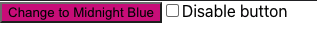
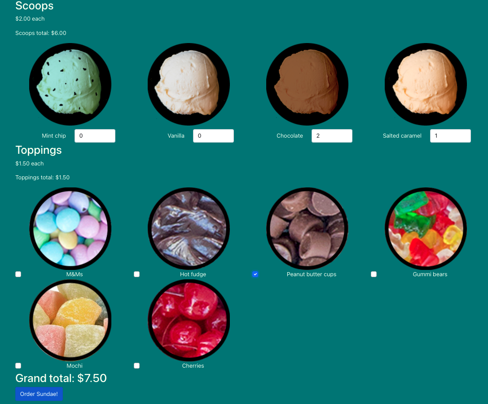
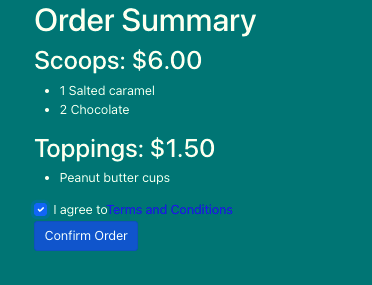
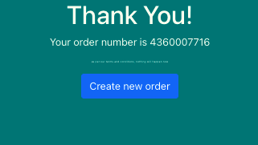

<h1 align="center"> Testing React with Jest and Testing Library </h1>

_React testing library. Not just a library, also a philosophy._
In this course I have developed two React projects which I coded unit and integration tests to confirm its correct behavior. The tests use React testing library and Jest.

## Color button

In this app I did basic tests to confirm the button's style. These tests verify that the button change its color when it's clicked and when is disabled.

<a href='./color-button/src/App.test.js'>Tests 📂</a>

## Sundaes on demand

In this app you can make your sundaes order 🍨✨
I did unit and integration tests to confirm the correct behavior of the app, also, I coded a server to handle with the images and prices requests.
I have used Mock Service Workers to simulate the server response in the tests.

<a href='./sundaes-on-demand/src'>Tests 📂</a>

