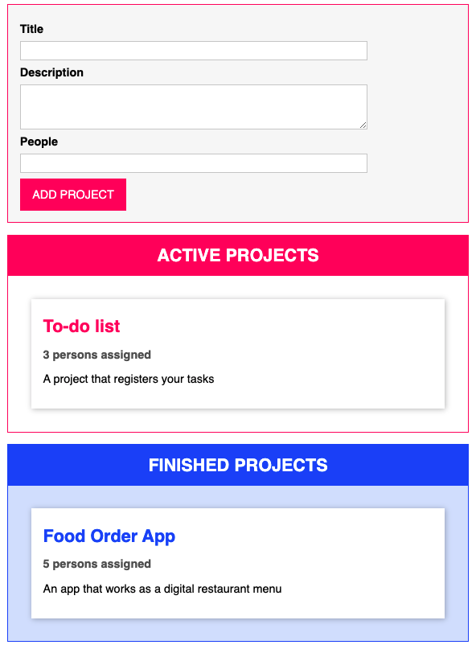
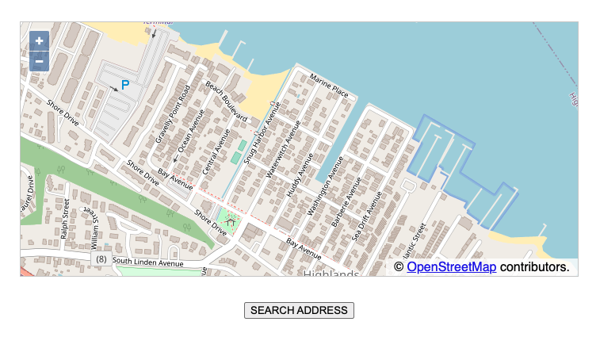
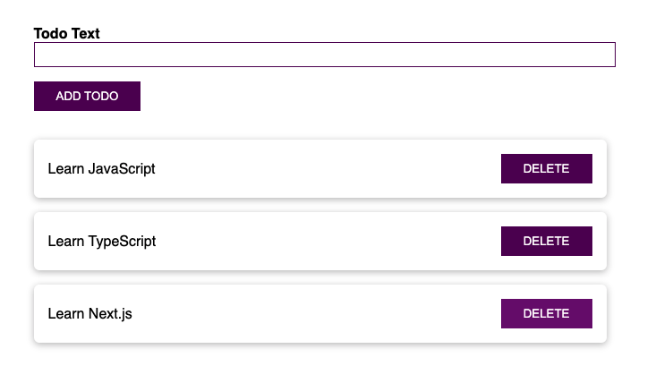

<h1  align="center"> Understanding TypeScript </h1>

In this course, I learned how to implement TypeScript in JavaScript projects to prevent errors and write cleaner code. I have learned the basic syntax, advanced features like decorators, and how to use TypeScript with node.js and 3rd party libraries.

The next is a list of projects that I have developed in this course and their description.

## TS basic syntax and basic types

TypeScript's basic syntax and advanced features.

<a  href='./basics/'>Code 📂</a>

## Drag and drop project

This page allows us to create a project list, once a project is ready, drag and drop the project to the finished projects list.

In this practice exercise, I created a project that renders a template using JavaScript, but with help of TypeScript's features like decorators to validate inputs, interfaces, namespaces, and Webpack to wrap up all the code in a single file.

<a  href='https://drag-and-drop-sandraenciso.vercel.app/'  target='_blank'>Live Demo ✨</a> 
<a  href='./drag-and-drop/'>Code 📂</a>

## Share place with OpenLayers

For this app, click the button to see a default address in a map from the OpenLayers library.

<a  href='https://share-place-openlayers-sandraenciso.vercel.app/'  target='_blank'>Live Demo ✨</a> 
<a  href='./share-place-openlayers/'>Code 📂</a>

## React and TypeScript

This app is a to-do list, we can register new activities and once they are finished, click the delete button in the item to delete it.

<a  href='https://todo-list-react-and-ts-sandraenciso.vercel.app/'  target='_blank'>Live Demo ✨</a> 
<a  href='./todo-list-react-ts/'>Code 📂</a>

## Node and TypeScript

Server app made with Node.js, Express and TypeScript

<a  href='./node-and-typescript/'>Code 📂</a>

